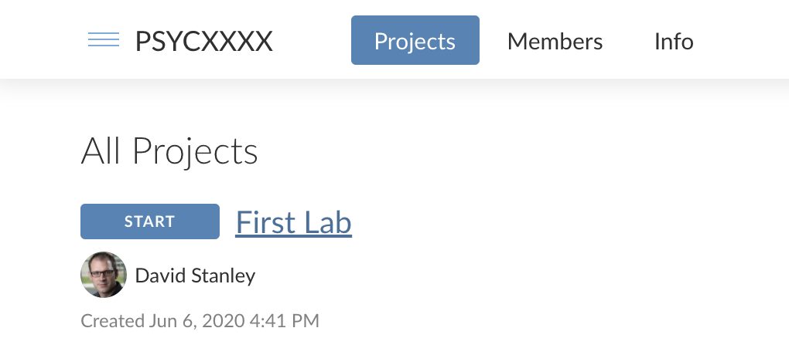

\mainmatter

# Introduction

Welcome! In this guide, we will use the statistical software R with the interface provided by R Studio. You can access R Studio using the website [R Studio Cloud](http://www.rstudio.cloud).

## A focus on workflow

An important part of this guide is training you in a workflow that will avoid a large number of problems than can occur when using R.

## R works with plug-ins

R is a statistical language with many plug-ins called **packages** that you will use for analyses. You can think of R as being like your smartphone. To do things with your phone you need **an App** (R equivalent: a *package*). Before you can use the App you need to **download**  it (R equivalent: *install.packages*) from the **App Store** (R equivalent: *CRAN*). To use the app you need **Open** it  (R equivalent:  *library command*). These similarities are illustrated in Table \@ref(tab:appstore) below.


```{r appstore, echo = FALSE}
app_store <- readr::read_csv("data_app_store_analogy.csv", col_type = readr::cols())
knitr::kable(
  head(app_store), caption = 'R packages are similar to smart phone apps (Kim, 2018)',
  booktabs = TRUE
)
```


## Create an account at R Studio Cloud

R Studio Cloud accounts are free and required for this guide. Please go to the website and set up a new account.


## Join the class workspace

To do the assignment required for this class you need to join the class workspace on R Studio Cloud\index{R Studio Cloud}. To do so:

1. Log into R Studio Cloud (if you haven't already done so).

2. Go to your university email account and find the message were you will emailed the link to the class R Studio workspace. The email will have the subject "R Studio Workspace Invitation".

3. Click on that the link in the email or paste it into your web browser. You should see a screen like the one below in Figure \@ref(fig:join). Click on the Join button.

```{r join, fig.cap="Screen shot of workspace join message.", echo = FALSE, out.width="70%"}
knitr::include_graphics("ch_first_time/images/screenshot_join.png")
```

4. Then you should see the welcome message illustrated in Figure \@ref(fig:welcome). Above this message is the Projects menu option. Click on the word Project.

```{r welcome, fig.cap="Screen shot of welcome messag", echo = FALSE, out.width="70%"}
knitr::include_graphics("ch_first_time/images/screenshot_welcome.png")
```

5. You should now see the First Project displayed as in \@ref(fig:assignment). Click the Start button. You will then move to a view of R Studio.

```{r assignment, fig.cap="Screen shot of starting first assignment", echo = FALSE, out.width="70%"}

```


## Exploring the R Studio Interface

Once you have created a Project, you are presented with the R Studio interface. There are a few key elements to the user interface that are illustrated in Figure \@ref(fig:interface) In the lower right of the screen you can see the a panel with several tabs (i.e., Files, Plots, Packages, etc) that I will refer to as the Files pane. You look in this pane to see all the files associated with your project. On the left side of the screen is the Console which is an interactive pane where you type and obtain results in real time. I've placed two large grey blocks on the screen with text to more clearly identify the Console and Files panes. Not shown in this figure is the Script panel where we can store our commands for later reuse.

```{r interface, fig.cap = "R Studio interface", echo = FALSE, out.width="70%"}
knitr::include_graphics("ch_first_time/images/screenshot_interface.png")
```

### Console panel

When you first start R, the Console panel is on the left side of the screen. Sometimes there are two panels on the left side; if so, the Console panel is the lower one. We can use R a bit like a calculator. Try typing the following into the Console window: 8 + 6 + 7 + 5. You can see that R immediately produced the result on a line preceded by two hashtags (##).

```{r}
8 + 6 + 7 + 5
```

We can also put the result into a variable to store it. We  can then print that variable at a later time to obtain our result. Specifically, we will add the numbers 3, 0, and 9 and store the result in the variable my_sum. The text "<-" indicate you are putting what is on the right side of the arrow into the variable on the left side of the arrow. You can think of a variable as cup into which you can put different things. In this case, imagine a real-world cup with  my_sum written on the outside and inside the cup we have stored the sum of 3, 0, and 9 (i.e., 12).

```{r}
my_sum <- 3 + 0 + 9

```

We can inspect the contents of the my_sum variable (i.e., my_sum cup) with the print command:

```{r}
print(my_sum)
```

Variable are very useful in R. We will use them to store entire data sets as well as the results of analyses.

### Script Panel

Although you can use R with just with the Console panel, it's a better idea to use scripts via the Script panel - not visible yet. Scripts are just text files with the commands you use stored in them. You can run a script (as you will see below) using the Run or Source buttons located in the top right of the Script panel. 

Scripts are valuable because if you need to run an analysis a second time you don't have to type the command in a second time. You can run the script again and again without retyping your commands. More importantly though, the script provides a record of your analyses. 

A common problem in science is that after an article is published, the authors can't reproduce the numbers in the paper. You can read more about the important problem in a surprising article in the journal [Molecular Brain](https://molecularbrain.biomedcentral.com/articles/10.1186/s13041-020-0552-2). In this article an editor reports how a request for the data underlying articles resulted in the wrong data for 40 out of 41 papers. Long story short -- keep track of the data and scripts you use for your paper.

## Writing your first script

### Create the script file

Create a script in your R Studio project by using the menu File > New File > R Script.

Save the file with an appropriate name using the File menu. A common, and good, convention for naming is to start all script names with the word "script" and separate words with an underscore. You might save this file with the name "script_my_first_one.R". The advantage of this approach is that when you look at your list of files alphabetically, all the script files will cluster together. Likewise, it's a good idea to save all data files such that they begin with "data_". This way all the data files will cluster together in your directory view as well. You can see there is already a data file with this convention called "data_okcupid_heights.csv". 

You can see as discussed previously, we are trying to instill and effect workflow as you learn R. Using a good naming convention (that is consistent with what others use) is part of the workflow. When you write your scripts it's a good idea to follow the [tidyverse style guide](https://style.tidyverse.org).


### Add a comment to your script

In the previous section you created your first script. We begin by adding a comment to the script. A comment is something that will be read by humans rather than the computer/R. You make comments for other people that will read your code and need to understand what you have done. However, realize that you are also making comments for your future self as illustrated in an [XKCD cartoon](https://xkcd.com/1421/). 

A good way to start every script is with a comment that includes the date of your script (or even better when you installed your packages, more on this later). Like smartphone apps, packages are updated regularly. Sometimes when a package is updated it will no longer work with an older script. Fortunately, the [checkpoint package](https://cran.r-project.org/web/packages/checkpoint/index.html)\index{R Studio Cloud} lets users role back the clock and use older versions of packages. Adding a comment with the date of your script will help future users (including you) to use your script with the same version of the package you used when you wrote the script. Dating your script is an important part of an effective and reproducible workflow.


```{r}
# Code written on: YYYY/MM/DD 
# By: John Smith
```

Note that in the above comment I used the internationally accepted date format\index{date format} order Year/Month/Day. Some people use the mnemonic *Your My Dream* to remember this order. Wikipedia provides more information about the [International Date Format ISO 8601](https://en.wikipedia.org/wiki/ISO_8601).


Moving forward, I suggest you use comments to make your own personal notes in your own code as your write it.

### Background about the tidyverse

One modern approach is using R is the tidyverse\index{tidyverse}. The tidyverse represents not a single package but rather a collection of packages the work together to give R a modern workflow. These packages do many things to help the data analyst (graphing, rearranging data etc.). That is, each of these packages adds new commands to R. A current list of the packages in the tidyverse is below:

```{r, echo = FALSE}
tidyverse::tidyverse_packages(include_self = TRUE)
```


Before you can use a package it needs to be installed -- this is the same as downloading an app from the App Store. You can install a packages with the install.packages command. Previously, you needed run an install.package command for every package in the tidyverse. That is previously you would need to run the command below for every package in the tidyverse (dplyr, ggplot, etc.):

```{r, eval=FALSE}
# The old way of installing the tidyverse packages
# Like downloading apps from the app store

install.packages("broom", dep = TRUE)
install.packages("cli", dep = TRUE)
install.packages("ggplot", dep = TRUE)
# etc
```

Fortunately, the packages have been officially grouped together into the tidyverse. Consequently, a single install can now install the entire set of tidyverse packages. Note that you should not put install.package command into your script - this can cause problems.
Type the install.package command below into Console window. 

**Class note: For the "First Lab", I've done the install.packages for you. So there is no need to use the install.packages command below in this first lab.**

```{r, eval = FALSE}
install.packages("tidyverse", dep = TRUE)
```

### Add library(tidyverse) to your script 

The tidyverse is now installed, so we need to activate it. 
We do that with the library command. Put the library line below at the top of your script file (below your comment):

```{r librarytidyverse, eval = FALSE}
# Code written on: YYYY/MM/DD 
# By: John Smith
library(tidyverse)
```

### Activate tidyverse auto-complete for your script

Select the library(tidyverse) text with your mouse/track-pad and highlight it. Then click the Run button in the upper right of the Script panel. Doing this "runs" the selected text. After you click the Run button you should see text like the following the Console panel:

```{r librarytidyverse, echo = FALSE, eval = TRUE}
```

When you use library(tidyverse) to activate the tidyverse you activate the most commonly used subset of the tidyverse packages. In the output you see checkmarks beside names of the tidyverse packages you have activated. 

By activating these packages you have added new commands to R that you will use. Sometimes these packages replace older versions of commands in R. The "Conflicts" section in the output shows you where you the packages you have activated have replaced older R commands with newer R commands. You can activate the other tidyverse package by running a library command for each package -- if needed. No need to do so now.

Most importantly, running the library(tidyverse) prior to entering the rest of your script allows R Studio to present auto-complete options when typing your text. Remember to start each script with the library(tidyverse) command and then Run it so you get the autocomplete options for the rest of the commands your enter.

## Loading your data

### Use read_csv (not read.csv) to open the file. 

If you inspect the Files pane on the right of the screen you see the  **data_okcupid_heights.csv** data file in our project directory. We will load this data with the commands below. If you followed the steps above, you should have auto-complete for the tidyverse commands you type for now in -- in the current R session. Enter the command below into your script. Then highlight the text and click on the "Run" button.

```{r firstread}
okcupid_profiles <- read_csv(file = "data_okcupid_heights.csv")

```

The output indicates that you have loaded a data file. The sex column is of type col_character which indicates it contains text/letters. The height column is of type col_double which merely indicates that it is a column of numbers represented with [high precision](https://en.wikipedia.org/wiki/Double-precision_floating-point_format).


## Getting your data ready for analysis

### Tell R which variables are categorical (i.e., a factor)

A key part of using R is telling it which variables are categorical variables. If you don't do this some analysis won't run. Worse - other analyses will run but provide the wrong numbers.

We can use the commands below to look at the nature of each of the variable we have loaded.:

```{r}
glimpse(okcupid_profiles)
```

We know that sex is a categorical variable (i.e., a factor). Yet when we look at the output above from glimpse it is of type chr - which means character. We need to make the data into a factor so that R knows it is a categorical variable. We so with the command below. Add this command to your script below read_csv. Then select and Run the command. Don't worry if you don't understand this command just now - we'll learn more about it in the future.

```{r}
okcupid_profiles <- mutate(okcupid_profiles, sex = as.factor(sex))

```

In later exercise we will deal with situation where numbers like 1 and 2 are used to designate sex instead of a label like male or female. When numbers are used in factors we have to provide labels for them (i.e., value labels in SPSS terms) using the level command; but that's a future exercise.

Use the glimpse command again to see how the nature sex has changed. Notice now that we have made sex a factor, there is fct beside it in the glimpse output.

```{r}
glimpse(okcupid_profiles)
```

If you read other sources about R you may encounter the str function. This is similar to the glimpse function (part of the tidyverse) but provides somewhat different output since it is part of the older way of doing R (base R). When you see str in other peoples scripts recognize it's very similar to glimpse. You should use glimpse moving forward.

```{r}
str(okcupid_profiles)
```

## Checking out your data

There many ways of viewing the actual data you loaded. A few of these are illustrated now. 

### view(): See a spreadsheet view of your data

You can inspect your data in a spreadsheet view by using the view command. Do NOT add this command to your script file. Just type it in the Console. Adding it to the script can cause problems. 

```{r, eval = FALSE}
view(okcupid_profiles)
```


### print(): Check out the data
You can inspect the first few rows of your data with the print() command. It is OK to add a print command to your script. Try the print command below in the Console:

```{r}
print(okcupid_profiles)
```

### head(): Check out the first few rows of data 

You can inspect the first few rows of your data with the head() command. Try the head() command below in the Console:

```{r}
head(okcupid_profiles)
```

### tail(): Check out the last few rows of data 

You can inspect the last few rows of your data with the tail() command. Try the tail() command below in the Console:

```{r}
tail(okcupid_profiles)
```

### summary(): Quick summaries

You can a short summary of your data with the summary command. Note that we will use the summary command in many places in the guide. The output of the summary command changes depending on what you give it - that is put inside the brackets.  You can give the summary command data, the results of a regression analysis, etc.

Add the summary command below to your script file, highlight it, and click Run.

```{r}
summary(okcupid_profiles)
```

## Run *vs.* Source with Echo *vs.* Source 

There are different ways of running commands in R. You can enter them into the Console as we have done already. Or you can put them in your script. There are three ways of running commands in your script. 

You can:

1. Select the command(s) and press the Run button.
2. Source Without Echo
3. Source With Echo

Two of these approaches involve using the Source button, see Figure \@ref(fig:sourcebutton). You bring up the options for the Source button, illustrated in this figure, by clicking on the small arrow to the right of the word Source.

```{r sourcebutton, fig.cap = "Source button options", echo=FALSE, out.width="35%"}
knitr::include_graphics("ch_first_time/images/screenshot_source.png")
```

### Run select text

The Run button will run the text you highlight and present the relevant output. You have used this command a fair amount above.

I strongly suggest you ONLY use the Run button when testing a command to make sure it works or to debug a script.

In general, you should always try to execute your R Scripts using the Source with Echo command (preceded by a Restart, see below). This ensures your script will work beginning to end for you in the future and for others that attempt to use it. Using the Run button in an ad lib basis can create output that is not reproducible.

### Source (without Echo)

Source (without Echo) is not designed for the typical analysis workflow. It is mostly helpful when you run simulations. You can see below that when you run Source (without Echo) much of the output you would wish to read is suppressed. In general, avoid this option. If you use it, you often won't see what you want to see in the output.

### Source with Echo

The Source with Echo command runs all of the contents of a script and presents the output in the R console. This is the approach you should use to running your scripts in most cases.

Prior to running Source with Echo (or just Source), it's always a good idea to restart R. This makes sure you clear the computer memory of any errors from any previous runs. 

So you should do the following EVERY time you run your script.

1.  Menu item: **Session > Restart R**
2.  Click the down arrow beside Source, and click on Source With Echo

This will clear potentially problematic previous stats, run the script commands, and display the output in the Console.  Moving forward we will use this approach for running scripts.


## Using R the old way or the new way (the tidyverse way) 

Below are a few key differences to keep in mind as you move forward with R. We will be using the tidyverse approach to using R but on the internet you will often see sample code that use the older base R approach. A bit of background knowledge is helpful for understanding why we do things one way (e.g., read_csv) instead of another (e.g., read.csv).

#### Tibbles vs Data Frames: Why use read_csv instead of read.csv

When you load data into R it is typically represented in one of two formats inside the computer. Depending on the command you use to load data, it can be represented in different ways inside R.

The original format for representing a data set in R is the data frame. You will see this term used frequently when you read about R. When you load data using read.csv your data is loaded into a data frame. 

#### read.csv puts data into a data frame
```{r}
my_dataframe <- read.csv(file = "data_okcupid_heights.csv")

```

Notice that when you print a data frame it does NOT show you the number of rows or columns above the data like our example did with the okcupid_profiles data.  

Here I actually pasted just the first 10 rows of the output - because all the rows are printed in your console.
```{r, eval = FALSE}
print(my_dataframe)
```

```{r, eval = TRUE, echo = FALSE}
print(my_dataframe[1:10, ])
```

#### read_csv puts data into a tibble

Notice that when you print a tibble it DOES show you the number of rows and columns.  As well, the tibble only provides the first few rows of output so it doesn't fill your screen.


```{r}
my_tibble <- read_csv(file = "data_okcupid_heights.csv")

```
```{r}
print(my_tibble)
```

#### Deeper differences between data frames and tibbles

In short you should always use tibbles (i.e., use read_csv) - they are simply enhanced data frames (i.e., the new version of the data frame). The differences between data frames and tibbles run deeper than the superficial output provided here. On some rare occasions an old package or command may not work with a tibble so you need to make it a data frame. You can do so with the commands below:

#### Converting a tibble into a data frame

```{r}
new_dataframe <- as.data.frame(my_tibble)
```

## A Few Key Points About R

Sometimes you will need to send a command in R additional information. Moreover, that information often needs to be grouped together into a vector or a list before you can send it to a command. We'll learn more about doing so in the future but here is a quick over view of vector and lists to provide a foundation for future chapters.

#### Vector of numbers

We can create a vector of only numbers using the "c" function - which you can think of as being short for "combine" (or concatenate). In the commands below we create a vector of a few even numbers called "even_numbers".

```{r}
even_numbers <- c(2, 4, 6, 8, 10)
```

```{r}
print(even_numbers)
```

We can obtain the second number in the vector using the following notation:

```{r}
print(even_numbers[2])
```


#### Vector of characters

We can also create vectors using only characters:

```{r}
favourite_things <- c("copper kettles", "woolen mittens", "brown paper packages")
```

```{r}
print(favourite_things)
```

As before, can obtain the second item in the vector using the following notation:

```{r}
print(favourite_things[2])
```


### Lists

Lists are similar to vectors in that you can create them and access items by their numeric position. Vectors must be all characters or all numbers. Lists can be a mix of characters or numbers. Most importantly items in lists can be accessed by their label.

```{r}
my_list <- list(last_name = "Smith",
                first_name = "John",
                office_number = 1913)

print(my_list)
```

You can access an item in a list using double brackets:

```{r}
print(my_list[2])
```

You can access an item in a list by its label/name using the dollar sign:

```{r}
print(my_list$last_name)
print(my_list$office_number)
```

## That's it!

Congratulations! You've reached the end of the introduction to R. Take a break, have a cookie, and read some more about R tomorrow!


```{block2, type='rmdcaution'}

Here are some warnings.

1. warning. asdfaslkj asdfl sadf. asdf.jasdf asd. asdfas.jdas.

2. warning again

3. last warning.

```

