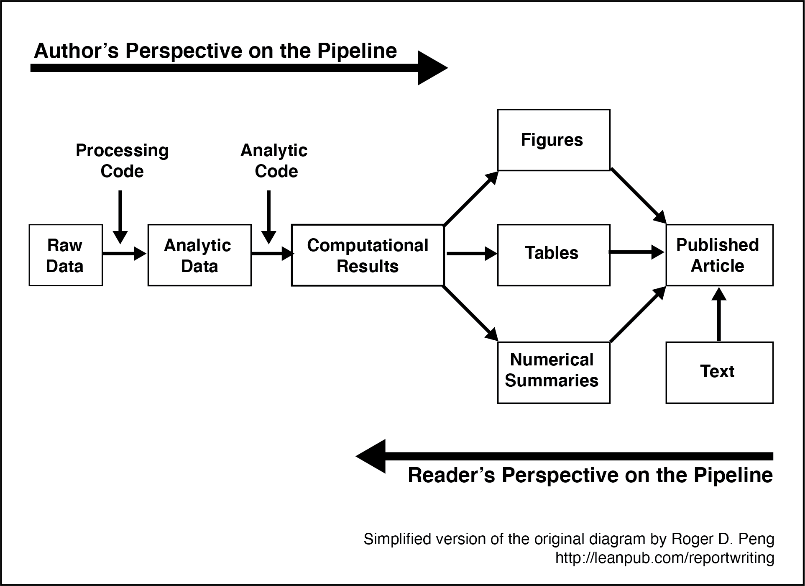

# Making your data ready for analysis

```{r, include=FALSE}
library(tidyverse)
```
A common problem in science is that after an article is published, the authors can't reproduce the numbers in the paper. You can read more about the important problem in a surprising article in the journal [Molecular Brain](https://molecularbrain.biomedcentral.com/articles/10.1186/s13041-020-0552-2). In this article an editor reports how a request for the data underlying articles resulted in the wrong data for 40 out of 41 papers. Long story short -- keep track of the data and scripts you use for your paper.


## Using R the old way or the new way (the tidyverse way) 


Previously we noted that there is an older way of using R (base R) and the new way of using R (the tidyverse) that we will use. Sometimes students have problems with their code when they mix and match these appoaches using a bit of both. We will be using the tidyverse approach to using R but on the internet you will often see sample code that uses the older base R approach. A bit of background knowledge is helpful for understanding why we do things one way (e.g., read_csv with the tidyverse) instead of another (e.g., read.csv with base R). 

#### Tibbles vs Data Frames: Why use read_csv instead of read.csv

When you load data into R it is typically represented in one of two formats inside the computer - depending on the command you used. The original format for representing a data set in R is the data frame. You will see this term used frequently when you read about R. When you load data using read.csv your data is loaded into a data frame in the computer. That is your data is represented in the memory of the computer in particular format and structure called a data frame.

#### read.csv puts data into a data frame
```{r}
my_dataframe <- read.csv(file = "data_okcupid.csv")

```

Notice that when you print a data frame it does NOT show you the number of rows or columns above the data like our example did with the okcupid_profiles data. It also list ALL of your data rather than just the first few rows. As a result in the output below I show only the first 10 rows of the output - because all the rows are printed in your Console (too much to show here).
```{r, eval = FALSE}
print(my_dataframe)
```

```{r, eval = TRUE, echo = FALSE}
print(my_dataframe[1:10, ])
```

#### read_csv puts data into a tibble

When you use the read_csv command the data you load is stored in the computer as a tibble. The tibble is modern version of the data frame. Notice that when you print a tibble it DOES show you the number of rows and columns.  As well, the tibble only provides the first few rows of output so it doesn't fill your screen.


```{r}
my_tibble <- read_csv(file = "data_okcupid.csv")

```
```{r}
print(my_tibble)
```

#### Deeper differences between data frames and tibbles

In short you should always use tibbles (i.e., use read_csv) - they are simply enhanced data frames (i.e., the new version of the data frame). The differences between data frames and tibbles run deeper than the superficial output provided here. On some rare occasions an old package or command may not work with a tibble so you need to make it a data frame. You can do so with the commands below:

#### Converting a tibble into a data frame

This command creates a new data set called new_data_frame (use any name you want) from the tibble data.

```{r}
new_dataframe <- as.data.frame(my_tibble)
```

## Required Packages

This chapter requires the following packages are installed:

| Required Packages |
|-------------------|
|apaTables          |
|janitor            |
|psych              |
|tidyverse          |

**Important Note:** that you should NOT use library(psych) at any point. There are major conflict between the psych package and the tidyverse. We will access the psych package command by preceding each command with psych:: instead of using library(psych).

## Objective


## Context

There is a growing interest in ensuring your analyses are reproducible. That is, that a third part could generate the numbers in the research article from materials provided by the researcher. Although this sounds like a low bar for rigor, it is in fact a surprisingly challening bar. Indeed, the editor of [Molecular Brain](https://molecularbrain.biomedcentral.com/articles/10.1186/s13041-020-0552-2). reported that a request for the data underlying articles resulted in the wrong data for 40 out of 41 papers.

Consequently, a trend is for journals and authors to adopt Transparency and Openness Promotion (TOP) [guidelines](https://www.cos.io/our-services/top-guidelines
). These guidelines involve such things as making your materials, data, code, and analysis scripts available on public repositories so anyone can check your data. A new journal rating system even emerged call the [TOP Factor](https://topfactor.org
).

The idea is not that open science articles are not more trust worthy that other types of articles -- the idea is that trust doesn't play a role. Anyone can inspect the data using the scripts provided by authors. It's really just the same as making your science available for auditing the way financial records can be audited. This process avoids the problem reported at Molecular Brain (doubless is common to many journals) - because the data and scripts need to have been uploaded at the time of publication. The TOP open science guidelines have made an impact and newer journals such as Meta Psycchology have fully embraced open science. Figure \@ref(fig:metapsychology) shows the header from an [article](https://open.lnu.se/index.php/metapsychology/article/view/1630/2266) in Meta Psychology that clearly delineates the open science attributes of the article. Take note that the header even specifies who checked that the analyses in the article were reproducible.

```{r metapsychology, echo=FALSE, out.width="85%", fig.cap="Open science in an article header"}
knitr::include_graphics("ch_score_items/images/screenshot_metapsychology.png")
```


## A mindset for moving foward

```{r pipeline, echo = FALSE, out.width="85%", fig.cap = "Data science pipeline by Roger Peng."}

```

In this chapter we walk you though the process of going from raw data to analytic data by creating processing script.

see Figure \@ref(fig:pipeline)

# Begin with the end in mind

-sample size analysis
-unfalsible article by lakens


TIDYVERSE NAMING CONVENTION ARE IMPORTANT BECAUSE IN SOME CASES THEY ARE REQUIRED for the SCRIPTS to work. If you haven't following the naming conventions you may be making your life quite difficult.


# Collecting your data

- data are collected in different ways
- data collected by programs in the lab that require 
- lab measurementson paper and entering later
- paper surveys and entering later
- website surveys 
- a mix of all of the above

each trial is a row - multiple rows per person...

Distinguish between entering data and not. But also think about what's not confusing...
talk about wide not showing DV or IV just levels of IV


if you're writing a cognitive program or making a survey think about the variable names
think about how the data is outputed.


If you have entirely within person data then tidy is the obvious choice
If you have entirely between then wide makes sense
If you have a mix - it's more difficult. Different research area. Think about the problems. 

For example, a good data code book is essential if you have wide with repeated measures varibles because there is no way to tell what the IV or DV is by inspecting the data.


# Entering your data


# Making analytic data


Think about
- missing data 
- column names
- representation of categorical variables in the data set


# Entering data

- computer/web collection


## Begin with a project

I suggest you begin every R Studio task in the following way:

R Studio in the Cloud
1. Create a new Project using the web interface
2. Upload your data files in using the upload button in the Files pane

R Studio on Your Computer
1. Create a folder on your computer for the analysis
2. Place your data files in that folder
3. Use the menu item File > New Project... to start the project
4. On the window that appears select "Existing Directory"
5. On the next screen, press the "Browse" button and find/select the folder with your data
6. Press the Create Project Button

Regardless of whether your are working from the cloud or locally you should now have an R Studio project with your data files in it. Using Projects.

**Class note: You dont' need to do either of these approach. You will just "Start" each assignment in the class workspace on R Studio Cloud".**

## Raw data

We begin by examining the data as originally entered into a spreadsheet. In Figure \@ref(fig:rawdataitems) you see a screen shot of the intial raw data as a researcher might receive it. Take careful note of the numerous -999 values used to indicate missing values. As part of creating the analytic data that we will analyze we need to indicate to the computer that the -999 are not data but codes to represent missing values.


```{r rawdataitems, echo = FALSE, out.width="85%", fig.cap = "Raw data for item scoring"}
knitr::include_graphics("ch_score_items/images/screenshot_raw_data.png")
```

## Loading raw data

Create an  RStudio project for this activity 
Create a new script in your project and save it wite

```{r, results='hide'}
library(tidyverse)
library(janitor)

my_missing_value_codes <- c("-999", "", "NA")

raw_data <- read_csv(file = "data_item_scoring.csv",
                     na = my_missing_value_codes)
```


## Initial inspection

We use glimipse to do an initial inspection of the column names in this data set. All of the column name conform to [tidyverse style guidelines](https://style.tidyverse.org) so we do not need to run the clean_name() function from the janitor package


```{r}
glimpse(raw_data)
```


```{r, eval = FALSE}
view(raw_data)
```

See Figure \@ref(fig:narawdataitems)

```{r narawdataitems, echo = FALSE, out.width="85%", fig.cap = "Missing values now NA"}
knitr::include_graphics("ch_score_items/images/screenshot_raw_data_na.png")
```


## Handling categorical variables

```{r}

# Turn all columns that are of type character into factors
raw_data <- raw_data %>%
  mutate(across(.cols = where(is.character),
                .fns = as.factor))

```

We can see there was only one column that changes, but if there had been many columns that were characters they all would have changed.

```{r}
glimpse(raw_data)
```

It's often helpful to has id as a factor rather than a number so we add and extra command that changes this value:

```{r}
raw_data <-raw_data %>%
  mutate(id = as.factor(id))
```

Now it looks like our data is ready for the creation of scale scores:

```{r}
glimpse(raw_data)
```


## Seeing your data

See the first six rows of the data with the *head* command below. If you wanted to see all of the data you would use View(raw_data). The NA values in the output indicate missing values (NA = Not Available).
```{r,echo=TRUE,eval=TRUE}
head(raw_data)
```


## Dealing with reverse key items

Our first step is dealing with reverse key items. The way you deal with these items depends on how you scored them. Imagine you had a 5-point scale. You could have scored the scale with the values 1, 2, 3, 4, and 5. Alternatively, you could have scored the scale with the values 0, 1, 2, 3, and 4. In this example, we scored the data using the 1 to 5 system. So we'll use that. Later I'll show you how to deal with the other scoring system (0 to 4).

### Scoring items where the ratings scale starts with 1
We need to take items that were reversed-key when the participant wrote them and recode those responses. We do that with using the *mutate* command from the *dplyr* package.

In this data file the only reverse-key item was SE7 (we known this from when we created the survey). We use the command below to reverse key an item with reponse options ranging from 1 to 5. So we use 6 in the command (i.e., one higher than 5).

```{r,echo=TRUE,eval=TRUE}
raw_data <-raw_data %>%
  mutate(SE7c = 6 - SE7)
```
The command above creates a new column in raw_data called SE7c that has the reverse-keyed values for SE7 in it.  You can see the new SE7c column using command below that displays the first six rows of the data. The SE7c column is at the far right of the data displayed.

```{r,echo=TRUE,eval=TRUE}
glimpse(raw_data)
```

We have reverse keyed one item. So now when we create our scale we will use item SE7c (the c stands for correctly coded) instead of the original item SE7. That is, we will use items SE1, SE2, SE3, SE4, SE5, SE6, **SE7c**, SE8, SE9, and SE10 to form the scale.


**Note for a box** multiple items what it looks like

**Note FOR A BOX **. If you had used response options numbered 0 to 4 for each item you would use the command below instead. Note that we use 4 in the command this time instead of a value one higher.
```{r,echo=TRUE,eval=FALSE}
raw_data <- mutate(raw_data, SE7c = 4 - SE7) 
```


## Creating the scale score

```{r}
raw_data <- raw_data %>% 
  rowwise() %>% 
  mutate(self_esteem = mean(c(SE1, SE2, SE3, SE4, SE5, SE6, SE7c, SE8, SE9, SE10),
                            na.rm = TRUE)) %>%
  ungroup()
```

When you see ungroup() in ths context you can think of it as "turn off rowwise".


We can see our data now has the self esteem column:

```{r}
glimpse(raw_data)
```

(Alternative code: removing ITEM 7 and using begings with: show full example)
Think about this when creating names for your column


## Creatinig analytic data from raw data

Select only the columns you will use in your analysis:
```{r}
analytic_data <- raw_data %>%
  select(id, age, sex, self_esteem)
```

We can see our new data set has only these columns of interest:
```{r}
glimpse(analytic_data)
```


## Wait: I need alpha!

We return to the raw_data file that has the original item data to obtain Cronbach's alpha which is labeled "raw alpha" in the output.


```{r}
self_esteem_item_analysis <- raw_data %>%
  select(SE1, SE2, SE3, SE4, SE5, SE6, SE7c, SE8, SE9, SE10) %>%
  psych::alpha()

print(self_esteem_item_analysis$total)

# To see the full item analysis use:
# print(self_esteem_item_analysis)
```


## Wait: I need item correlations and descriptive statistics


```{r, eval = FALSE}
SE_items <- raw_data %>% 
  select(starts_with("SE", ignore.case = FALSE))

psych::describe(SE_items)
```

```{r, echo = FALSE}
SE_items <- raw_data %>% 
  select(starts_with("SE", ignore.case = FALSE))
psych::describe(SE_items)[,1:5]
```


When you run the cor command you have to indicate how the it will handle missing the data. The options are below. You can learn more about what each one of these options means  by typing: **?cor** into the Console, this will bring up the help page for the cor command.

|Missing data options for cor  |
|-----------------------|
| everything            |
| all.obs               |
| complete.obs          |
| na.or.complete        |
| pairwise.complete.obs |

```{r}
SE_items %>%
  cor(use = "pairwise.complete.obs") %>%
  round(2)
```


```{r, include=FALSE, eval = FALSE}
desc_summary <- list(
  mean  = ~mean(.x, na.rm = TRUE), 
  sd    = ~sd(.x, na.rm = TRUE),
  min   = ~min(.x, na.rm = TRUE),
  max   = ~max(.x, na.rm = TRUE)
)

numeric_data <- raw_data %>% select(where(is.numeric)) %>% select(-self_esteem)

row_sum <- numeric_data %>% summarise(across(everything(), desc_summary), sep = c("z"))

long_summary <- row_sum %>% pivot_longer(cols = everything(),
                        names_to = c("var", "stat"),
                        names_sep = c("z"),
                        values_to = "value")

wide_summary <- long_summary %>% pivot_wider(names_from = stat,
                                 values_from = value)

print(wide_summary)
  


```


```{r, include=FALSE, eval = FALSE}

x <- raw_data %>% summarise(across(starts_with("SE", ignore.case = FALSE), 
                              desc_summary)) 


y <- x %>% pivot_longer(cols = everything(),
                   names_to = c("var", "stat"),
                   names_sep = c("_"),
                   values_to = "value")

y %>% pivot_wider(names_from = stat,
                  values_from = value)

```

```{r, include=FALSE, eval = FALSE}
y %>% pivot_wider(names_from = stat,
                  values_from = value)
```

