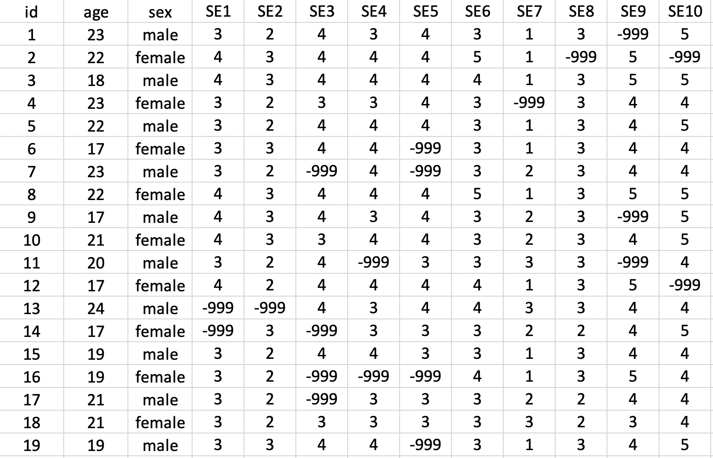

# Making your data ready for analysis

```{r, include=FALSE}
library(tidyverse)
```

## Required Packages

This chapter requires the following packages are installed:

| Required Packages |
|-------------------|
|apaTables          |
|janitor            |
|psych              |
|tidyverse          |

**Important Note:** that you should NOT use library(psych) at any point. There are major conflicts between the psych package and the tidyverse. We will access the psych package command by preceding each command with psych:: instead of using library(psych).

## Objective

## Context

Due to a number of high profile failure to replicate study results [@cos2015] it's become increasingly clear that there is a general crisis of confidence in many areas of science [@baker2016]. Statistical (and other) explanations have been offered [@simmons2011] for why it's hard to replicate results across different sets of data. However, scientists are also finding it challenging to recreate the numbers in their papers using their own data. Indeed, the editor of Molecular Brain asked authors to submit the data used to create the numbers in published papers and found that the wrong data was submitted for 40 out of 41 papers [@miyakawa2020].

Consequently, some researchers have suggested that it is critical to distinguish between replication and reproducibility [@patil2019]. Replication refers to trying to obtain the same result from a different data sets. Reproducibility refers to trying to obtain the same results from the same data set. Unfortunately, some authors use these two terms interchangably and fail to make any distinction between them. I encourage you to make the distinction and the use the terms consist with use sugggested by [@patil2019].

It may seem that reproducibility should be given - but it's not. Correspondingly, there a trend is for journals and authors to adopt Transparency and Openness Promotion (TOP) [guidelines](https://www.cos.io/our-services/top-guidelines
). These guidelines involve such things as making your materials, data, code, and analysis scripts available on public repositories so anyone can check your data. A new open science journal rating system has even emerged called the [TOP Factor](https://topfactor.org
).

The idea is not that open science articles are  more trustworthy that other types of articles -- the idea is that trust doesn't play a role. Anyone can inspect the data using the scripts and data provided by authors. It's really just the same as making your science available for auditing the way financial records can be audited. But just like in the world of business some people don't like the idea of make it possible for other to audit their work. The problems reported at Molecular Brain (doubtless is common to many journals) are likely avoided with open science - because the data and scripts needed to reproduce the numbers in the articles are uploaded prior to publication. 

The TOP open science guidelines have made an impact and some newer journals, such as Meta Psychology, have fully embraced open science. Figure \@ref(fig:metapsychology) shows the header from an [article](https://open.lnu.se/index.php/metapsychology/article/view/1630/2266) in Meta Psychology that clearly delineates the open science attributes of the article that used computer simulations (instead of participant data). Take note that the header even specifies who checked that the analyses in the article were reproducible.

```{r metapsychology, echo=FALSE, out.width="100%", fig.cap="Open science in an article header"}
knitr::include_graphics("ch_score_items/images/screenshot_metapsychology.png")
```

In Canada, the majority of university research is funded by the Federal Government's Tri-Agency (i.e., NSERC, SSHRC, CIHR). The agency has a new draft [Data Management Policy](https://www.ic.gc.ca/eic/site/063.nsf/eng/h_83F7624E.html) in which they state that "*The agencies believe that research data collected with the use of public funds belong, to the fullest extent possible, in the public domain and available for reuse by others.*" This perspective of the funding agency differs from that of some researchers who incorrectly believe "they own their data". In Canada at least, the government makes it clear that tax payers fund the research so the data is public property. Additionally the Tri-Agency Data Management policy clearly indicates the responsibilities of funded researchers:

"Responsibilities of researchers include:

- incorporating data management best practices into their research;
- developing data management plans to guide the responsible collection, formatting, preservation and sharing of their data throughout the entire lifecycle of a research project and beyond;
- following the requirements of applicable institutional and/or funding agency policies and professional or disciplinary standards;
- acknowledging and citing datasets that contribute to their research; and
- staying abreast of standards and expectations of their disciplinary community."

As a result of this perspective on data, it's important that you think about structuring your data for reuse by yourself and others before you collect it. Toward this end, you will see documentation of your data file via data codebooks is critical.


## Begin with the end in mind

In this chapter we will walk you though the steps from data collection, data entry, loading raw data, and the creation of data you will analyze,  analytic data, via preprocessing scripts. These steps are outlined in Figure \@ref(fig:pipeline). This figure makes a clear distinction between raw data and analytic data. Raw data refers to the data as you entered it into a spreadsheet or received it from survey software. Analytic data the data the has been structured and processed so that it is ready for analyis. This pre-processing could include such things as identifying categorical variables to the computer, combining multiple items measuring the same thing into scale scale scores, among other tasks.

It's critial that you don't think of analysis of your results as being completely removed from the data collection and data entry choices you make. Poor choices at the data collection and data entry stage can make your life substantially more complicated when it comes time to write the preprocessing script that will convert your raw data to analytic data. The mantra of this chapter is *begin with the end in mind*.


```{r pipeline, echo = FALSE, out.width="85%", fig.cap = "Data science pipeline by Roger Peng."}
knitr::include_graphics("ch_enter_load/images/pipeline.png")
```


It's difficult to being with the end in mind when you haven't read later chapters. So here we will be provide you with some general thoughts around different approaches to structuring data files and the naming conventions you use when creating those data files.

### tidy data: Comparing wide vs long formats

When conducting many types of analyses it is necessary to have data in a format called tidy data [@tidy-data]. [tidy data](https://cran.r-project.org/web/packages/tidyr/vignettes/tidy-data.html) as defined by Hadley involves (among other requirements) that: 

1. Each variable forms a column.
2. Each observation forms a row.

The tidy data format can be initially challenging for some researchers to understand because it is based on thinking about, and structuring data, in terms of observations/measurements instead of participants. In this section we will describe common approaches to entering animal and human participant data and how they can be done keeping the tidy data requirement in mind. It's not essential that data be entered in a tidy data format but it is essential that you enter data in manner that makes it easy to later convert data to a tidy data format.  When dealing with animal or human participant data it's common to enter data into a spreadsheet. Each row of the spreadsheet is typically used to represent a single participant and each column of the spreadshet is used to represent a variable.

**Between participant data**. Consider  Table \@ref(tab:betweenex) which illustrates between particpant data for six human particpants running 5 kilometers  The first column is id, which indicates there are six unique participants and provides and identification number for each of them. The id is the varible and there is one observation per row - so the id column conforms to tidy data specification. The second column is sex, which is a varible, and there is one observation per for row, so sex also conforms to the tidy data specification. Finally, there is a last column five_km_time which is a variable with one observation per row -- also conforming to tidy data specification. Thus, single occasion between subject data like this conforms to the tidy data specification. There is usually nothing you need to do to convert between participant data (or cross-sectional data) to be in a tidy data format.


```{r betweenex, echo = FALSE}
data_between <- read_csv("data_ex_between.csv", col_type = cols())
knitr::kable(
  head(data_between), caption = 'Between participant data entered one row per participant',
  booktabs = TRUE,
  linesep = c("","","","","","","\\addlinespace")
)
```


**Within participant data**. Consider  Table \@ref(tab:withinex) which illustrates within particpant data for six human particpants running 5 kilometers - but on three different occasions. The first column is id, which indicates there are six unique participants and provides and identification number for each of them. The id is the varible and there is one observation per row - so the id column conforms to tidy data specification. The second column is sex, which is a varible, and there is one observation per for row, so sex also conforms to the tidy data specification. Next, there are three different columns (march, may, july) representing the levels of a single variable. That is the within subject variable is occasion and the levels of that variable are march, june, and july. The march column contains the times for participants in March. The may column contains the times for participants in May. The july column contains the times for participants in July, These three columns are not in a tidy data format. 


```{r withinex, echo = FALSE}
data_within <- read_csv("data_ex_within.csv", col_types = cols())
knitr::kable(
  head(data_within), caption = 'Within participant data entered one row per participant',
  booktabs = TRUE,
  linesep = c("","","","","","","\\addlinespace")
)
```

```{r, include=FALSE}
data_within_tidy <- data_within %>% 
  pivot_longer(cols = march:july,
               names_to = "occasion",
               values_to =  "elapsedtime")

```

```{r withintidyex, echo = FALSE}
knitr::kable(
  head(data_within_tidy,18), caption = 'A tidy data version of the within participant data',
  booktabs = TRUE,
  linesep = c("", "","\\addlinespace")
)
```


The problem with the format of the data in Table \@ref(tab:withinex) is that march, may, and july are levels of single variable, occasion, that is not represented in the data. Nowhere in the Table \@ref(tab:withinex) can you see the label occasion. This single variable is presented over three columns - a very confusing situation. Moreover, due to the way the columns are labelled it's not clear what is being measured. Nowhere in  Table \@ref(tab:withinex) can you see the variable elapsedtime. Thus with the format used in \@ref(tab:withinex) you don't know what the predictor (occassion) is nor do you know the dependent varible (elapsedtime.). Thus, a major problem with entering data in this format is that there are hidden variables in the data and you need insider knowledge to know the columns represent. That said, this is not necessarily a terrible way to enter your data as long as you have all of this missing information documented in a data code book.


| Disadvantages one row per participant  | Advantages one row per participant | 
| ---------------|------------|
| 1) Predictor variable (*occassion*) is hidden and spread over multiple columns | 1) Easy to enter this way | 
| 2) Unclear that each month is a level of the predictor variable *occasion* | |
| 3) Dependent variable (*elapsedtime*) is not  indicated    | |
| 4) Unclear that *elapsedtime* is the measurement in each month column | |


Fortunately, the problems with Table \@ref(tab:withinex) can be largely resolved by converting the data to the a tidy data format. This can be done with the pivot_long() command that we will learn about later in the chapter. Thus, we can enter the data in the easy to enter format of Table \@ref(tab:withinex) but then later convert it to a tidy data format. After this conversion the data will be appear as in Table \@ref(tab:withintidyex). For elapsedtime variable this data is now in the tidy data format. Each row corresponds to a single elapsedtime observed. Each column corresponds to a single variable. Somewhat problematically, however, sex if repeated three times for each person (i.e., over the three rows) - and this can be confusing. However, if the focus in on analyzing elapsed time this tidy data format makes sense.

Why did we walk you through this technical treatment of structuring data within the computer at this point in time? So that you pay attention to the advice the follows. You can see at this point that you may well need to restructure your data for certain analyses. The ability to do so quickly and easily depends upon you following the advice in the rest of this chapter around the naming conventions for variables and other aspects of your analyses. You can imagine the challenges for converting the data in Figure \@ref(tab:withinex) to the data in Figure \@ref(tab:withintidyex) by hand. You want to be able to automate that process and others - which is made substantially easier if you following the forthcoming advice about naming conventions in the tidyverse.


## Data collection and entry
- data are collected in different ways
- data collected by programs in the lab that require 
- lab measurements paper and entering later
- paper surveys and entering later
- website surveys 
- a mix of all of the above

Think about
- missing data 
- column names
- representation of categorical variables in the data set
- computer/web collection

### Question with numerical answers

### Likert-type items

Likert type scales. 

Score and analysis section of wikipedia page
https://en.wikipedia.org/wiki/Likert_scale
Basic issue if if the data is orginal or interval. Is the psychological interval between 1 and 2 the same as the numerical interval between 1 an 2.
Mean, standard deviation, and averaging is in appropriate.
Probably avoid this concern by simply labelling the end points and none of the middle points.
See wiki references.


You can add the labels later with if needed. Basic distinction - if you plan to do a numerical analysis or create scales enter the numbers. If you plan to treat them as cateogrical responses enter labels.


Enter the numbers, not the labels strongly agree etc. into your data
if you have a measure with subscale label the items in your survey etc by subscale
affcomm1  affcomm2, affcomi

avoid labels like AC1, AC2 these are insufficiently unique. Consequently it may be hard to select them with a command like starts_with()

besure to indicate reverse key items using a suffix at the end of the column name
besure to indicate for reservse key items the range of the scale 0 to 5 or 1 to 6. The actual numbers used on the scale will dictate how the items are reverse keyed.


### Categorical classifications (between participant)

Avoid numerical representation of categorical variables. Don't use 1 or 2 to represent sex. Use male and female in your speadsheet - likewise in yoru survey program.
Similarily don't use 1, 2, 3, for education if you plan to analyze it as a categorical variable, indicate the levels "elementary", "secondardy", "college", etc.

Likewise, for between particpant variables drug_condition don't use 1 or 2 use "drug" and "placebo" but the actually drug name would be better.s


### Categorical classifications (between participant)

If you have an stdu that is a survey over time.....


If you have a sstudy that involves a within- or within/between particpants ANOVA design be very carefuly how you collect an name that data.

Andy Field discussess ..... within/between data...
 see data set from apaTAbles

For example, a good data code book is essential if you have wide with repeated measures variables because there is no way to tell what the IV or DV is by inspecting the data.


## Raw data

We begin by examining the data as originally entered into a spreadsheet. In Figure \@ref(fig:rawdataitems) you see a screen shot of the initial raw data as a researcher might receive it. Take careful note of the numerous -999 values used to indicate missing values. As part of creating the analytic data that we will analyze we need to indicate to the computer that the -999 are not data but codes to represent missing values.


```{r rawdataitems, echo = FALSE, out.width="85%", fig.cap = "Raw data for item scoring"}

```

## Loading raw data

I suggest you begin every R Studio task in the following way:

R Studio in the Cloud
1. Create a new Project using the web interface
2. Upload your data files in using the upload button in the Files pane

R Studio on Your Computer
1. Create a folder on your computer for the analysis
2. Place your data files in that folder
3. Use the menu item File > New Project... to start the project
4. On the window that appears select "Existing Directory"
5. On the next screen, press the "Browse" button and find/select the folder with your data
6. Press the Create Project Button

Regardless of whether your are working from the cloud or locally you should now have an R Studio project with your data files in it. Using Projects.

**Class note: You don't' need to do either of these approach. You will just "Start" each assignment in the class workspace on R Studio Cloud".**

Create an  R Studio project for this activity 
Create a new script in your project and save it quite

```{r, results='hide'}
library(tidyverse)
library(janitor)

my_missing_value_codes <- c("-999", "", "NA")

raw_data <- read_csv(file = "data_item_scoring.csv",
                     na = my_missing_value_codes)
```


## Initial inspection

We use glimpse to do an initial inspection of the column names in this data set. All of the column name conform to [tidyverse style guidelines](https://style.tidyverse.org) so we do not need to run the clean_name() function from the janitor package


```{r}
glimpse(raw_data)
```


```{r, eval = FALSE}
view(raw_data)
```

See Figure \@ref(fig:narawdataitems)

```{r narawdataitems, echo = FALSE, out.width="85%", fig.cap = "Missing values now NA"}
knitr::include_graphics("ch_score_items/images/screenshot_raw_data_na.png")
```


## Handling categorical variables

```{r}

# Turn all columns that are of type character into factors
raw_data <- raw_data %>%
  mutate(across(.cols = where(is.character),
                .fns = as.factor))

```

We can see there was only one column that changes, but if there had been many columns that were characters they all would have changed.

```{r}
glimpse(raw_data)
```

It's often helpful to has id as a factor rather than a number so we add and extra command that changes this value:

```{r}
raw_data <-raw_data %>%
  mutate(id = as.factor(id))
```

Now it looks like our data is ready for the creation of scale scores:

```{r}
glimpse(raw_data)
```


## Seeing your data

See the first six rows of the data with the *head* command below. If you wanted to see all of the data you would use View(raw_data). The NA values in the output indicate missing values (NA = Not Available).
```{r,echo=TRUE,eval=TRUE}
head(raw_data)
```


## Dealing with reverse key items

Our first step is dealing with reverse key items. The way you deal with these items depends on how you scored them. Imagine you had a 5-point scale. You could have scored the scale with the values 1, 2, 3, 4, and 5. Alternatively, you could have scored the scale with the values 0, 1, 2, 3, and 4. In this example, we scored the data using the 1 to 5 system. So we'll use that. Later I'll show you how to deal with the other scoring system (0 to 4).

### Scoring items where the ratings scale starts with 1
We need to take items that were reversed-key when the participant wrote them and recode those responses. We do that with using the *mutate* command from the *dplyr* package.

In this data file the only reverse-key item was SE7 (we known this from when we created the survey). We use the command below to reverse key an item with response options ranging from 1 to 5. So we use 6 in the command (i.e., one higher than 5).

```{r,echo=TRUE,eval=TRUE}
raw_data <-raw_data %>%
  mutate(SE7c = 6 - SE7)
```
The command above creates a new column in raw_data called SE7c that has the reverse-keyed values for SE7 in it.  You can see the new SE7c column using command below that displays the first six rows of the data. The SE7c column is at the far right of the data displayed.

```{r,echo=TRUE,eval=TRUE}
glimpse(raw_data)
```

We have reverse keyed one item. So now when we create our scale we will use item SE7c (the c stands for correctly coded) instead of the original item SE7. That is, we will use items SE1, SE2, SE3, SE4, SE5, SE6, **SE7c**, SE8, SE9, and SE10 to form the scale.


**Note for a box** multiple items what it looks like

**Note FOR A BOX **. If you had used response options numbered 0 to 4 for each item you would use the command below instead. Note that we use 4 in the command this time instead of a value one higher.
```{r,echo=TRUE,eval=FALSE}
raw_data <- mutate(raw_data, SE7c = 4 - SE7) 
```

## Creating the scale score

```{r}
raw_data <- raw_data %>% 
  rowwise() %>% 
  mutate(self_esteem = mean(c(SE1, SE2, SE3, SE4, SE5, SE6, SE7c, SE8, SE9, SE10),
                            na.rm = TRUE)) %>%
  ungroup()
```

When you see ungroup() in this context you can think of it as "turn off rowwise".

We can see our data now has the self esteem column:

```{r}
glimpse(raw_data)
```

(Alternative code: removing ITEM 7 and using beings with: show full example)
Think about this when creating names for your column


## Creatinig analytic data from raw data

Select only the columns you will use in your analysis:
```{r}
analytic_data <- raw_data %>%
  select(id, age, sex, self_esteem)
```

We can see our new data set has only these columns of interest:
```{r}
glimpse(analytic_data)
```


## Wait: I need alpha!

We return to the raw_data file that has the original item data to obtain Cronbach's alpha which is labeled "raw alpha" in the output.


```{r}
self_esteem_item_analysis <- raw_data %>%
  select(SE1, SE2, SE3, SE4, SE5, SE6, SE7c, SE8, SE9, SE10) %>%
  psych::alpha()

print(self_esteem_item_analysis$total)

# To see the full item analysis use:
# print(self_esteem_item_analysis)
```


## Wait: I need item correlations and descriptive statistics


```{r, eval = FALSE}
SE_items <- raw_data %>% 
  select(starts_with("SE", ignore.case = FALSE))

psych::describe(SE_items)
```

```{r, echo = FALSE}
SE_items <- raw_data %>% 
  select(starts_with("SE", ignore.case = FALSE))
psych::describe(SE_items)[,1:5]
```


When you run the cor command you have to indicate how the it will handle missing the data. The options are below. You can learn more about what each one of these options means  by typing: **?cor** into the Console, this will bring up the help page for the cor command.

|Missing data options for cor  |
|-----------------------|
| everything            |
| all.obs               |
| complete.obs          |
| na.or.complete        |
| pairwise.complete.obs |

```{r}
SE_items %>%
  cor(use = "pairwise.complete.obs") %>%
  round(2)
```


```{r, include=FALSE, eval = FALSE}
desc_summary <- list(
  mean  = ~mean(.x, na.rm = TRUE), 
  sd    = ~sd(.x, na.rm = TRUE),
  min   = ~min(.x, na.rm = TRUE),
  max   = ~max(.x, na.rm = TRUE)
)

numeric_data <- raw_data %>% select(where(is.numeric)) %>% select(-self_esteem)

row_sum <- numeric_data %>% summarise(across(everything(), desc_summary), sep = c("z"))

long_summary <- row_sum %>% pivot_longer(cols = everything(),
                        names_to = c("var", "stat"),
                        names_sep = c("z"),
                        values_to = "value")

wide_summary <- long_summary %>% pivot_wider(names_from = stat,
                                 values_from = value)

print(wide_summary)
  


```


```{r, include=FALSE, eval = FALSE}

x <- raw_data %>% summarise(across(starts_with("SE", ignore.case = FALSE), 
                              desc_summary)) 


y <- x %>% pivot_longer(cols = everything(),
                   names_to = c("var", "stat"),
                   names_sep = c("_"),
                   values_to = "value")

y %>% pivot_wider(names_from = stat,
                  values_from = value)

```

```{r, include=FALSE, eval = FALSE}
y %>% pivot_wider(names_from = stat,
                  values_from = value)
```


## Using R the old way or the new way (the tidyverse way) 


Previously we noted that there is an older way of using R (base R) and the new way of using R (the tidyverse) that we will use. Sometimes students have problems with their code when they mix and match these approaches using a bit of both. We will be using the tidyverse approach to using R but on the internet you will often see sample code that uses the older base R approach. A bit of background knowledge is helpful for understanding why we do things one way (e.g., read_csv with the tidyverse) instead of another (e.g., read.csv with base R). 

#### Tibbles vs Data Frames: Why use read_csv instead of read.csv

When you load data into R it is typically represented in one of two formats inside the computer - depending on the command you used. The original format for representing a data set in R is the data frame. You will see this term used frequently when you read about R. When you load data using read.csv your data is loaded into a data frame in the computer. That is your data is represented in the memory of the computer in particular format and structure called a data frame.

#### read.csv puts data into a data frame
```{r}
my_dataframe <- read.csv(file = "data_okcupid.csv")

```

Notice that when you print a data frame it does NOT show you the number of rows or columns above the data like our example did with the okcupid_profiles data. It also list ALL of your data rather than just the first few rows. As a result in the output below I show only the first 10 rows of the output - because all the rows are printed in your Console (too much to show here).
```{r, eval = FALSE}
print(my_dataframe)
```

```{r, eval = TRUE, echo = FALSE}
print(my_dataframe[1:10, ])
```

#### read_csv puts data into a tibble

When you use the read_csv command the data you load is stored in the computer as a tibble. The tibble is modern version of the data frame. Notice that when you print a tibble it DOES show you the number of rows and columns.  As well, the tibble only provides the first few rows of output so it doesn't fill your screen.


```{r}
my_tibble <- read_csv(file = "data_okcupid.csv")

```
```{r}
print(my_tibble)
```

#### Deeper differences between data frames and tibbles

In short you should always use tibbles (i.e., use read_csv) - they are simply enhanced data frames (i.e., the new version of the data frame). The differences between data frames and tibbles run deeper than the superficial output provided here. On some rare occasions an old package or command may not work with a tibble so you need to make it a data frame. You can do so with the commands below:

#### Converting a tibble into a data frame

This command creates a new data set called new_data_frame (use any name you want) from the tibble data.

```{r}
new_dataframe <- as.data.frame(my_tibble)
```

