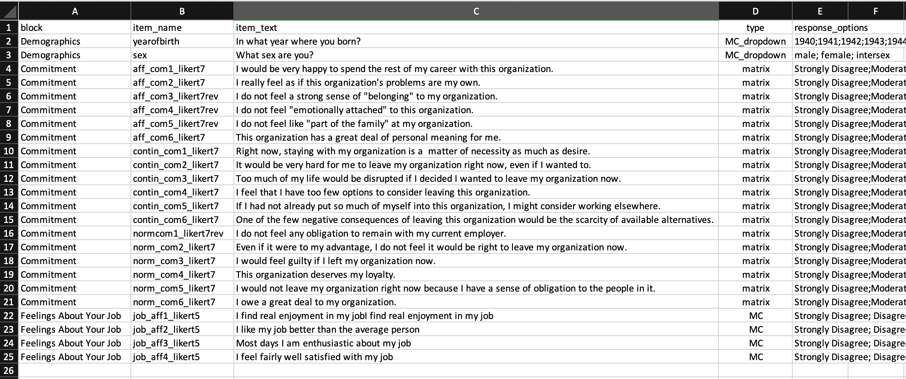
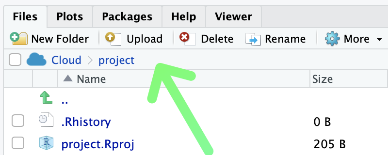
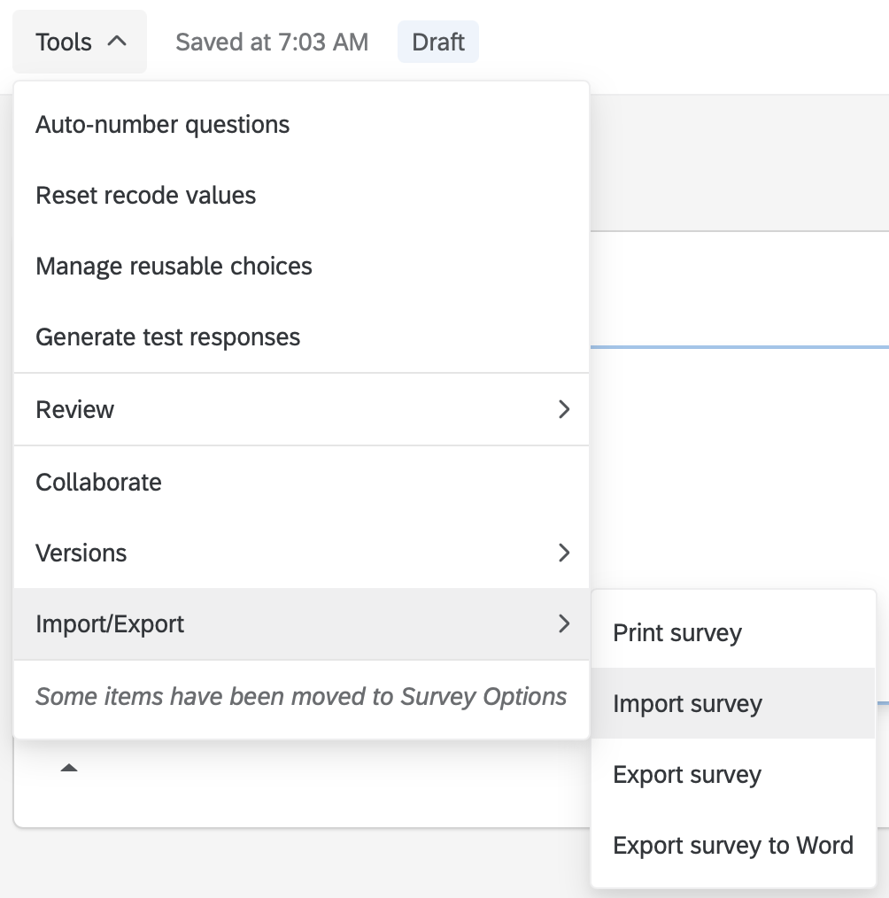
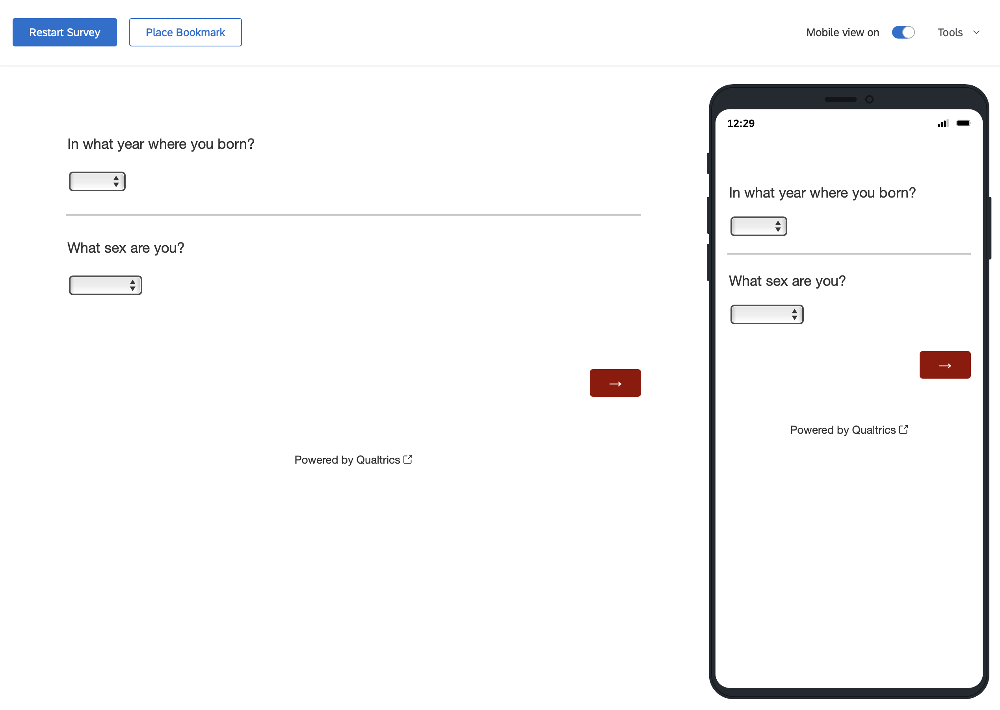
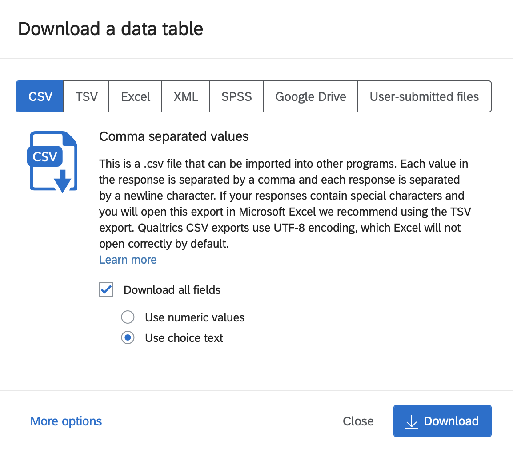

# Qualtrics

```{r, include=FALSE}
library(tidyverse)
```
## Overview

There are two tasks covered in this section: 1) importing surveys into Qualtrics and 2) moving data from Qualtrics to R. An overview of each process is below.

**1. Importing items into Qualtrics**

* Create a survey codebook in Excel (or similar program) that has each item and the response options for it
* Convert the survey codebook to Qualtrics [Advanced Text Format](https://www.qualtrics.com/support/survey-platform/survey-module/survey-tools/import-and-export-surveys/)
* Import the items
* Tweak the survey after import

**2. Qualtrics Data to R**

* Export the raw data from Qualtrics with maximal information in the data file
* Load the raw data into R
* Convert the raw data to analytic data. This conversion includes: assigning values to response options (e.g., "Strongly Disagree" becomes the value 1), flipping response for reverse-worded (i.e., reverse-key) items, and creating scale scores.

The overall steps are quite simple and I walk you through each step in detail below.

## Required

The data files below are used in this chapter. Right click to save each file.

| Required Data |
|-------------------|
|[survey_codebook.csv](survey_codebook.csv)   |
|[survey_items_qualtrics_format.txt](survey_items_qualtrics_format.txt)   |
|[data_qualtrics_raw.csv](data_qualtrics_raw.csv)   |


The following CRAN packages must be installed:

| Required CRAN Packages |
|-------------------|
|tidyverse          |
|janitor            |
|remotes            |


The following GitHub packages must be installed:

| Required GitHub Packages |
|--------------------------|
|[dstanley4/qualtricsMaker](https://github.com/dstanley4/qualtricsMaker)|


A GitHub package can be installed using the code below:

```{r, eval = FALSE}
remotes::install_github("dstanley4/qualtricsMaker")
```


## Items to Qualtrics

There are two approaches to entering survey items into Qualtrics.

* Enter the items one at a time using the Qualtrics web interface.

* Create a text file using Qualtrics [Advanced Text Format](https://www.qualtrics.com/support/survey-platform/survey-module/survey-tools/import-and-export-surveys/) and import the times. Be warned though a bit of tweaking is often still needed using the web interface.

Here we focus only on the second approach to entering items into Qualtrics.

### Create survey codebook

We want to create a survey that contains 2 demographics items, 18 commitment items, and 4 job satisfaction items. We have entered the items into the [survey_codebook.csv](survey_codebook.csv) file (illustrated below). We treat the 2 demogrpahic questions as block, the 18 commitment items as a block, and the 4 job satisfaction items as a block. Below I describe what information should be place into each of the columns in the survey codebook (block, item_name, item_text, type, response_options).

```{r, echo=FALSE, out.width="100%"}

```

#### block column

Enter any text you wish to use as a label for a block of items.

#### item_name column

To make your life easier down the road, it is critical you set up your spreadsheet or online survey such that it uses a naming convention prior to data collection. The naming conventions suggested here are adapted from the tidyverse [style guide](https://style.tidyverse.org).

* Do not allow Qualtrics to name your items for you. Set up meaningful names for each item.

* Lowercase letters only

* If two word column names are necessary, only use the underscore ("_") character to separate words in the name.

* Avoid short decontextualized variable names like q1, q2, q3, etc.

* Do use moderate length column names. Aim to achieve a unique prefix for related columns so that those columns can be selected using the starts_with() command discussed in the previous chapter. Be sure to avoid short two or three letter prefixes for item names. Instead, use unique moderate length item prefixes so that it will easy to select those columns using start_with() such that you don't accidentally get additionally columns you don't want - that have a similar prefix. 

* Likert items. Be sure to indicate the following information in the name of each Likert item or you will make your life substantially more complicated when you start to analyze your data. The information to include: a) the name of the measure, b) the item number for the measure, c) that it is a Likert item, d) the number of Likert response options, and e) whether the item is reverse keyed. That's five things to include in each Likert item name. But it's easy to do so. Consider two "affective commitment" items, the 2nd and 3rd items on scale. Both items use a 5-point Likert response format. However, item 3 is reverse keyed. **Names that conform to this convention are: aff_com3_likert5, aff_com3_likert5rev.**  Usiing this naming convention ensure you can easily select and convert the items later. You can select by "likert5", "likert5rev" or select by "aff_com".

* If you have a column name that represents the levels of two repeated measures variables only use the underscore character to separate the levels of the different variables. See within-participant ANOVA section below for details.

##### Likert-type items

A Likert-type item is typically composed of a statement with which participants are asked to agree or disagree. For example, participants could be asked to indicate the extent to which they agree with a number of statements such as "I like my job". Then they would be presented with response scale such as: 1 - Strongly Disagree, 2 - Moderately Disagree, 3 - Neutral, 4, Moderately Agree, 5 - Strongly Agree. A common question is, how should I enter the data?

**Export texst responses not numbers** Software such as Qualtrics gives you the option of exporting the label (e.g., "Strongly Agree") or a value (e.g., 1). Make sure you export the text lable ("Strongly Agree). That way, the data file stands alone - and doesn't require additional knowledge to know what "1" means. You can easily convert the labels to numbers later.

* **High numbers should be associated with more of the construct being measured.** When designing your survey or data collection tools, it is important that you set the response options appropriately. If your scale measures job satisfaction, it is important that you collect data in a manner that ensures high numbers on the job satisfaction scale indicate high levels of job satisfaction. Therefore, assigning numbers makes sense using the 5-point scale: 1 - Strongly Disagree, 2 - Moderately Disagree, 3 - Neutral, 4, Moderately Agree, 5 - Strongly Agree. With this approach high response numbers indicate more job satisfaction. However, using the opposite scale would not make sense: 1 - Strongly Agree, 2 - Moderately Agree, 3 - Neutral, 4, Moderately Disagree, 5 - Strongly Disagree. With this opposite scale high numbers on a job satisfaction scale would indicate lower levels of job satisfaction - a very confusing situation. Avoid this situation, assign numbers so that higher numbers are associated with more of the construct being measured. 

* **Use appropriate item names.** As described in the naming convention section, use moderate length names with different labels for each subscale.

* **Use moderate length column names unique to each subscale**. Imagine you have a survey with an 18-item commitment scale [@meyer1993commitment] composed of three 6-item subscales: affective, normative, and continuance commitment. It would be a poor choice to prefix the labels of all 18 columns in your data with "commit" such that the names would be commit1, commit2, commit3, etc. The problem with this approach is that it fails to distinguish among the three subscales in naming convention; making it impossible to select the items for a single subscale using starts_with(). A better, but still poor choice for a naming convention would be use use a two letter prefix for the three scale such ac, nc, and cc. This would result in names for the columns like ac1, ac2, ac3, etc. This is an improvement because you could apparently (but likely not) select the columns using starts_with("ac"). The problem with these short names is that there could be many columns in data set that start with "ac" beside the affective commitment items. You might want to select the affective commitment items using starts_with("ac"); but you would get all the affective commitment item columns; but also all the columns measuring other variables that also start with "ac". Therefore, it's a good idea to use a moderate length unique prefix for column names. For example, you might use prefixes like affect_com, norm_com, and contin_com for the three subscales. But see below because you need to include more than this in each name. 

* **Indicate these 5 things in each Likert item name.** Be sure to indicate the following information in the name of each Likert item or you will make your life substantially more complicated when you start to analyze your data. The information to include: a) the name of the measure, b) the item number for the measure, c) that it is a Likert item, d) the number of Likert response options, and e) whether the item is reverse keyed. That's five things to include in each Likert item name. But it's easy to do so. Consider two "affective commitment" items, the 2nd and 3rd items on scale. Both items use a 5-point Likert response format. However, item 3 is reverse keyed. **Names that conform to this convention are: aff_com3_likert5, aff_com3_likert5rev.**  Usiing this naming convention ensure you can easily select and convert the items later. You can select by "likert5", "likert5rev" or select by "aff_com".

**Indicate in the item name if the item is reversed keyed. ** Sometimes with Likert-type items, an item is reverse keyed. For example, on a job satisfaction scale, participants will typically respond to items that reflect job satisfaction using the scale: 1 - Strongly Disagree, 2 - Moderately Disagree, 3 - Neutral, 4, Moderately Agree, 5 - Strongly Agree. Higher numbers indicate more job satisfaction. Sometimes, however, some items will use the same 1 to 5 response scale but be worded in the opposite manner such as "I hate my job". Responding with a 5 to this item would indicate high job *dissatisfaction*. But the columns for job satisfaction items should have high values indicate job satisfaction not job dissatifaction. Consequently, we flag the names of columns with reversed responses (i.e., reverse-key items) so that we know to treat those column differently later. Columns with reverse-keyed items need to be processed by a script so that the values are flipped and scored in the right direction. The procedure for doing so is outlined in the next point.  

 **Indicate in the item name the range for reverse-key items.** If an item is reverse keyed, the process for the flipping the scores depends upon the range of a scale. Although 5-point scales are common, any number of points are possible. The process for correcting a reverse-key item depends upon: 1) the number of points on the scale, and 2) the range of the points on the scale. The reverse-key item correction process is different for an item that uses a 5-point scale ranging from 1 to 5 versus from 0 to 4. Both are 5-point scales but your correction process will be different. Therefore, for reverse-key items add a suffix at the end of each item name that indicates an item is reverse keyed and the range of the item. For example, if the third job satisfaction item was reversed keyed on scale using a 1 to 5 response format you might name the item: job_sat3_likert5rev. The suffix "_likert5rev" indicates the item is Likert item that is reverse keyed and the range of responses used on the item is 1 to 5. Be sure to set up your survey with this naming convention when you collect your data.

* If you collect items over multiple time points use a prefix with a short code to indicate the time followed by an underscore. For example, if you had a multi-item self-esteem scale you might call the column for the first time "t1_esteem1_likert5rev". This indicate that you have for time 1 (t1), the first self-esteem item (esteem1) and that item is a likert item that is reverse keyed on a 1 to 5 scale.


#### item_text column

The item_text column contains the text for each item. Note that if you use commas in your item text do not save this file as a .csv file - it will not work. Rather save it as .tsv file (tab separated values). Then use read_tsv command instead of the read_csv command in the code that follows later.


#### type column

| Code for type column | Qualtrics Item Type | Additional Information  |
|----------------------|---------------------|-------------------------|
| matrix               | matrix     | If the first item in a block has type *matrix* all items in the block will be used to constucts the matrix question. **Unfortunately, importing item_names for matrix questions is not supported by qualtrics. You will need to manually restore your item_names following the directions below for matrix items.** |
| MC                   | multiple choice vertical format  |  |
| MC_horizonal         | multiple choice horizontal format  |  |
| MC_multi_horizonal   | multiple choice horizontal format multiple answers |  |
| MC_select            | select box |  |
| MC_multi_select      | select multiple boxes     |  |
| MC_dropdown          | dropdown   |  |


#### response_options column

The Likert items for the different blocks use different response options. The commitment items use a 7-point response option and the job satisfaction items use a 5-point response option.

##### Year of birth

We used a number of response options to indicate Year of Birth. We entered them as per below. Each response option is separated by a semi-colon. Each of the years below will be in the dropdown button.

**Entered in the response_option column as below. Each option separated by a semicolon.**

1940;1941;1942;1943;1944;1945;1946;1947;1948;1949;1950;1951;1952;1953;1954;1955;1956;1957;1958;1959;1960;1961;1962;1963;1964;1965;1966;1967;1968;1969;1970;1971;1972;1973;1974;1975;1976;1977;1978;1979;1980;1981;1982;1983;1984;1985;1986;1987;1988;1989;1990;1991;1992;1993;1994;1995;1996;1997;1998;1999;2000;2001;2002;2003;2004;2005;2006;2007;2008;2009;2010


##### Sex 3 points

| Sex 3-point Response Options |
|-------------------|
| 1 - male |
| 2 - female|
| 3 - intersex|

**Entered in the response_option column as below. Each option separated by a semicolon.**

males; female; intersex


##### Commitment 7 points

| Commitment 7-point Response Options |
|-------------------|
| 1 - Strongly Disagree |
| 2 - Moderately Disagree|
| 3 - Slightly Disagree|
| 4 - Neither Agree nor Disagree|
| 5 - Slightly Agree|
| 6 - Moderately Agree|
| 7 - Strongly Agree|

**Entered in the response_option column as below. Each option separated by a semicolon.**

Strongly Disagree;Moderately Disagree;Slightly Disagree;Neither Agree nor Disagree;Slightly Agree;Moderately Agree;Strongly Agree


To indicate this information in the survey_items.csv file, in the **response_options** column we put 

##### Job Satisfaction 5 points

| Job Satisfaction 5-point Response Options |
|-------------------|
| 1 - Strongly Disagree |
| 2 - Disagree|
| 3 - Neutral|
| 4 - Agree|
| 5 - Strongly Agree|

**Entered in the response_option column as below. Each option separated by a semicolon.**

Strongly Disagree; Disagree; Neutral; Agree; Strongly Agree

### Convert to Qualtrics format

#### Create TXT file

Once you have the survey codebook above, you need to convert it to an [Advanced Text Format](https://www.qualtrics.com/support/survey-platform/survey-module/survey-tools/import-and-export-surveys/) .txt file. We can do so by following the steps below.

##### RStudio on your computer
1. Create a folder on your computer with the survey_codebook.csv file in it. if you are using RStudio Clo

2. Op


##### RStudio Cloud

1. Open a new project

2. Ensure you ave installed the packages specified above by typing the commands below into the RStudio Cloud Console (not the script window).

```{r, eval=FALSE}
install.packages("tidyverse", dep = TRUE)
install.packages("janitor", dep = TRUE)
install.packages("remotes", dep = TRUE)
```

Then install the qualtricsMaker package from GitHub:

```{r, eval = FALSE}
remotes::install_github("dstanley4/qualtricsMaker")
```

3. Import the [survey_codebook.csv](survey_codebook.csv) file by using the Import button in the Files tab in the lower right panel.

```{r, echo = FALSE, out.width = "50%"}

```


### Import the items

##### Click the Create New Project button.

```{r, echo=FALSE, out.width="30%"}
knitr::include_graphics("ch_qualtrics/images/screenshot_b1.png")
```

#### Select the Survey option.

```{r, echo=FALSE, out.width="30%"}
knitr::include_graphics("ch_qualtrics/images/screenshot_b2.png")
```

#### Click the Get Started button.

```{r, echo=FALSE, out.width="40%"}
knitr::include_graphics("ch_qualtrics/images/screenshot_b3.png")
```

#### Enter project name, click Create Project

```{r, echo=FALSE, out.width="40%"}
knitr::include_graphics("ch_qualtrics/images/screenshot_b4.png")
```

#### Use the Tools menu to import the items

Select the Import option and then specify the filename for the Advanced Text import file with the items in it.

```{r, echo=FALSE, out.width="50%"}

```


#### Resulting Survey

The resulting survey for data collection looks like the image below.

```{r, echo=FALSE, out.width="30%"}

```

### Tweak survey in Qualtrics


## Qualtrics data to R

Following data collection, you can obtain your data from Qualtrics. As of 2021, Tri-Agency (NSERC, SSHRC, CIHR) [policy](https://www.science.gc.ca/eic/site/063.nsf/eng/h_97610.html) is that data collected with Tri-Agency funded research must be available for reuse by others. The data should follow the FAIR (Findable, Accessible, Interoperable, and Reusable) principle. Consequently, when you export the data from Qualtrics (and eventually post it) we want to ensure it has as much information in it as possible. This principle guides the options we select below.

### Export from Qualtrics

#### Click the Data & Analysis tab


```{r, echo=FALSE, out.width="70%"}
knitr::include_graphics("ch_qualtrics/images/screenshot_data.png")
```

##3# Click the Export & Import button.

Then click the **Export Data...** option.

```{r, echo=FALSE, out.width="20%"}
knitr::include_graphics("ch_qualtrics/images/screenshot_export.png")
```


#### Click Use Choice Text

To ensure the data can be used by others, as per the FAIR policy described above, we SELECT the "Use Choice Text" option when exporting data. If you were (non-optimally) select "Use numeric value" as an export option then the resulting data file would be missing information that make it difficult for others to use. Then click the Download button.

```{r, echo=FALSE, out.width="60%"}

```


In doing so we have several goals

* Ensure a workflow that is reproducible. 

* Ensure the data file has as much information as possible - so facilitate reuse by others. 


### Load data in R

### Convert to analytic data
