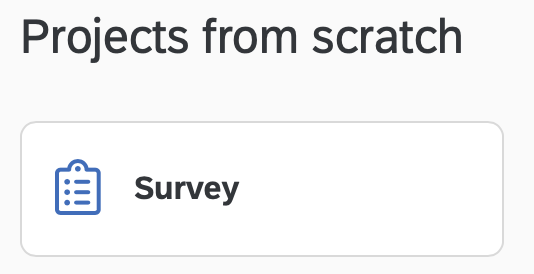

# Qualtrics

```{r, include=FALSE}
library(tidyverse)
```

## Required

The data files below are used in this chapter. Right click to save each file.

| Required Data |
|-------------------|
|[data_qualtrics_raw.csv](data_qualtrics_raw.csv)   |


The following CRAN packages must be installed:

| Required CRAN Packages |
|-------------------|
|tidyverse          |


## Qualtrics Survey Creation

There are two approaches to entering survey items into Qualtrics.

* Enter the items one at a time using the Qualtrics web interface.

* Create a text file using *Qualtrics Advanced Text Import format* and import the times. Be warned though a bit of tweaking is often still needed using the web interface.

Here we focus only on the second approach to entering items into Qualtrics.

## Items

We want to create a survey that contains 18 commitment items and 4 job satisfaction items. We have entered the items into the XXXX file (illustrated below). We treat the 18 commitment items as a block and the 4 job satisfaction items as a block for the survey.

```{r, echo=FALSE, out.width="100%"}
knitr::include_graphics("ch_qualtrics/screenshot_items.png")
```


### Response options

The Likert items for the different blocks use different response options. The commitment items use a 7-point response option and the job satisfaction items use a 5-point response option.

#### 7-point scale

| Commitment 7-point Response Options |
|-------------------|
| 1 - Strongly Disagree |
| 2 - Moderately Disagree|
| 3 - Slightly Disagree|
| 4 - Neither Agree nor Disagree|
| 5 - Slightly Agree|
| 6 - Moderately Agree|
| 7 - Strongly Agree|

To indicate this information in the survey_items.csv file, in the **response_options** column we put "Strongly Disagree;Moderately Disagree;Slightly Disagree;Neither Agree nor Disagree;Slightly Agree;Moderately Agree;Strongly Agree" for each item.


#### 5-point scale

| Job Satisfaction 5-point Response Options |
|-------------------|
| 1 - Strongly Disagree |
| 2 - Disagree|
| 3 - Neutral|
| 4 - Agree|
| 5 - Strongly Agree|

To indicate this information in the survey_items.csv file, in the **response_options** column we put "Strongly Disagree; Disagree; Neutral; Agree; Strongly Agree" for each item.

### Create item file


### Import into Qualtrics

#### Click the Create New Project button.

```{r, echo=FALSE, out.width="30%"}
knitr::include_graphics("ch_qualtrics/screenshot_b1.png")
```

#### Select the Survey option.

```{r, echo=FALSE, out.width="30%"}

```

#### Click the Get Started button.

```{r, echo=FALSE, out.width="40%"}
knitr::include_graphics("ch_qualtrics/screenshot_b3.png")
```

#### Enter project name, click Create Project

```{r, echo=FALSE, out.width="40%"}
knitr::include_graphics("ch_qualtrics/screenshot_b4.png")
```

#### Use the Tools menu to import the items

Select the Import option and then specify the filename for the Advanced Text import file with the items in it.

```{r, echo=FALSE, out.width="50%"}
knitr::include_graphics("ch_qualtrics/screenshot_b5.png")
```


### Resulting Survey

The resulting survey for data collection looks like the image below.

```{r, echo=FALSE, out.width="30%"}
knitr::include_graphics("ch_qualtrics/screenshot_iphone.png")
```

## Exporting from Qualtrics

Following data collection, you can obtain your data from Qualtrics. As of 2021, Tri-Agency (NSERC, SSHRC, CIHR) [policy](https://www.science.gc.ca/eic/site/063.nsf/eng/h_97610.html) is that data collected with Tri-Agency funded research must be available for reuse by others. The data should follow the FAIR (Findable, Accessible, Interoperable, and Reusable) principle. Consequently, when you export the data from Qualtrics (and eventually post it) we want to ensure it has as much information in it as possible. This principle guides the options we select below.

### Click the Data & Analysis tab


```{r, echo=FALSE, out.width="70%"}
knitr::include_graphics("ch_qualtrics/screenshot_data.png")
```

### Click the Export & Import button.

Then click the **Export Data...** option.

```{r, echo=FALSE, out.width="20%"}
knitr::include_graphics("ch_qualtrics/screenshot_export.png")
```


### Click Use Choice Text

To ensure the data can be used by others, as per the FAIR policy described above, we SELECT the "Use Choice Text" option when exporting data. If you were (non-optimally) select "Use numeric value" as an export option then the resulting data file would be missing information that make it difficult for others to use. Then click the Download button.

```{r, echo=FALSE, out.width="60%"}
knitr::include_graphics("ch_qualtrics/screenshot_export_choice.png")
```

## Loading into R


In doing so we have several goals

* Ensure a workflow that is reproducible. 

* Ensure the data file has as much information as possible - so facilitate reuse by others. 
