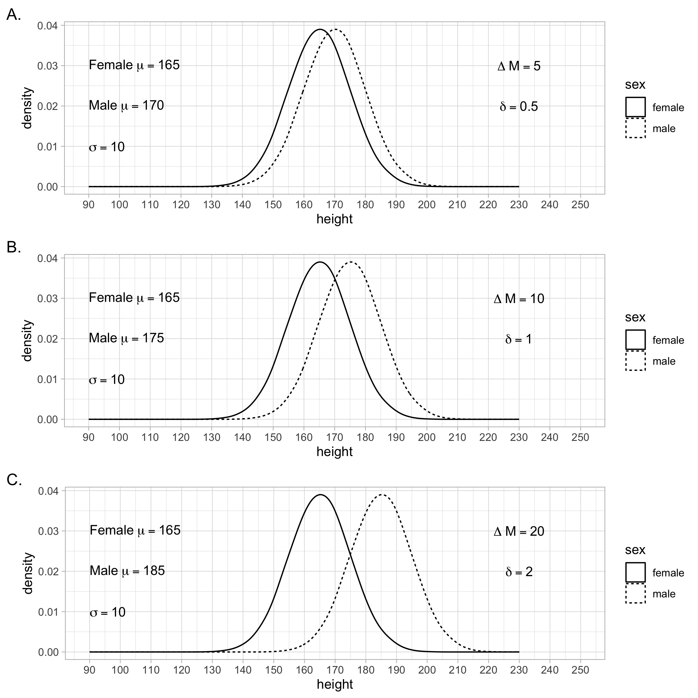
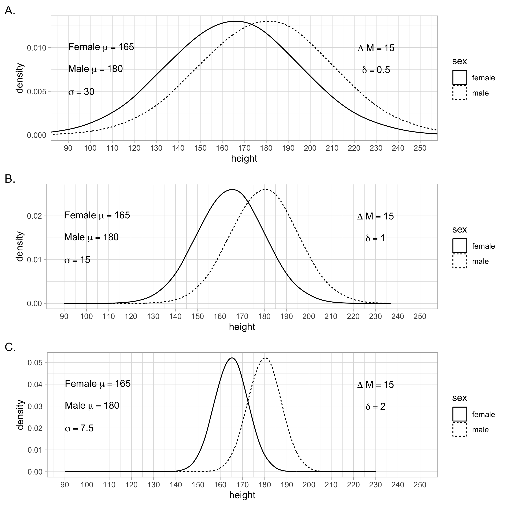
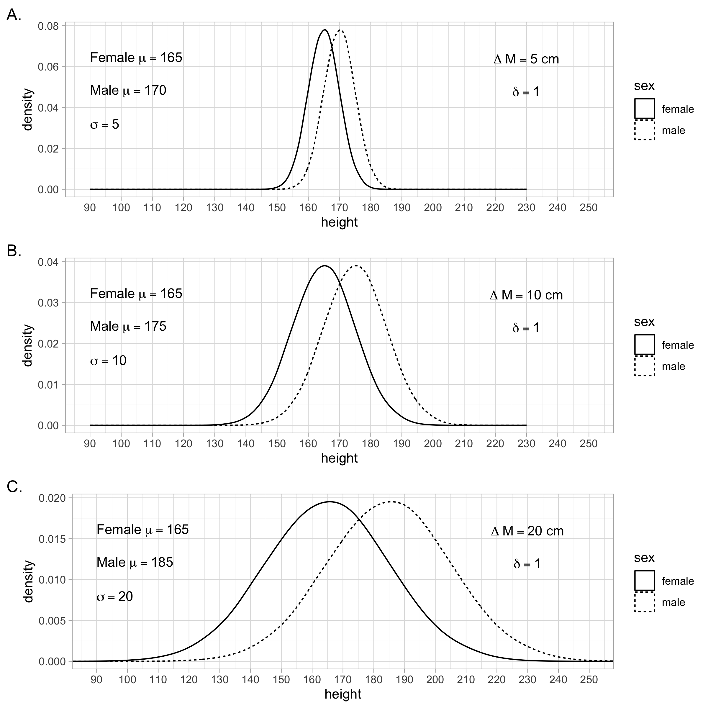
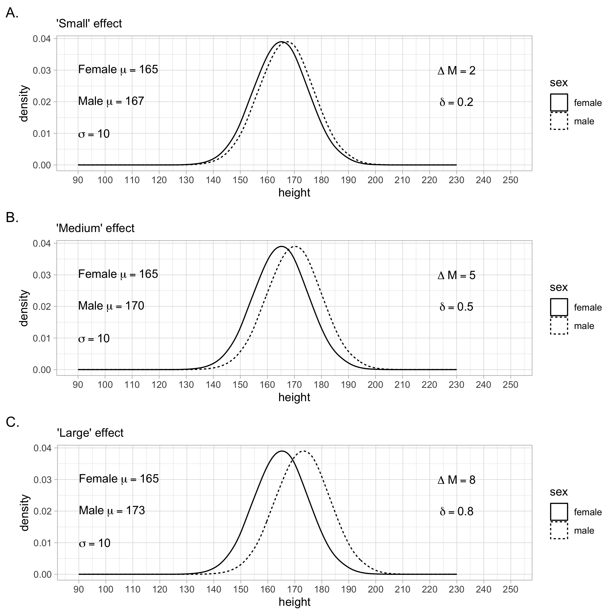

# Populations

```{r, include=FALSE}
library(tidyverse)
```

## Notation

In this chapter we will use summation notation. If you are not familiar with summation notation, we present a brief overview here.

Consider a scenario where we have the IQ data for three participants We use the N symbol to represent the number of participants. Because we have three participants N = 3. The data for these participants is illustrated in Figure \@ref(fig:notationdata).

Notice how each person in the data set can be represented by the variable X: the first person by $X_1$, the second by $X_2$, and the third by $X_3$. Often we refer to individuals in a data set by using the variable X accompanied by a subscript (e.g., 1, 2, 3, etc.).

```{r notationdata, echo = FALSE, out.width="40%", fig.cap = "Data for understanding summation notation"}
knitr::include_graphics("ch_populations/images/screenshot_data_n6.png")
```

Referring to participants using the variable X and subscript is valuable because it can be used in conjunction with the sigma (i.e., $\Sigma$) symbol for summation. Consider the example below in which we use the summation notation to indicate that we want to add all the X values (representing IQ) for the participants. We use a lower case $i$ to represent all possible subscript values. The notation, $i$ = 1, below the $\Sigma$ symbol indicates that we should start with participant 1. The notation, N, above the $\Sigma$ symbol indicates that we should iterate $i$ up to the value indicated by N; in this case 3, because there are three participants.

$$
\begin{aligned} 
\sum_{i=1}^{N} X_i &=  X_1 + X_2 + X_3\\ 
&= 110 + 120 + 100 \\
&= 330
\end{aligned} 
$$

Sometimes, to simplify the notation, the numbers above and below the $\Sigma$ symbol are omitted. Likewise, the $i$ subscript is omitted. There is a general understanding that these components of the notation are omitted that the version of the notation above is implied.

$$
\begin{aligned} 
\sum{X} &= X_1 + X_2 + X_3\\ 
&= 110 + 120 + 100\\
&= 330
\end{aligned} 
$$


**Calculating a mean**. The full version of the notation can be used to indicate how anb= average/mean is calculated.


$$
\begin{aligned} 
\bar{X} &= \frac{\sum_{i=1}^{N} X_i}{N} \\
&= \frac{X_1 + X_2 + X_3}{3}\\ 
&= \frac{110 + 120 + 100}{3}\\
&= \frac{330}{3}\\
&= 110\\
\end{aligned} 
$$

Likewise, the concise version of the notation can be used to indicate how an average/mean is calculated.

$$
\begin{aligned} 
\bar{X} &= \frac{\sum{X}}{N} \\
&= \frac{X_1 + X_2 + X_3}{3}\\ 
&= \frac{110 + 120 + 100}{3}\\
&= \frac{330}{3}\\
&= 110\\
\end{aligned} 
$$


**Calculating squared differences**.A common task in statistics is to calculate 1) the squared difference between each person and the mean, and 2) add up those squared differences. This calculation is easily expressed with the full version of the notation.

$$
\begin{aligned} 
\sum_{i=1}^{N}{(X_i - \bar{X})^2} &= (X_1-\bar{X})^2 + (X_2-\bar{X})^2 + (X_3-\bar{X})^2\\ 
&= (110-110)^2 + (120-110)^2 + (100-110)^2\\
&= (0)^2 + (10)^2 (-10)^2 \\
&= 0 + 100 + 100 \\
&= 200
\end{aligned} 
$$

Likewise, the sum of the squared differences from the mean can be expressed using the concise version of the notation.

$$
\begin{aligned} 
\sum{(X - \bar{X})^2} &= (X_1-\bar{X})^2 + (X_2-\bar{X})^2 + (X_3-\bar{X})^2\\ 
&= (110-110)^2 + (120-110)^2 + (100-110)^2\\
&= (0)^2 + (10)^2 (-10)^2 \\
&= 0 + 100 + 100 \\
&= 200
\end{aligned} 
$$


## Population vs samples

As we move closer to conducting our own research it is critical to make a distinction between populations and samples. A population is the complete set of people/animals about which we want to make conclusions. A samples is a subset of the total number of people/animals in the population. In most scenarios it is impractical to work with an entire population and, for practical reasons, we study a subset of the population called a sample. 

Researchers, and consumers of research, typically have little interest in making conclusions at the sample level. In general, we care about conclusions that generalize to the population but not conclusions that only apply to specific individuals in the sample. Consider the case of COVID-19. Imagine a team of researchers creates a vaccine that they hope generates immunity to COVID-19. We care very little if the immunity only works for the specific individuals in the study. However, we care a great deal if the immunity works, or is likely to work, for all Canadians or all humans. Thus, we study samples but typically wish to make conclusions that apply to the population.

Statistic tests are a means of helping researchers use sample data to make conclusions at the population level. When we calculate a number that summarises an attribute of all of the people/animals in the population we refer to it as a **parameter**. 

## A small population

Populations are typically quite large but, for the purpose of reviewing how we typically describe populations, we focus on a population of just three chocolate chip cookies. We refer to the three cookies as $X_1$, $X_2$, and $X_3$. The cookies have the weights of 8, 10, and 12 grams, respectively. 

### Mean ($\mu$)

It can be helpful to create a model that describes our data. Of course, the model won’t describe every participant perfectly and each participant will differ to some extent from the model.

**Model:** To create a model we first need data, which in this example will be the weight of three different chocolate chip cookies. As mentioned previously, the weights the three cookies are designated by $X_1$, $X_2$, and $X_3$. A simple model for our cookie weight data is the mean, $\mu$. 


$$
\begin{aligned} 
\mu &= \frac{\sum{X}}{N} \\
&= \frac{X_1 + X_2 + X_3}{3}\\ 
&= \frac{8 + 10 + 12}{3}\\
&= \frac{30}{3}\\
&= 10\\
\end{aligned} 
$$


We can think of the “mean cookie" as our model for our cookie weight data, see Figure \@ref(fig:meancookie). The "mean cookie" is represented by $\mu$ in equations. 

```{r meancookie, echo=FALSE, out.width="60%", fig.cap="Variance as a fit index for the mean"}
knitr::include_graphics("ch_populations/images/cookie.png")
```


**Error:**  As mentioned previously, each participant (i.e., cookie) differs to some extent from our model (“mean cookie"). In general this can be conceptualized as:

$$
\begin{aligned} 
X_i &= model + error_i \\
\end{aligned} 
$$

More specifically, the difference between the weight of any individual cookie ($X_i$) and the model ($\mu$) is indicated by $error_i$ as shown below. 

$$
\begin{aligned} 
X_i &= \mu + error_i \\
\end{aligned} 
$$

The model, above is just a concise way of describing the following:

$$
\begin{aligned} 
X_1 &= \mu + error_1 \\
X_2 &= \mu + error_2 \\
X_3 &= \mu + error_3 \\
\end{aligned} 
$$

That is the weights of the three cookies ($X_1 = 8$, $X_2 = 10$, and $X_3 = 12$) can be conceptualized as:


$$
\begin{aligned} 
X_1 &= 10 + (-2) \\
X_2 &= 10 + 0 \\
X_3 &= 10 + 2 \\
\end{aligned} 
$$


The mean of the population, $\mu = 10$, is a parameter that serves as model for the cookie weight data. When we calculate a model for our data, it's helpful to have an index of how well the model fits the data. Or perhaps more accurately, it's helpful to have a single number that indicates extent to which the data (e.g., cookie weights) differs from the model.

### Variance ($\sigma^2$)

Variance is a simple way of calculating how data differs from the model. It is represented by the symbol $\sigma^2$.

We want to index the extent to which the data differs from the model -- that is, we want to see the extent to which the cookie weights differ from our "mean cookie" model. Variance is a simple approach to assessing the fit of the model - or more accurately the lack of fit of our model. 

**Why use squared errors?** Error, the extent to which the data deviates from the model, is calculated using squared differences. That is, take each data point, subtract the model value, and then square the resulting number (e.g., $(8 - 10)^2 = 4$). It probably strikes you as an odd choice to square the difference between each data point and the model. Why not just take the difference (e.g., $(8 - 10) = -2$) or take the absolute difference (e.g., $|8 - 10|= 2$)? The answer is somewhat complex, but it relates to the more general situation in statistics of trying to find models that best fit the data (which occurs by minimizing errors). When we use error as the squared difference it is easier to apply calculus, via derivatives, to calculate a model that minimizes the errors (i.e., obtains the best fit). Long story short, for complex statistical reasons, we use squared differences to index error rather than other approaches.


| Cookie Mass |  Model | Error = Squared Difference | 
| ---         |  ---   |  ---             |
| $X_1 = 8$  |  $\mu = 10$ |  $(X_1 - \mu)^2 =(8 - 10)^2= 4$ |
| $X_2 = 10$  |  $\mu = 10$ |  $(X_2 - \mu)^2 =(10 - 10)^2= 0$ |
| $X_3 = 12$  |  $\mu = 10$ |  $(X_3 - \mu)^2 =(12 - 10)^2= 4$ |

You can see in the table above that we can calculate the squared differences for data points 1 through 3 (i.e., cookie weights 1 through 3). The squared differences are 4, 0, and 4, respectively. We combine these numbers into a single index by taking an average. This calculation, $(4 + 0 + 4)/3 = 2.67$, tells us the average of the squared deviations from the model is 2.67 grams$^2$. Because we squared the differences the units  are also squared; in this case grams$^2$. .We refer to 2.67 grams$^2$ as the variance. 

Recall the formula for calculating an avearge:

$$
\begin{aligned} 
\bar{X} &= \frac{\sum{X}}{N} \\
\end{aligned} 
$$

You can see from the formula for variance below that variance is just an average. Variance is the average of the squared errors.

$$
\begin{aligned} 
\sigma^2 &= \frac{\sum{(X - \bar{X})^2}}{N}\\
&= \frac{(X_1-\bar{X})^2 + (X_2-\bar{X})^2 + (X_3-\bar{X})^2}{N}  \\ 
&= \frac{(8-10)^2 + (10-10)^2 + (12-10)^2}{3}\\
&= \frac{(-2)^2 + (0)^2 (2)^2}{3} \\
&= \frac{4 + 0 + 4}{3} \\
&= \frac{8}{3} \\
&= 2.67 grams^2 \\
\end{aligned} 
$$


**Interpretation**. A variance of zero indicates that the model fits the data perfectly. In the cookie case, if the variance was zero, that would indicate that all the cookies had the same mass as the model, exactly 10 grams. To the extent that the variance is larger than zero it implies data points (i.e., cookie weights) differ from the model (i.e., the mean cookie). By implication, a larger variance indicates larger  differences among the observations (e.g., cookie weights). That is, when the variance is small, cookie weights tend to similar to the model -- and each other. In contrast, when the variance is large, cookie weights tend to different from the model -- and each other.

### Standard Deviation ($\sigma$)

Variance is easy to interpret as the average of the squared differences between the model and the data. However, variance presents an answer in squared units (e.g., 2.67 grams$^2$). Consequently, some people prefer to take the square root of this value and call it standard deviation; representing it with the symbol $\sigma$.

$$
\begin{aligned} 
\sigma &= \sqrt{var(X)} \\
&= \sqrt{2.67} \\
&= 1.63 grams\\
\end{aligned} 
$$

Unfortunately, although variance has a straight forward interpretation, standard deviation does not. Consider what happens when you take the square root of variance. Standard deviation can be thought of as the sum of the absolute deviations from the mean divided by the square root of the number of observations. Standard deviation is not an average - because you are dividing by the square root of N instead of just N. As a result, it's much harder to describe what standard deviation means.

$$
\begin{aligned} 
sd(X) &= \sqrt{\frac{\sum{(X - \bar{X})^2}}{N}}\\
 &= \frac{\sum{|X - \bar{X}|}}{\sqrt{N}}\\
\end{aligned} 
$$


We encourage you to think primarily in terms of variance rather than standard deviation due to the fact the interpretation of variance is more straightforward. Additionally, variance is foundational in the language used to describe regression and analysis of variance. That said, standard deviation is used in the calculation of some standardized effect sizes - so it is important to know and understand both indices.


```{r, include = FALSE}
library(learnSampling)
library(tidyverse)

# varible means, d-value of 0.5
hdata1 <- get_height_population(mdiff = 5, std = 10)
hdata1$sex <- as.factor(hdata1$sex)
hdata1$dvalue <- 0.5

# variable means, d-value of 1.0
hdata2 <- get_height_population(mdiff = 10, std = 10)
hdata2$sex <- as.factor(hdata2$sex)
hdata2$dvalue <- 1.0

# variable means, d-value of 2.0
hdata3 <- get_height_population(mdiff = 20, std = 10)
hdata3$sex <- as.factor(hdata3$sex)
hdata3$dvalue <- 2.0

textMean1 <- expression(Delta~"M" == 5)
textMean2 <- expression(Delta~"M" == 10)
textMean3 <- expression(Delta~"M" == 20)
textd1 <- expression(delta == 0.50)
textd2 <- expression(delta == 1.00)
textd3 <- expression(delta == 2.00)
textfemale1 <- expression("Female"~mu == 165)
textfemale2 <- expression("Female"~mu == 165)
textfemale3 <- expression("Female"~mu == 165)
textmale1 <- expression("Male"~mu == 170)
textmale2 <- expression("Male"~mu == 175)
textmale3 <- expression("Male"~mu == 185)
texts1 <- expression(sigma == 10)
texts2 <- expression(sigma == 10)
texts3 <- expression(sigma == 10)


g1 <- ggplot(data = hdata1,
       mapping = aes(x = height, linetype = sex)) +
  geom_density(position = "identity", alpha = .50, adjust = 2) +
  coord_cartesian(xlim = c(90, 250)) +
  scale_x_continuous(breaks = seq(90, 250, by = 10)) +
  annotate("text", x = 230, y = .03, 
           parse = T, label = as.character(textMean1)) +
  annotate("text", x = 230, y = .02, 
           parse = T, label = as.character(textd1)) +
  annotate("text", x = 90, y = .03, 
           parse = T, label = as.character(textfemale1), hjust = 0) +
  annotate("text", x = 90, y = .02, 
           parse = T, label = as.character(textmale1), hjust = 0) +
  annotate("text", x = 90, y = .01, 
           parse = T, label = as.character(texts1), hjust = 0) +
  theme_light() +
  labs(tag = "A.")

g2 <- ggplot(data = hdata2,
       mapping = aes(x = height, linetype = sex)) +
  geom_density(position = "identity", alpha = .50, adjust = 2) +
  coord_cartesian(xlim = c(90, 250)) +
  scale_x_continuous(breaks = seq(90, 250, by = 10)) +
  annotate("text", x = 230, y = .03, 
           parse = T, label = as.character(textMean2)) +
  annotate("text", x = 230, y = .02, 
           parse = T, label = as.character(textd2)) +
  annotate("text", x = 90, y = .03, 
           parse = T, label = as.character(textfemale2), hjust = 0) +
  annotate("text", x = 90, y = .02, 
           parse = T, label = as.character(textmale2), hjust = 0) +
  annotate("text", x = 90, y = .01, 
           parse = T, label = as.character(texts1), hjust = 0) +
  theme_light() +
  labs(tag = "B.")

g3 <- ggplot(data = hdata3,
       mapping = aes(x = height, linetype = sex)) +
  geom_density(position = "identity", alpha = .50, adjust = 2) +
  coord_cartesian(xlim = c(90, 250)) +
  scale_x_continuous(breaks = seq(90, 250, by = 10)) +
  annotate("text", x = 230, y = .03, 
           parse = T, label = as.character(textMean3)) +
  annotate("text", x = 230, y = .02, 
           parse = T, label = as.character(textd3)) +
  annotate("text", x = 90, y = .03, 
           parse = T, label = as.character(textfemale3), hjust = 0) +
  annotate("text", x = 90, y = .02, 
           parse = T, label = as.character(textmale3), hjust = 0) +
  annotate("text", x = 90, y = .01, 
           parse = T, label = as.character(texts1), hjust = 0) +
  theme_light() +
  labs(tag = "C.")

png(file = "ch_populations/images/dvalue_ex1.png", res = 300, width = 8*300, height = 8*300)
gridExtra::grid.arrange(g1, g2, g3, nrow =3)
dev.off()
```


```{r, include = FALSE}
library(learnSampling)
library(tidyverse)

# fixed means, d-value of 0.5
hdata1 <- get_height_population(std = 30)
hdata1$sex <- as.factor(hdata1$sex)
hdata1$dvalue <- 0.5

# fixed means, d-value of 1.0
hdata2 <- get_height_population(std = 15)
hdata2$sex <- as.factor(hdata2$sex)
hdata2$dvalue <- 1.0

# same means, d-value of 2.0
hdata3 <- get_height_population(std = 7.5)
hdata3$sex <- as.factor(hdata3$sex)
hdata3$dvalue <- 2.0

textMean1 <- expression(Delta~"M" == 15)
textMean2 <- expression(Delta~"M" == 15)
textMean3 <- expression(Delta~"M" == 15)
textd1 <- expression(delta == 0.50)
textd2 <- expression(delta == 1.00)
textd3 <- expression(delta == 2.00)
textfemale1 <- expression("Female"~mu == 165)
textfemale2 <- expression("Female"~mu == 165)
textfemale3 <- expression("Female"~mu == 165)
textmale1 <- expression("Male"~mu == 180)
textmale2 <- expression("Male"~mu == 180)
textmale3 <- expression("Male"~mu == 180)
texts1 <- expression(sigma == 30)
texts2 <- expression(sigma == 15)
texts3 <- expression(sigma == 7.5)


g1 <- ggplot(data = hdata1,
       mapping = aes(x = height, linetype = sex)) +
  geom_density(position = "identity", alpha = .50, adjust = 2) +
  coord_cartesian(xlim = c(90, 250)) +
  scale_x_continuous(breaks = seq(90, 250, by = 10)) +
  annotate("text", x = 230, y = .01, 
           parse = T, label = as.character(textMean1)) +
  annotate("text", x = 230, y = .0075, 
           parse = T, label = as.character(textd1)) +
  annotate("text", x = 90, y = .01, 
           parse = T, label = as.character(textfemale1), hjust = 0) +
  annotate("text", x = 90, y = .0075, 
           parse = T, label = as.character(textmale1), hjust = 0) +
  annotate("text", x = 90, y = .0050, 
           parse = T, label = as.character(texts1), hjust = 0) +
  theme_light() +
  labs(tag = "A.")

g2 <- ggplot(data = hdata2,
       mapping = aes(x = height, linetype = sex)) +
  geom_density(position = "identity", alpha = .50, adjust = 2) +
  coord_cartesian(xlim = c(90, 250)) +
  scale_x_continuous(breaks = seq(90, 250, by = 10)) +
  annotate("text", x = 230, y = .02, 
           parse = T, label = as.character(textMean2)) +
  annotate("text", x = 230, y = .015, 
           parse = T, label = as.character(textd2)) +
  annotate("text", x = 90, y = .02, 
           parse = T, label = as.character(textfemale2), hjust = 0) +
  annotate("text", x = 90, y = .015, 
           parse = T, label = as.character(textmale2), hjust = 0) +
  annotate("text", x = 90, y = .01, 
           parse = T, label = as.character(texts2), hjust = 0) +
  theme_light() +
  labs(tag = "B.")

g3 <- ggplot(data = hdata3,
       mapping = aes(x = height, linetype = sex)) +
  geom_density(position = "identity", alpha = .50, adjust = 2) +
  coord_cartesian(xlim = c(90, 250)) +
  scale_x_continuous(breaks = seq(90, 250, by = 10)) +
  annotate("text", x = 230, y = .04, 
           parse = T, label = as.character(textMean3)) +
  annotate("text", x = 230, y = .03, 
           parse = T, label = as.character(textd3)) +
  annotate("text", x = 90, y = .04, 
           parse = T, label = as.character(textfemale3), hjust = 0) +
  annotate("text", x = 90, y = .03, 
           parse = T, label = as.character(textmale3), hjust = 0) +
  annotate("text", x = 90, y = .02, 
           parse = T, label = as.character(texts3), hjust = 0) +
  theme_light() +
  labs(tag = "C.")

png(file = "ch_populations/images/dvalue_ex2.png", res = 300, width = 8*300, height = 8*300)
gridExtra::grid.arrange(g1, g2, g3, nrow =3)
dev.off()

```


```{r, include = FALSE}
library(learnSampling)
library(tidyverse)

# variable means, d-value of 1.0
hdata1 <- get_height_population(mdiff = 5, std = 5)
hdata1$sex <- as.factor(hdata1$sex)
hdata1$dvalue <- 1

# variable means, d-value of 1.0
hdata2 <- get_height_population(mdiff = 10, std = 10)
hdata2$sex <- as.factor(hdata2$sex)
hdata2$dvalue <- 1

# variable means, d-value of 2.0
hdata3 <- get_height_population(mdiff = 20, std = 20)
hdata3$sex <- as.factor(hdata3$sex)
hdata3$dvalue <- 1

textMean1 <- expression(Delta~"M" == "5 cm")
textMean2 <- expression(Delta~"M" == "10 cm")
textMean3 <- expression(Delta~"M" == "20 cm")
textd1 <- expression(delta == 1)
textd2 <- expression(delta == 1)
textd3 <- expression(delta == 1)
textfemale1 <- expression("Female"~mu == 165)
textfemale2 <- expression("Female"~mu == 165)
textfemale3 <- expression("Female"~mu == 165)
textmale1 <- expression("Male"~mu == 170)
textmale2 <- expression("Male"~mu == 175)
textmale3 <- expression("Male"~mu == 185)
texts1 <- expression(sigma == 5)
texts2 <- expression(sigma == 10)
texts3 <- expression(sigma == 20)


g1 <- ggplot(data = hdata1,
       mapping = aes(x = height, linetype = sex)) +
  geom_density(position = "identity", alpha = .50, adjust = 2) +
  coord_cartesian(xlim = c(90, 250)) +
  scale_x_continuous(breaks = seq(90, 250, by = 10)) +
  annotate("text", x = 230, y = .064, 
           parse = T, label = as.character(textMean1)) +
  annotate("text", x = 230, y = .048, 
           parse = T, label = as.character(textd1)) +
  annotate("text", x = 90, y = .064, 
           parse = T, label = as.character(textfemale1), hjust = 0) +
  annotate("text", x = 90, y = .048, 
           parse = T, label = as.character(textmale1), hjust = 0) +
  annotate("text", x = 90, y = .032, 
           parse = T, label = as.character(texts1), hjust = 0) +
  theme_light() +
  labs(tag = "A.")

g2 <- ggplot(data = hdata2,
       mapping = aes(x = height, linetype = sex)) +
  geom_density(position = "identity", alpha = .50, adjust = 2) +
  coord_cartesian(xlim = c(90, 250)) +
  scale_x_continuous(breaks = seq(90, 250, by = 10)) +
  annotate("text", x = 230, y = .032 , 
           parse = T, label = as.character(textMean2)) +
  annotate("text", x = 230, y = .024, 
           parse = T, label = as.character(textd2)) +
  annotate("text", x = 90, y = .032, 
           parse = T, label = as.character(textfemale2), hjust = 0) +
  annotate("text", x = 90, y = .024, 
           parse = T, label = as.character(textmale2), hjust = 0) +
  annotate("text", x = 90, y = .016, 
           parse = T, label = as.character(texts2), hjust = 0) +
  theme_light() +
  labs(tag = "B.")

g3 <- ggplot(data = hdata3,
       mapping = aes(x = height, linetype = sex)) +
  geom_density(position = "identity", alpha = .50, adjust = 2) +
  coord_cartesian(xlim = c(90, 250)) +
  scale_x_continuous(breaks = seq(90, 250, by = 10)) +
  annotate("text", x = 230, y = .016, 
           parse = T, label = as.character(textMean3)) +
  annotate("text", x = 230, y = .012, 
           parse = T, label = as.character(textd3)) +
  annotate("text", x = 90, y = .016, 
           parse = T, label = as.character(textfemale3), hjust = 0) +
  annotate("text", x = 90, y = .012, 
           parse = T, label = as.character(textmale3), hjust = 0) +
  annotate("text", x = 90, y = .008, 
           parse = T, label = as.character(texts3), hjust = 0) +
  theme_light() +
  labs(tag = "C.")

png(file = "ch_populations/images/dvalue_ex3.png", res = 300, width = 8*300, height = 8*300)
gridExtra::grid.arrange(g1, g2, g3, nrow =3)
dev.off()


```


```{r, include = FALSE}
library(learnSampling)
library(tidyverse)

# variable means, d-value of 0.5
hdata1 <- get_height_population(mdiff = 2, std = 10)
hdata1$sex <- as.factor(hdata1$sex)
hdata1$dvalue <- 0.5

# variable means, d-value of 1.0
hdata2 <- get_height_population(mdiff = 5, std = 10)
hdata2$sex <- as.factor(hdata2$sex)
hdata2$dvalue <- 1.0

# variable means, d-value of 2.0
hdata3 <- get_height_population(mdiff = 8, std = 10)
hdata3$sex <- as.factor(hdata3$sex)
hdata3$dvalue <- 2.0

textMean1 <- expression(Delta~"M" == 2)
textMean2 <- expression(Delta~"M" == 5)
textMean3 <- expression(Delta~"M" == 8)
textd1 <- expression(delta == 0.20)
textd2 <- expression(delta == 0.50)
textd3 <- expression(delta == 0.80)
textfemale1 <- expression("Female"~mu == 165)
textfemale2 <- expression("Female"~mu == 165)
textfemale3 <- expression("Female"~mu == 165)
textmale1 <- expression("Male"~mu == 167)
textmale2 <- expression("Male"~mu == 170)
textmale3 <- expression("Male"~mu == 173)
texts1 <- expression(sigma == 10)
texts2 <- expression(sigma == 10)
texts3 <- expression(sigma == 10)


g1 <- ggplot(data = hdata1,
       mapping = aes(x = height, linetype = sex)) +
  geom_density(position = "identity", alpha = .50, adjust = 2) +
  coord_cartesian(xlim = c(90, 250)) +
  scale_x_continuous(breaks = seq(90, 250, by = 10)) +
  annotate("text", x = 230, y = .03, 
           parse = T, label = as.character(textMean1)) +
  annotate("text", x = 230, y = .02, 
           parse = T, label = as.character(textd1)) +
  annotate("text", x = 90, y = .03, 
           parse = T, label = as.character(textfemale1), hjust = 0) +
  annotate("text", x = 90, y = .02, 
           parse = T, label = as.character(textmale1), hjust = 0) +
  annotate("text", x = 90, y = .01, 
           parse = T, label = as.character(texts2), hjust = 0) +
  theme_light() +
  labs(tag = "A.",subtitle = "'Small' effect")

g2 <- ggplot(data = hdata2,
       mapping = aes(x = height, linetype = sex)) +
  geom_density(position = "identity", alpha = .50, adjust = 2) +
  coord_cartesian(xlim = c(90, 250)) +
  scale_x_continuous(breaks = seq(90, 250, by = 10)) +
  annotate("text", x = 230, y = .03, 
           parse = T, label = as.character(textMean2)) +
  annotate("text", x = 230, y = .02, 
           parse = T, label = as.character(textd2)) +
  annotate("text", x = 90, y = .03, 
           parse = T, label = as.character(textfemale2), hjust = 0) +
  annotate("text", x = 90, y = .02, 
           parse = T, label = as.character(textmale2), hjust = 0) +
  annotate("text", x = 90, y = .01, 
           parse = T, label = as.character(texts2), hjust = 0) +
  theme_light() +
  labs(tag = "B.",subtitle = "'Medium' effect")

g3 <- ggplot(data = hdata3,
       mapping = aes(x = height, linetype = sex)) +
  geom_density(position = "identity", alpha = .50, adjust = 2) +
  coord_cartesian(xlim = c(90, 250)) +
  scale_x_continuous(breaks = seq(90, 250, by = 10)) +
  annotate("text", x = 230, y = .03, 
           parse = T, label = as.character(textMean3)) +
  annotate("text", x = 230, y = .02, 
           parse = T, label = as.character(textd3)) +
  annotate("text", x = 90, y = .03, 
           parse = T, label = as.character(textfemale3), hjust = 0) +
  annotate("text", x = 90, y = .02, 
           parse = T, label = as.character(textmale3), hjust = 0) +
  annotate("text", x = 90, y = .01, 
           parse = T, label = as.character(texts3), hjust = 0) +
  theme_light() +
  labs(tag = "C.",subtitle = "'Large' effect")

png(file = "ch_populations/images/dvalue_ex4.png", res = 300, width = 8*300, height = 8*300)
gridExtra::grid.arrange(g1, g2, g3, nrow =3)
dev.off()
```
## Visualizing populations

Three different ways

* histotext

* histogram

* density curve

## Population comparisons

To facilitate comparing two populations we use the heights of males and females, measured in centimeters, as an example. There is variability in the heights of both males and females. However, on average, males are taller than females. That is, the mean of the male population is higher than the mean of the female population.

In this section we present a large number of hypothetical populations representing the heights of males and females. Each of the following figures contains three scenarios (labeled A, B, C) in which we manipulate the mean height and variability of the populations. In each scenario the standard deviation of heights is the same for the male and female populations.


### Standardized units

#### Individual scores

Often when we compare two means we use the original metric.  In the case of the male and female heights that metric is centimeters. The original units are a useful way to convey information about the difference between two populations.

In addition to the original unit metric it is also possible, and sometimes desirable, to use the standardized mean difference. The word *standardized* is used to indicate that the comparison is relative to the standard deviation.


Imagine a population of male heights ($\mu = 170$, $\sigma = 10$) from which we have obtained a single individual, Ian, whose height is 185 cm.

$$
X_{Ian} = 185cm
$$

The raw metric is useful for describing Ian's height but it doesn't tell use about his height relative to the other people in the population. We have to know the mean and standard deviation of the population to know if Ian is shorter or taller than the average height - and by how much.

$$
\begin{aligned} 
z_{Ian} &=  \frac{X_{Ian} - \mu_{males}}{\sigma_{males}}\\ 
&=  \frac{185 - 170}{10}\\
&=  \frac{15}{10}\\
&= 1.50
\end{aligned} 
$$

The above calculation is a ratio. Ratios are used to compare two numbers. The numerator (number on the top) is compared to the denominator (number on bottom)  through division. The resulting number tells you how much larger the numerator is than the denominator.

In this case, the numerator is the extent to which Ian is taller than the mean height for males ($X_{Ian} - \mu_{males}$). This numerator is compared to the denominator -- which is the standard deviation for males ($\sigma_{males}$). The resulting number is 1.50 which indicates the numerator is 1.50 times larger than the denominator. In other words, Ian is 1.50 standard deviations taller than the average male. This is a standardized score for Ian's height - it expresses the difference between his height and the mean height in standard deviation units.

#### Population means

The same approach to generating standardized scores can be applied to population means. Consider a situation where we have population of male heights ($\mu = 170$, $\sigma = 10$) and a population of female heights ($\mu = 165$, $\sigma = 10$). Notice that both populations have the same standard deviation.

We can calculate a standardized value to compare these heights. This standardized value is called the standardized mean difference (SMD). Alternatively, it is also known as Cohen's $d$ which is represented at the population level with the symbol $\delta$. Calculation of the standardized mean difference is based on the premise that both populations have the same standard deviation. 

In this calculation the numerator represents the difference between the two population means. The denominator represents the population standard deviation - which is the same for both populations. The resulting division of this ratio reveals that the numerator is 0.50 times as large (i.e., half as large) as the denominator. That is, the difference between the populations is half as large as the standard deviation. Therefore, the population mean for males is 0.50 standard deviations larger than the population mean for female; $\delta = 0.50$:

$$
\begin{aligned} 
\delta &=  \frac{\mu_{males} - \mu_{males}}{\sigma}\\ 
&=  \frac{170 - 165}{10}\\
&=  \frac{5}{10}\\
&= 0.50
\end{aligned} 
$$


### Cohen's $d$ units

Because the metric for the standardized mean difference is the standard deviation  it can be easy to interpret if you are unfamiliar with the original units. It is usually a good idea to report difference between populations in both the original units (cm) and standardized units ($\delta$). Figure \@ref(fig:dex1) illustrates three different population difference scenarios (A through C). The population standard deviation is held constant across the three scenarios. You can see that as the difference between the population means increases in raw units - it does the same in $\delta$ (i.e., Cohen's $d$) units. In raw units (i.e., cm), the difference between the population means for scenarios A through C are 5 cm, 10 cm, and 20 cm, respectively. In standardized units (i.e., standard deviations), the difference the between the population means for scenarios A through C are 0.50  standard deviations, 1.0 standard deviations, and 2.0 standard deviations, respectively. In other words, the population-level Cohen's $d$-values are 0.50, 1.0, and 2.0 for scenarios A through C.

```{r dex1, fig.cap="The difference between two population means can be expressed in the original units as indicated by $\\Delta M$. Alternatively, the difference can be expressed using a Standardized Mean Difference (SMD). The SMD index is also known as the population-level $d$-value and is represented by the symbol $\\delta$. The SMD is a way of expressing the difference between population means without using the original units. ", echo = FALSE, out.width="100%"}

```

### Cohen's $d$ advantages

The standardized mean difference takes into account the variability of heights around each population mean. This means that the same difference between two population means can produce different standardized mean difference values if the population standard deviation varies. In the scenarios depicted in Figure \@ref(fig:dex2) the population standard deviation becomes increasing small - resulting in larger standardized mean difference values (i.e., $\delta$). This larger $\delta$ value corresponds to progressively less overlap between the two populations. Thus, taking into account the standard deviation of the populations can be viewed as a strength of using the standardized mean difference.

```{r dex2, fig.cap="An advantage of using the Standardized Mean Difference (SMD) to index the difference between two population means (i.e., $\\delta$) is that it takes the population standard deviation into account. In these three examples, the difference between the populations means is the same using the original/raw units of centimeters. However, the standard deviation of the populations varies across scenarios A, B, and C. The SMD illustrates that these three scenarios are different. If you only looked the difference in the original units (i.e., $\\Delta M$) you would conclude the effect is the same across the three scenarios. However, by using SMD, indexed by $\\delta$ - the population $d$-value, you see that the effect is progressively stronger from scenario A, to B, to C. This is illustrated by the fact that there is progressively less overlap between the distributions as you move from scenario A to C.", echo = FALSE, out.width="100%"}

```

### Cohen's $d$ caveats

It is important to also look at the original units when interpreting results - not just the standardized mean difference. Examine the scenarios in Figure \@ref(fig:dex3). Notice how the $\delta$ value stays constant across scenarios - as does the overlap of the two distributions. However, inspect the shape of the curves and the original units to see how the scenarios vary. Both the original units and the standardized mean difference (i.e., Cohen's $d$) provide important interpretational information - don't rely on just one of them.

```{r dex3, fig.cap="The three scenarios in this figure illustrate that a Standardized Mean Difference (i.e., population $d$-value or $\\delta$) can remain constant across scenarios when there is a change in the raw difference (i.e., $\\Delta M$) between the population means. This constant SMD occurs because the standard deviations also changes across the three scenarios.", echo = FALSE, out.width="100%"}

```

### Benchmarks

Cohen suggested that the standardized mean difference values of 0.20, 0.50, and 0.80 correspond to the effect size labels of small, medium, and large, respectively [@cohen1988]. These effect sizes are illustrated in Figure \@ref(fig:dex4). As described in an interesting  [blog post](https://replicationindex.com/2015/09/22/the-statistical-power-of-abnormal-social-psychological-research-a-revew-by-jacob-cohen/), these benchmark values came from reviewing a single issue of the *Journal of Abnormal and Social Psychology*. This was a relatively small number of studies - that were prone to publication bias. A recent investigation [see @schafer2019meaningfulness] of effect sizes in pre-registered studies, with no publication bias, suggests substantially lower benchmark values.


```{r dex4, fig.cap="Cohen's (1988) effect size benchmarks.", echo = FALSE, out.width="100%"}

```


You can investigate the look of any $\delta$ value (i.e., population $d$-value) using the rpsychologist [website](https://rpsychologist.com/d3/cohend/). This website also provides a number of interesting statistics such as the percentage of overlapping values in two populations for a given $\delta$/d value.

## Key points

* Populations are described using numbers called parameters.

* Commonly used parameters include mean ($\mu$ or $\bar{X}$), variance ($\sigma^2$), or standard deviation ($\sigma$). Population-level parameters are often represented using Greek letter.

* Individual scores can be expressed in standardized units.

* Population differences can be described in original raw units or standardized units called the standardized mean difference (SMD).

* SMD is based on the premise that the two population being compared have the same standard deviation.

* SMD is a ratio that compares two numbers (the numerator and the denominator).

* Make sure you understand what is represented by both the numerator and denominator in the SMD ratio.

* SMD (i.e,. Cohen's d) represents the number of standard deviations between two population means. Recall both populations have the same standard deviation.

* SMD is indicated at the population level using the Greek letter delta ($\delta$). At the sample level we tend to use the term "$d$-value" or "Cohen's $d$".

