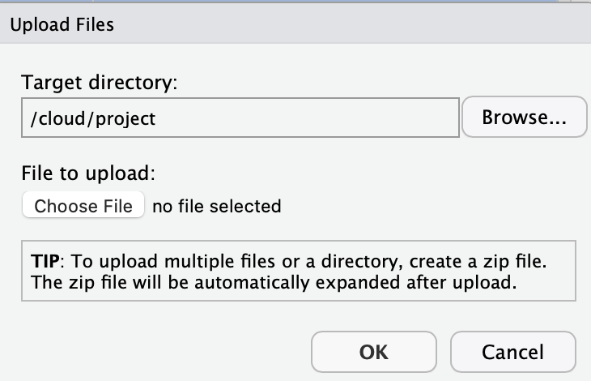
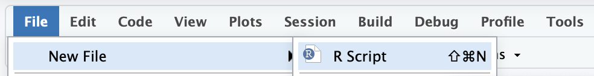
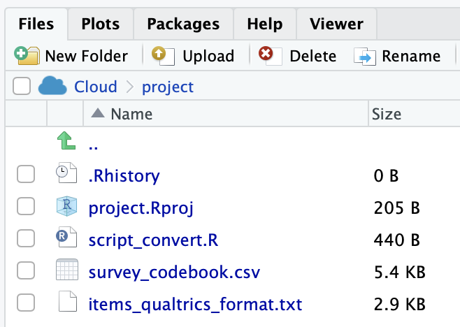
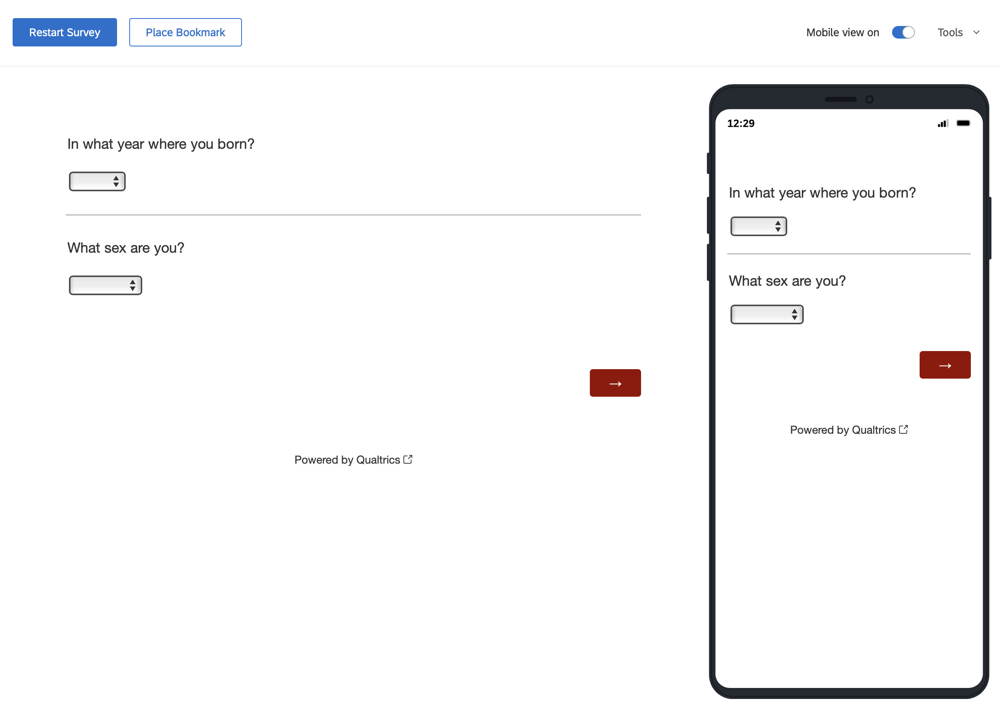
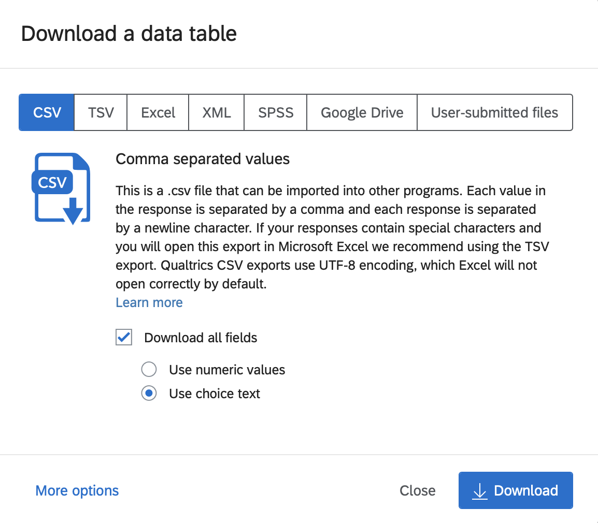

# Qualtrics

```{r, include=FALSE}
library(tidyverse)
```
## Overview

There are two tasks covered in this section: **1)** importing surveys into Qualtrics and **2)** moving data from Qualtrics to R. An overview of each process is below.

**1. Importing items into Qualtrics**

* Create a survey codebook in Excel (or similar program) that has each item and the response options for it
* Convert the survey codebook to Qualtrics [Advanced Text Format](https://www.qualtrics.com/support/survey-platform/survey-module/survey-tools/import-and-export-surveys/)
* Import the items
* Tweak the survey after import

**2. Qualtrics Data to R**

* Export the raw data from Qualtrics with maximal information in the data file
* Load the raw data into R
* Convert the raw data to analytic data. This conversion includes: assigning values to response options (e.g., "Strongly Disagree" becomes the value 1), flipping response for reverse-worded (i.e., reverse-key) items, and creating scale scores.

The overall steps are quite simple and I walk you through each step in detail below.

## Required

The data files below are used in this chapter. Right click to save each file.

| Required Data |
|-------------------|
|[survey_codebook.csv](survey_codebook.csv)   |
|[survey_items_qualtrics_format.txt](survey_items_qualtrics_format.txt)   |
|[data_qualtrics_raw.csv](data_qualtrics_raw.csv)   |


The following CRAN packages must be installed:

| Required CRAN Packages |
|-------------------|
|tidyverse          |
|janitor            |
|remotes            |


The following GitHub packages must be installed:

| Required GitHub Packages |
|--------------------------|
|[dstanley4/qualtricsMaker](https://github.com/dstanley4/qualtricsMaker)|


A GitHub package can be installed using the code below:

```{r, eval = FALSE}
remotes::install_github("dstanley4/qualtricsMaker")
```


## Items to Qualtrics

There are two approaches to entering survey items into Qualtrics.

* Enter the items one at a time using the Qualtrics web interface.

* Create a text file in the Qualtrics [Advanced Text Format](https://www.qualtrics.com/support/survey-platform/survey-module/survey-tools/import-and-export-surveys/) and import the itme. Be warned though a bit of tweaking is often still needed using the web interface.

Here we focus only on the second approach to entering items into Qualtrics.

### Create survey codebook

The easy way to create items in the [Advanced Text Format](https://www.qualtrics.com/support/survey-platform/survey-module/survey-tools/import-and-export-surveys/) is to use the qualtricsMaker package. With this package you create a spreadsheet with the items and then convert that spreadsheet to the Advanced Text Format. Consider a scneario where we want to create a survey that contains 2 demographics items, 18 commitment items, and 4 job satisfaction items. We being by creating a survey codebook spreadsheet in Excel (or similar program). The spreadsheet should have the columns with the names: block, item_name, item_text, type, response_options. The completed file (  [survey_codebook.csv](survey_codebook.csv)) is illustrated below. Although you can see the information that should be in each column based of the figure I provide a detailed information of what should be placed in each column. Remember to work from the guiding principle that one row is use for one item/question.

```{r, echo=FALSE, out.width="100%"}
knitr::include_graphics("ch_qualtrics/images/screenshot_items.png")
```

#### block column

Enter any text you wish to use as a label for a block of items.

#### item_name column

To make your life easier down the road, it is critical you set up your spreadsheet or online survey such that it uses a naming convention prior to data collection. Recall the [naming convention from the previous chapter](https://dstanley4.github.io/psyc6060bookdown/an-emphasis-on-workflow.html#naming-conventions).


#### item_text column

The item_text column contains the text for each item. Note that if you use commas in your item text do not save this file as a .csv file - it will not work. Rather save it as .tsv file (tab separated values). Then use read_tsv command instead of the read_csv command in the code that follows later.


#### type column

| Code for type column | Qualtrics Item Type | Additional Information  |
|----------------------|---------------------|-------------------------|
| matrix               | matrix     | If the first item in a block has type *matrix* all items in the block will be used to constucts the matrix question. **Unfortunately, importing item_names for matrix questions is not supported by Qualtrics. You will need to manually restore your item_names following the directions below for matrix items.** |
| MC                   | multiple choice vertical format  |  |
| MC_horizonal         | multiple choice horizontal format  |  |
| MC_multi_horizonal   | multiple choice horizontal format multiple answers |  |
| MC_select            | select box |  |
| MC_multi_select      | select multiple boxes     |  |
| MC_dropdown          | dropdown   |  |


#### response_options column

The Likert items for the different blocks use different response options. The commitment items use a 7-point response option and the job satisfaction items use a 5-point response option.

##### Year of birth

We used a number of response options to indicate Year of Birth. We entered them as per below. Each response option is separated by a semi-colon. Each of the years below will be in the dropdown button.

**Entered in the response_option column as below. Each option separated by a semicolon.**

1940;1941;1942;1943;1944;1945;1946;1947;1948;1949;1950;1951;1952;1953;1954;1955;1956;1957;1958;1959;1960;1961;1962;1963;1964;1965;1966;1967;1968;1969;1970;1971;1972;1973;1974;1975;1976;1977;1978;1979;1980;1981;1982;1983;1984;1985;1986;1987;1988;1989;1990;1991;1992;1993;1994;1995;1996;1997;1998;1999;2000;2001;2002;2003;2004;2005;2006;2007;2008;2009;2010

##### Sex 3 points

**Entered in the response_option column as below. Each option separated by a semicolon.**

males; female; intersex


##### Commitment 7 points

**Entered in the response_option column as below. Each option separated by a semicolon.**

Strongly Disagree;Moderately Disagree;Slightly Disagree;Neither Agree nor Disagree;Slightly Agree;Moderately Agree;Strongly Agree

##### Job Satisfaction 5 points

**Entered in the response_option column as below. Each option separated by a semicolon.**

Strongly Disagree; Disagree; Neutral; Agree; Strongly Agree

### Convert to Qualtrics format

#### Create TXT file

Once you have the survey codebook above, you need to convert it to an [Advanced Text Format](https://www.qualtrics.com/support/survey-platform/survey-module/survey-tools/import-and-export-surveys/) .txt file. We can do so by following the steps below. The instructions differ slightly for RStudio Cloud and RStudio - both are presented.

##### RStudio on your computer
1. Create a folder on your computer called "new_survey" **with the survey_codebook.csv file in it.** 

2. Open RStudio. Then go to File > New Project... and select Existing Directory.

```{r, echo = FALSE, out.width="50%"}
knitr::include_graphics("ch_qualtrics/images/screenshot_existing_dir.png")
```

2. Then find and select the "new_survey" folder on your hard drive and click the Create Project button.

```{r, echo = FALSE, out.width="50%"}
knitr::include_graphics("ch_qualtrics/images/screenshot_folder.png")
```

3. You should previously have installed the remote and tidyverse package from the CRAN and the qualtricsMaker package from GitHub. If you haven't done this already type the commands below into the **Console**.

**Installing Packages from the CRAN**

```{r, eval=FALSE}
install.packages("tidyverse", dep = TRUE)
install.packages("remotes", dep = TRUE)
```

**Installing Package from GitHub**

Then install the qualtricsMaker package from GitHub:

```{r, eval = FALSE}
remotes::install_github("dstanley4/qualtricsMaker")
```


3. Create a new script by going to File > New File > R Script. A new script will appear in RStudio. Immediately press Control-S to save the script. Call it "script_convert.R".

```{r, echo = FALSE, out.width="50%"}
knitr::include_graphics("ch_qualtrics/images/screenshot_new_script.png")
```

4. Place the code below into the script and press Control-S to save your work.

```{r, eval = FALSE}
library(tidyverse)
library(qualtricsMaker)

survey_codebook <- read_csv("survey_codebook.csv",
                            show_col_types = FALSE)

make_survey(survey_codebook,
            filename = "items_qualtrics_format.txt")
```

5. Run the script by pressing the Source button in the top right of the the Script window. Doing so will create the items_qualtrics_format.txt file that you will import into Qualtrics. You can see the file after it has been created in the Files tab below.

```{r, echo = FALSE, out.width="50%"}
knitr::include_graphics("ch_qualtrics/images/screenshot_post_creation.png")
```

**Congratulation - your items are ready to be imported into Qualtrics. Move on to the "Import the items" section.**


##### RStudio Cloud

1. Open a new project in RStudio Cloud

3. You should previously have installed the remote and tidyverse package from the CRAN and the qualtricsMaker package from GitHub. If you haven't done this already type the commands below into the **Console**.However, if you are working from a class project I created **these packages will have been installed already for you.**

```{r, eval=FALSE}
install.packages("tidyverse", dep = TRUE)
install.packages("remotes", dep = TRUE)
```

Then install the qualtricsMaker package from GitHub:

```{r, eval = FALSE}
remotes::install_github("dstanley4/qualtricsMaker")
```

4. Import the [survey_codebook.csv](survey_codebook.csv) file by using the Upload button in the Files tab in the lower right panel.

```{r, echo = FALSE, out.width = "50%"}
knitr::include_graphics("ch_qualtrics/images/screenshot_import_button.png")
```


5. Click the Choose File button and select the survey_codebook.csv file on your hard drive. Then click OK. The survey_codebook.csv file will then appear on the Files tab within RStudio Cloud.

```{r, echo = FALSE, out.width = "50%"}

```

6. Create a new script by going to File > New File > R Script. A new script will appear in RStudio. Immediately press Control-S to save the script. Call it "script_convert.R".

```{r, echo = FALSE, out.width="50%"}

```

7. Place the code below into the script and press Control-S to save your work.

```{r, eval = FALSE}
library(tidyverse)
library(qualtricsMaker)

survey_codebook <- read_csv("survey_codebook.csv",
                            show_col_types = FALSE)

make_survey(survey_codebook,
            filename = "items_qualtrics_format.txt")
```

8. Run the script by pressing the Source button in the top right of the the Script window. Doing so will create the items_qualtrics_format.txt file that you will import into Qualtrics. You can see the file after it has been created in the Files tab below.

```{r, echo = FALSE, out.width="50%"}

```


9. Select the checkbox beside the file you just created: items_qualtrics_format.txt

```{r, echo = FALSE, out.width="35%"}
knitr::include_graphics("ch_qualtrics/images/screenshot_select_export_file.png")
```

10. Select Export from the More menu.

```{r, echo = FALSE, out.width="60%"}
knitr::include_graphics("ch_qualtrics/images/screenshot_select_export_menu.png")
```

11. Leave the filename as it appears and click the Download button. The file will appear in the Downloads directory on your computer.

```{r, echo = FALSE, out.width="40%"}
knitr::include_graphics("ch_qualtrics/images/screenshot_export_filename.png")
```

12. Move the file (items_qualtrics_format.txt) from the Download folder to an easy to access place (e.g. the Desktop).


### Import the items

##### Click the Create New Project button.

```{r, echo=FALSE, out.width="20%"}
knitr::include_graphics("ch_qualtrics/images/screenshot_b1.png")
```

#### Select the Survey option.

```{r, echo=FALSE, out.width="30%"}
knitr::include_graphics("ch_qualtrics/images/screenshot_b2.png")
```

#### Click the Get Started button.

```{r, echo=FALSE, out.width="40%"}

```

#### Enter project name, click Create Project

```{r, echo=FALSE, out.width="40%"}
knitr::include_graphics("ch_qualtrics/images/screenshot_b4.png")
```

#### Use the Tools menu to import the items

Select the Import option and then specify the filename for the Advanced Text import file with the items in it.

```{r, echo=FALSE, out.width="50%"}
knitr::include_graphics("ch_qualtrics/images/screenshot_b5.png")
```

**Congratulation - your items are ready to be imported into Qualtrics. Move on to the "Import the items" section.**


#### Resulting Survey

The resulting survey for data collection looks like the image below.

```{r, echo=FALSE, out.width="30%"}

```

### Tweak survey in Qualtrics


## Qualtrics data to R

Following data collection, you can obtain your data from Qualtrics. As of 2021, Tri-Agency (NSERC, SSHRC, CIHR) [policy](https://www.science.gc.ca/eic/site/063.nsf/eng/h_97610.html) is that data collected with Tri-Agency funded research must be available for reuse by others. The data should follow the FAIR (Findable, Accessible, Interoperable, and Reusable) principle. Consequently, when you export the data from Qualtrics (and eventually post it) we want to ensure it has as much information in it as possible. This principle guides the options we select below.

### Export from Qualtrics

#### Click the Data & Analysis tab


```{r, echo=FALSE, out.width="70%"}
knitr::include_graphics("ch_qualtrics/images/screenshot_data.png")
```

#### Click the Export & Import button.

Then click the **Export Data...** option.

```{r, echo=FALSE, out.width="20%"}
knitr::include_graphics("ch_qualtrics/images/screenshot_export.png")
```


#### Click Use Choice Text

To ensure the data can be used by others, as per the FAIR policy described above, we SELECT the "Use Choice Text" option when exporting data. If you were (non-optimally) select "Use numeric value" as an export option then the resulting data file would be missing information that make it difficult for others to use. Then click the Download button.

```{r, echo=FALSE, out.width="60%"}

```


In doing so we have several goals

* Ensure a workflow that is reproducible. 

* Ensure the data file has as much information as possible - so facilitate reuse by others. 


### Load data in R

### Convert to analytic data
