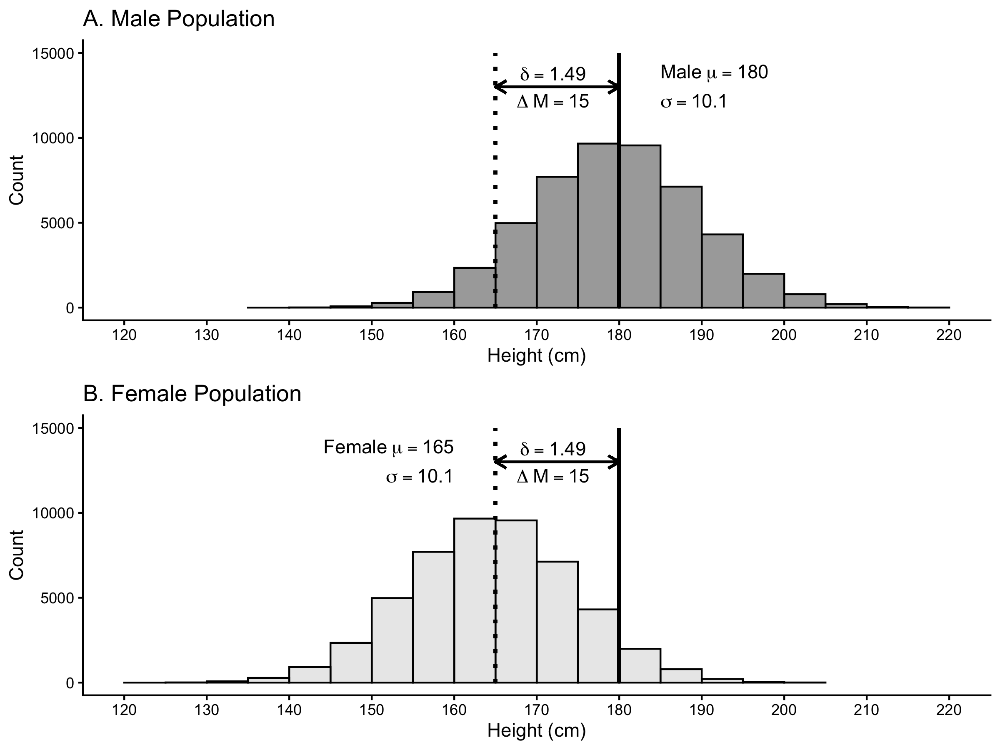

# Samples

Researchers are usually interested in describing the attributes of a population; numbers that describe the population are called parameters. Two parameters that are frequently of interest are the mean and variance of the population.  Unfortunately,  it’s rarely possible to obtain information from every member of a population to calculate a parameter. Consequently, researchers use subsets of the population called samples to estimate parameters. Numbers calculated from sample data are called statistics. Typically, sample statistics are used to estimate population parameters.

Sample statistics, however, often differ from population parameters. The difference between a sample statistic and the population parameter occurs because the sample data is random subset of the population data — with correspondingly fewer observations. Sometimes the sample statistic will be higher than the population parameter; other times the sample statistic will be lower than the population parameter.  Because random sampling is used to select the sample data the direction and magnitude of the difference between the sample statistic the population parameter will vary randomly.

Further complicating matters is  the fact that the formula used for a sample statistic may or may not be the same as the formula used for the corresponding population parameter. This occurs because the purpose of the sample statistic is typically not to describe the sample. Rather the purpose of the sample statistic is to estimate the population parameter. Depending on the parameter, you may or may not be able to use the same formula with sample data as you would with population data.

## Data for the chapter


We begin by activating the required packages:

```{r, include=FALSE}
library(tidyverse)
library(learnSampling)
```

```{r}
library(tidyverse)
library(learnSampling)
```

Next, we create a large population with 100,000 people using the get_height_population() command:

```{r}
pop_data <- get_height_population() 
```

The glimpse() command can be used to confirm that the population contains 100,000 people.

```{r}
glimpse(pop_data)
```

We can use the head() command to see the first 10 rows of the 100,00 rows. We see that each row in pop_data represents a single person.

```{r}
head(pop_data, 10)
```


## Notation

In the formulas below, when we refer the population, we use uppercase letters when indicating members ($X$) or the size ($N$). In contrast, when we refer to the sample, we use lowercsae letters when indicating members ($x$) or the size ($n$). Make sure you notice the similarities between population and sample formulas even when the notation differs.

## Estimating the mean

We are interested in the sample mean ($\bar{x}$) to the extent that it provides an estimate of the population mean ($\mu$). The population mean is calculated using Formula \@ref(eq:popmeanch5):

\begin{equation} 
\mu = \frac{\sum{X}}{N}
      (\#eq:popmeanch5)
\end{equation} 


We can calculate the population mean for the height column of pop_data using the summarise() and mean() commands. The mean() command uses Formula \@ref(eq:popmeanch5). We see in the output that the population mean is 172.48 ($\mu = 172.48$).

```{r}
pop_data %>%
  summarise(pop_mean = mean(height)) %>%
  as.data.frame()
```


As noted previously, we rarely has access to data from an entire population. Consequently, we use the sample mean as an estimate of the population mean. The sample mean, $\bar{x}$, is a statistic calculated using the using Formula \@ref(eq:samplemeanch5). The bar of above the $x$, indicates that it is a mean. Notice that Formula \@ref(eq:popmeanch5) and Formula \@ref(eq:samplemeanch5) are the same - even though they use different notation.


\begin{equation} 
\bar{x} = \frac{\sum{x}}{n}
      (\#eq:samplemeanch5)
\end{equation} 

Because a sample mean (a statistic) is calculated using a random subset of the population it is likely to differ from the population mean (a parameter). If you, inaccurately, believe that you can learn something meaningful from a single study, this fact may be concerning. Statisticians know, however, that you can rarely learn anything from a single study or even a small set of studies. Consequently, they are more interested in what is true, on average, over a large number of studies. Therefore, we simulate drawing a large number of samples from a population with the code below.

```{r}
many_samples <- get_M_samples(pop.data = pop_data, 
                              pop.column.name = height,
                              n = 10,
                              number.of.samples = 5000)
```

We use the head() command to see the first 10 rows (i.e., 10 samples of 5000 samples):

```{r}
head(many_samples, 10)
```


Each row of many_samples represents a sample of 10 people. Each column of many_samples indicates a sample statistic. You can see the for each sample/row we indicate n (the sample size) and sample.mean (the mean of the population), and a few other statistics. Even though all the samples came from the same population you can see how the values in the sample.mean column vary across samples/rows. You can see the full extent to which the sample means vary by creating a graph with the code below. In this code, we use the pull() command to extract the value from the sample.mean column and then we send them to the base R hisogram command, hist().

```{r}
many_samples %>%
 pull(sample.mean) %>%
 hist(main = "Histogram of Sample Means")
```
 
 
You can see the 5000 sample means, from the sample.mean column, plotted in this graph. Recall the population mean for heights is $\mu = 172.48$ cm. Notice that most of the sample means cluster around this value. Also notice there is considerable variability about this value. Any given sample mean ($\bar{x}$) may differ substantially from the population mean ($\mu = 172.48$). This variability illustrates the challenges with learning something from a single study - particularly a study with a small sample size. Many of the sample means fall quite far from the population mean.

Statisticians, recognizing the limitations of a single study, are not particularly concerned if a single sample mean deviates from the population mean. That said, statisticians are very concerned whether the results of a large number of studies are correct -- on average. That is, does the average of many sample means correspond to the population mean. If, on average, the sample mean is accurate we refer to it as an unbiased estimator. 

In the code below we calculate the average of the 5000 sample means to determine if the sample mean is an unbiased estimator.

```{r}
many_samples %>%
  summarise(mean_of_sample.mean = mean(sample.mean)) %>%
  as.data.frame()
```

We find that the average of the 5000 sample means is 172.41 which is very close to the population mean of 172.48. Note that when we did this, we used the same formula to calculate the sample mean (Formula \@ref(eq:samplemeanch5)) as we did the population mean (Formula \@ref(eq:popmeanch5)), although the notation differed. The average of the sample means was not identical to the population mean but it was very close - it would have been exactly the same with many more samples. Consequently, the sample mean provides an unbiased estimate of the population mean. In other words, it makes sense to use the sample mean as an estimate of the population mean. If we try to estimate the population mean with a sample mean we will, on average, be correct; although any given sample/study mean might be "wrong".


## Estimating variance


We are interested in the sample variance ($s^2$) to the extent that it provides an estimate of the population variance ($\sigma^2$). The population variance is calculated using Formula \@ref(eq:popvarch5):

\begin{equation} 
\sigma^2 = \frac{\sum{(X - \mu)^2}}{N}
      (\#eq:popvarch5)
\end{equation} 


We can calculate the population variance for the height column of pop_data using the summarise() and var.pop() commands. The var.pop() command uses Formula \@ref(eq:popvarch5). We see in the output that the population variance is 157.5 ($\sigma^2 = 157.5$).

```{r}
pop_data %>%
  summarise(pop_var = var.pop(height)) %>%
  as.data.frame()
```

Because we rarely have access to data for an entire population we typically want to estimate the population variance using sample data. However, estimating the population parameter from a statistic, is more complicated for variance than it was for the mean. Initially, we might be tempted to use the formula below for sample variance, in which we divide by $n$. This formula is the same as the population variance formula, Formula \@ref(eq:popvarch5), but adapted to use sample-level notation.


$$
\begin{aligned} 
s^2 = \frac{\sum{(x - \bar{x})^2}}{n}
\end{aligned} 
$$

The formula for sample variance with an $n$ in the denominator is, unfortunately, a biased estimator of population variance. In the many_samples data, the column sample.var.n contains the variance for the sample calculated with the above formula. Below we use code obtain, over the 5000 samples, the average of sample.var.n. The output reveals

Because a sample mean (a statistic) is calculated using a random subset of the population it is likely to differ from the population mean (a parameter). If you, inaccurately, believe that you can learn something meaningful from a single study, this fact may be concerning. Statisticians know, however, that you can rarely learn anything from a single study or even a small set of studies. Consequently, they are more interested in what is true, on average, over a large number of studies. Therefore, we simulate drawing a large number of samples from a population with the code below.

```{r}
many_samples %>%
 summarise(mean_of_var.n = mean(sample.var.n))
```

The average of the sample variances (141.86), using $n$ in the denominator, was different from the population variancee (157.46). The average of sample.var.n was much smaller than the population variance. Consequently, sample variance, using $n$ in the denominator, provides a biased estimate of the population variance. If we try to estimate the population variance with a sample variance, using $n$ in the denominator, we will, on average, be wrong.

Fortunately, there is a sample-level formula that estimates the population variance without bias (see Hayes). An unbiased estimate of the population variance can be obtained if we calculate the sample variance but divide by $n - 1$ instead of $n$. The unbiased estimate is calculated using Formula \@ref(eq:samplevarn1ch5).

\begin{equation} 
s^2 = \frac{\sum{(x - \bar{x})^2}}{n-1}
      (\#eq:samplevarn1ch5)
\end{equation} 

In the many_samples data, the column sample.var.n_1 was generated using Formula \@ref(eq:samplevarn1ch5). We can evaluate the quality of Formula \@ref(eq:samplevarn1ch5), using $n-1$, by averaging over values in the sample.var.n_1 column.

```{r}
many_samples %>%
 summarise(mean_of_var.n_1 = mean(sample.var.n_1))
```

We see that the average of the 5000 values using $n-1$ in the denominator is 157.62 which is very close to the population varaince of 157.46. Consequently, we when we use $n-1$ in the denominator we have an unbiased estimate of the population variance. If we try to estimate the population variance with a sample variance, using $n-1$ in the denominator, we will, on average, be right.

You may wonder at this point, when we use $n-1$ in the denominator of the sample variance, can we still think of it as the average of the squared deviations from the mean. The short answer is yes. When you use $n-1$ in the denominator of the sample variance you are not calculating the variance for the group people in the sample. Rather, you are estimating the variance for the much larger group of people in the population. Consequently, it makes sense to think of sample variance, using $n-1$, as an estimate of the average of the squared errors in the population. That is, it makes sense to think of sample variance, using $n-1$, as an estimate of the average of the squared differences between each person in the population and the population mean.

## Estimating standard deviation

Due to the above findings for variance, we tend to estimate the population standard deviation using Formula \@ref(eq:samplesd1ch5).

\begin{equation} 
s = \sqrt{\frac{\sum{(x - \bar{x})^2}}{n-1}}
      (\#eq:samplesd1ch5)
\end{equation} 


## Estimating SMD

```{r}
female_pop_data <- pop_data %>% filter(sex == "female")
male_pop_data <- pop_data %>% filter(sex == "male")
```

For females:

$$
\begin{aligned} 
\mu_{female} &= 165 \\
\sigma_{female} &= 10\\
\end{aligned} 
$$


For males:

$$
\begin{aligned} 
\mu_{male} &= 180 \\
\sigma_{male} &= 10\\
\end{aligned} 
$$


```{r, out.height="80%", echo = F}
textMean1 <- expression(Delta~"M" == 15)
textd1 <- expression(delta == 1.50)
textfemale1 <- expression("Female"~mu == 165)
textmale1 <- expression("Male"~mu == 180)
texts1 <- expression(sigma == 10)


twopop <- ggplot(data = pop_data,
       mapping = aes(x = height,
                     alpha = sex)) +
  geom_histogram(position = "identity",
                 boundary = 0,
                 binwidth = 5,
                 fill = "black",
                 color =  "black") +
  theme_classic() +
  scale_alpha_manual(values = c(.30, .50)) +
  facet_wrap(~sex, nrow = 2) +
  scale_x_continuous(breaks = seq(100, 250, by = 10)) +
  geom_vline(xintercept = 165, size = 2) +
  geom_vline(xintercept = 180, size = 2) +
  labs(x = "Height (cm)", y = "Count", alpha = "Sex") +
  annotate("text", x = 230, y = 9000, 
           parse = T, label = as.character(textMean1)) +
  annotate("text", x = 230, y = 7000, 
           parse = T, label = as.character(textd1)) +
  annotate("text", x = 90, y = 9000, 
           parse = T, label = as.character(textfemale1), hjust = 0) +
  annotate("text", x = 90, y = 7000, 
           parse = T, label = as.character(textmale1), hjust = 0) +
  annotate("text", x = 90, y = 5000, 
           parse = T, label = as.character(texts1), hjust = 0)

ggsave(filename = "ch_samples/images/sex_pops.png", dpi = 300, width = 8, height = 6)
```

```{r sexpop, echo=FALSE, out.width="95%", fig.cap="Illustration of the standardized mean difference of 1.50 for height between males and females. The solid black vertical lines indicates the means ($\\mu$) for the two populations."}

```


### Population SMD

In original units:
$$
\begin{aligned} 
\Delta M &= (\mu_{male} - \mu_{female}) \\
&= (180 - 165) \\
&= 15 \\
\end{aligned} 
$$


Formula \@ref(eq:popsmdch5) below illustrates....

\begin{equation} 
\delta  = \frac{(\mu_{male} - \mu_{female})}{\sigma} 
      (\#eq:popsmdch5)
\end{equation} 


Calculation:

$$
\begin{aligned} 
\delta  &= \frac{(\mu_{male} - \mu_{female})}{\sigma} \\
&= \frac{(180 - 165)}{10} \\
&= \frac{15}{10} \\
&= 1.50 \\
\end{aligned} 
$$

### Sample SMD

Formula \@ref(eq:samplesmdch5) below illustrates....

\begin{equation} 
d  = \frac{(\bar{x}_{male} - \bar{x}_{female})}{s_{pooled}} 
      (\#eq:samplesmdch5)
\end{equation} 

#### Estimating means

#### Estimating variance

```{r pool1, echo=FALSE, out.width="95%", fig.cap="The male sample variance (n-1) is an estimate of male population variance. Likewise, the female sample variance (n-1) is an estimate of the female population variance. "}
knitr::include_graphics("ch_samples/images/pool1.png")
```


```{r pool2, echo=FALSE, out.width="95%", fig.cap="We assume the population variances are the same. Therefore, the male and female sample variances are both estimates of the same population variance."}
knitr::include_graphics("ch_samples/images/pool2.png")
```


```{r pool3, echo=FALSE, out.width="95%", fig.cap="We create a single estimate of the population variance called pooled variance ($s_{pooled}^2$). When sample sizes are equal, the pooled variance is just the average of the two sample variances (both using n-1). When the sample sizes are unequal, we need to use a more sophisticated formula to obtain the pooled variance."}
knitr::include_graphics("ch_samples/images/pool3.png")
```

#### Combining everything

$$
\begin{aligned} 
d  &= \frac{(\bar{x}_{male} - \bar{x}_{female})}{s_{pooled}} \\
\end{aligned} 
$$


\newpage

## Meta-analysis


## Overview

\doublespacing

| Name | Parameter  | Estimated by this statistic | 
| ---   | ---         |  ---   |
| Mean |$\mu = \frac{\sum{X}}{N}$ | $\bar{x} = \frac{\sum{x}}{n}$|
| Variance |$\sigma^2 = \frac{\sum{(X - \mu)^2}}{N}$  | $s^2 = \frac{\sum{(x - \bar{x})^2}}{n-1}$ |
| Standard deviation |$\sigma = \sqrt{\frac{\sum{(X - \mu)^2}}{N}}$  | $s =\sqrt{\frac{\sum{(x - \bar{x})^2}}{n-1}}$ |
| Cohen's $d$ or SMD|$\delta= \frac{\mu_{1} - \mu_{2}}{\sigma}$ | $d  = \frac{\bar{x}_{1} - \bar{x}_{2}}{s_{pooled}}$    |


\singlespacing