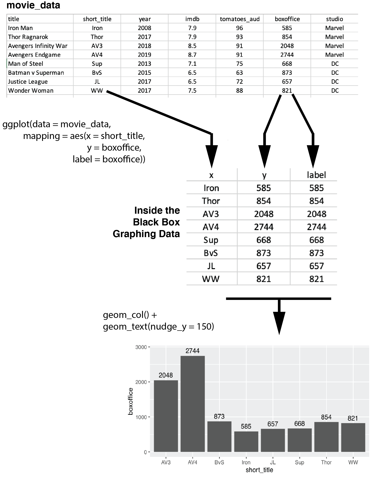
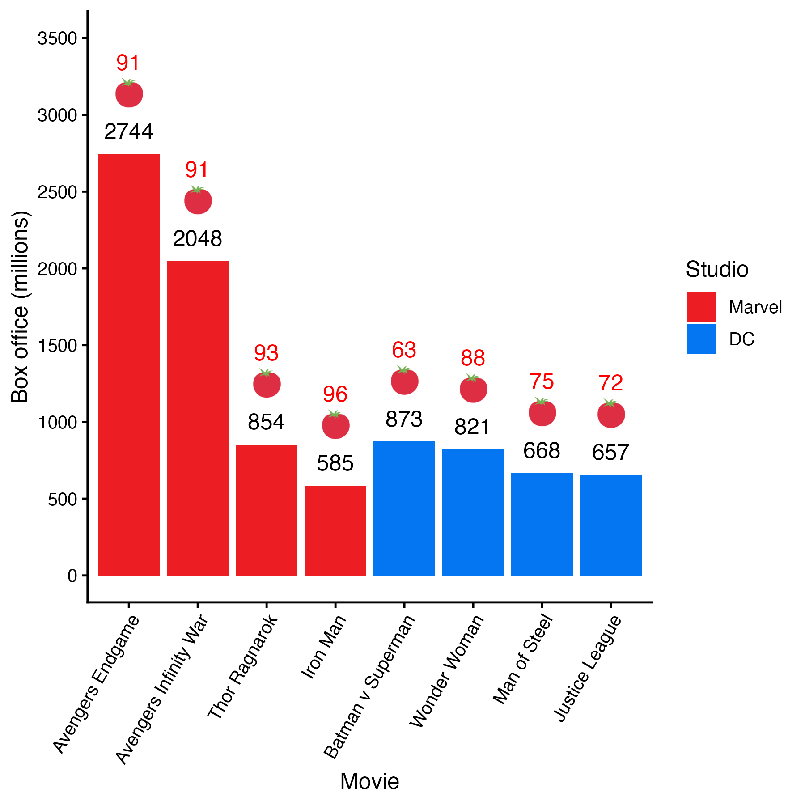

# Graphing
## Required

The following data files below are used in this chapter. The files are available at: https://github.com/dstanley4/psyc6060bookdown

| Required Data |
|-------------------|
|data_movies.csv |


The following packages CRAN must be installed:

| Required CRAN Packages |
|-------------------|
|tidyverse          |


```{r, include = FALSE}
library(tidyverse)
```


## Data 

To learn about making graphs using the tidyverse we use movie data rating and box office data obtained at the time of writing. Movie ratings were obtained from the [IMDB](https://www.imdb.com) and [RottenTomatoes](https://www.rottentomatoes.com) at the time of writing. Box office data (in millions of dollars) was obtained from [Box Office Mojo](https://www.boxofficemojo.com). If you enjoy learning about movies these are all excellent sites. 

We begin by loading data_movies.csv  using read_csv(), not read.csv():

```{r, include=FALSE}
library(tidyverse)
movie_data <- read_csv("data_movies.csv")
```

```{r, eval=FALSE}
movie_data <- read_csv("data_movies.csv")
```

Next we inspect movie_data using the print() command. We see that each row of the data corresponds to a superhero movie. The title for each movie is provided in both long form and short form by the columns title and short_title, respectively. Additional column provide the IMDB rating, Rotten Tomatoes Audience rating, and Box Office Mojo revenue estimates. Finally, the last column indicates the studio that made the movie (Marvel or DC).

```{r}
print(movie_data)
```

It is extremely important for graphing and analyses that you tell R which columns are composed of categorical variables. We do that using the as_factor command. The as_factor command turns a column into a categorical column. We use the mutate command to replace the original column with the column that has been defined as a categorical variables using as_factor. 

```{r}
movie_data <- movie_data %>% 
  mutate(across(.cols = where(is.character), 
                .fns = as_factor))
```


We can confirm the column type has changed by using the print() command again and examing the type under the column name.


```{r}
print(movie_data)
```


## Graph basics 

In this section we teach you how to make a graph from "first principles" to form a foundation for understanding how the tidyverse graphing command ggplot works. Note, however, that the approach used for creating a graph in this section is for teaching purposes only. Later we will make graphs in a more efficient manner.

We start a graph using the ggplot() command. The ggplot() command creates an empty template for the graph. After creating the template we have to add content (like bars) to the graph using the geom_col() command. We can also add text using the geom_text() command.

Commands that plot information on the graph, such as geom_col(), need to know what data set to use to create the graph. We can do so in the command using the **data** argument. For example, we use "data = movie_data" to tell a command which data set to use.

Additionally, graphing commands, such as geom_col(), must know the columns/variables to use within that data set when plotting the graph. Specifically, what variable/column will vary over the x- and y-axes. We can do so in the command using the **mapping** argument. For example, we use "mapping = aes(x = short_title, y = boxoffice)" to tell ggplot that we should use the column short_title along the x-axis and the column boxoffice when determining heights for the y-axis. This information is nested within the aes() command which is short for aesthetic. You use are telling ggplot about the aesthetics for the graph (i.e., which columns to use for the x- and y-axes) using the aes() command. There are a larger number of aesthetics you can specify within the aes() command (e.g., color, fill, linetype, etc.).

In the examples that follow we tell each command (geom_col, geom_text) that data set and the columns to use via the **data** and **mapping** arguments.

Use *geom_col* to put each boxoffice column value into a bar.

```{r, fig.width = 6, fig.height= 3}
my_graph <- ggplot() +
  geom_col(data = movie_data,
           mapping = aes(x = short_title, 
                         y = boxoffice))

print(my_graph)
```


Use *geom_text* to put text above each column with the value 

```{r, fig.width = 6, fig.height= 3}
my_graph <- ggplot() +
  geom_col(data = movie_data,
           mapping = aes(x = short_title, 
                         y = boxoffice)) +
  geom_text(data = movie_data, 
           mapping = aes(x = short_title, 
                         y = boxoffice, 
                         label = boxoffice))
print(my_graph)
```

Unfortunately, when we position the text at the exact height of each column it overlaps with the column making it difficult to read. We fix this on the next page using nudge_y.

We can nudge each label higher on the y-axis using the *nudge_y* command. In the above code, we nudge it up 150 units. Since nudge_y uses the values on the y-axis we are nudging the labels up by 150 million on the y-axis.

```{r, fig.width = 6, fig.height= 3}
my_graph <- ggplot() +
  geom_col(data = movie_data,
           mapping = aes(x = short_title, 
                         y = boxoffice)) +
  geom_text(data = movie_data, 
           mapping = aes(x = short_title, 
                         y = boxoffice, 
                         label = boxoffice),
           nudge_y = 150)

print(my_graph)
```


## Graphing efficiently 

You may have noticed that creating the graphs the way we did above required repeating the data and mapping assignments within each command (e.g., geom_text, geom_col). Fortunately, we can use a shortcut and specify the data and mapping once only in the ggplot command. After that, we only need to specify the data and mapping if we want to use values different than those in the ggplot command.

Examine the code below and compare it to the code above. Notice how in the geom_col() command we don't have anything specified -- the data and mapping from the ggplot command are used.

Likewise, notice how in the geom_text() command we only specify the arguments we need that are different than those in the ggplot command. In this cases, that means simply adding the nudge_y = 150 to the geom_text command.


```{r, fig.width = 6, fig.height= 3}
my_graph <- ggplot(data = movie_data,
           mapping = aes(x = short_title,
                         y = boxoffice,
                         label = boxoffice)) +
  geom_col() +
  geom_text(nudge_y = 150) 

print(my_graph)
```

## aes()

### Inside the black box

What happens when we put the data and mapping in the ggplot command instead of the specific commands? When we put data and the mapping arguments in the ggplot() command we set those attributes for the entire graph. To understand this, you need to know that ggplot uses an internal data set that I will call the "black box" data set (i.e., inside the [black box](https://en.wikipedia.org/wiki/Black_box) of ggpplot). To create a graph ggplot maps/copies columns from you data set (e.g., movie_data) to an internal data set. This internal data set is then used to create the graph. The diagram below illustrates what is happening "inside the black box" when you create the graph using the code above.


```{r, echo = FALSE, out.width = "80%", fig.cap="ggplot()'s internal data."}

```


### Bar colors

You might want to influence the color of the bars in the graph such that the bars for Marvel and DC movies have different colors. That's easy to do with the aes() command. We simply tell aes() that the **fill** of any object in the graph should be determined by the studio column. Simply adding "fill = studio" to the aes() command changes the colors of the bars. 

```{r, fig.width = 6, fig.height= 3}
my_graph <- ggplot(data = movie_data,
           mapping = aes(x = short_title,
                         y = boxoffice,
                         label = boxoffice,
                         fill = studio )) +
  geom_col() +
  geom_text(nudge_y = 150) 

print(my_graph)
```

```{r, echo = FALSE}
knitr::include_graphics("ch_graphing/images/mapping_fill.png")
```

### Overriding aes()

Just because you specify something in the ggplot() command doesn't mean that you are stuck with it for all your subsequent commands. Recall how at the start of this exercise we specified the data and the mapping for each geom_col() and geom_text() individually. We can still do that. 

Now we want to add the Rotten Tomatoes audience score for each movie above the box office revenue. But if we just use geom_text() like we did before it plot the same information boxoffice information because of the  "label = boxoffice" aes() specification in the ggpplot() command. We want the new gome_text() command to plot plot different text; that is, we want it to use "label = tomatoes_aud". 

Fortunately, if we simply put "mapping = aes(label = tomatoes_aud)" within the new geom_text() command we get the desired information in the graph. The mapping/aes commands within geom_text() overrides the mapping/aes commands within ggplot() used to create the internal data set. Or more accurately, the next geom_text() command creates it's own version of the internal data set in which the label column is filled with information from tomatoes_aud.

```{r, fig.width = 6, fig.height= 4}
my_graph <- ggplot(data = movie_data,
           mapping = aes(x = short_title,
                         y = boxoffice,
                         label = boxoffice, 
                         fill = studio)) +
  geom_col() +
  geom_text(nudge_y = 150)  +
  geom_text(mapping = aes(label = tomatoes_aud)) 
print(my_graph)
```

Notice that we have the same problem as before with the text being difficult to read. We add "nudge_y = 400" to move the text higher than the boxoffice text/label. Don't forget the units used by nudge_y are the units on the y-axis.

```{r, fig.width = 6, fig.height= 4}
my_graph <- ggplot(data = movie_data,
           mapping = aes(x = short_title,
                         y = boxoffice,
                         label = boxoffice, 
                         fill = studio)) +
  geom_col() +
  geom_text(nudge_y = 150)  +
  geom_text(mapping = aes(label = tomatoes_aud), 
            nudge_y = 400) 
print(my_graph)
```


## APA style

Use theme_classic to make the graph look APA style. We use theme_classic(12) to make the graph roughly APA style with a 12-point font below.

```{r, fig.width = 6, fig.height= 3}
my_graph <- ggplot(data = movie_data,
           mapping = aes(x = short_title,
                         y = boxoffice,
                         label = boxoffice, 
                         fill = studio)) +
  geom_col() +
  geom_text(nudge_y = 150)  +
  geom_text(mapping = aes(label = tomatoes_aud), 
            nudge_y = 400) +
  theme_classic(12)

print(my_graph)
```


## Axes

### Range 

Use *coord_cartesian* to adjust range of axes. In the code below we use coord_cartesian() to make the y-axis range from 0 to 3500.


```{r, fig.width = 6, fig.height= 3}
my_graph <- ggplot(data = movie_data,
           mapping = aes(x = short_title,
                         y = boxoffice,
                         label = boxoffice, 
                         fill = studio)) +
  geom_col() +
  geom_text(nudge_y = 150)  +
  geom_text(mapping = aes(label = tomatoes_aud), 
            nudge_y = 400) +
  coord_cartesian(ylim = c(0, 3500)) +
  theme_classic(12)


print(my_graph)
```

Note that if you had a continuous variable on the x-axis also (we do not in this example), you could set the range of both the x- and y-axes like this:

```{r, eval=FALSE}
coord_cartesian(ylim = c(0, 3500),
                xlim = c(0, 3500))
```


### Ticks 

Use *scale_y_continuous* to adjust the ticks on the y-axis. We set the tick on the y-axis to range from 0 to 3500 in 500 tick increments using the scale_y_continuous command below:

```{r, fig.width = 6, fig.height= 3}
my_graph <- ggplot(data = movie_data,
           mapping = aes(x = short_title,
                         y = boxoffice,
                         label = boxoffice, 
                         fill = studio)) +
  geom_col() +
  geom_text(nudge_y = 150)  +
  geom_text(mapping = aes(label = tomatoes_aud), 
            nudge_y = 400) +
  coord_cartesian(ylim = c(0, 3500)) +
  scale_y_continuous(breaks = seq(0, 3500, by = 500)) +
  theme_classic(12)

print(my_graph)
```

Note that if you had a continuous variable on the x-axis also (we do not in this example), you could set the ticks of the x-axis like the code below using scale_x_continuous:

```{r, eval=FALSE}
scale_x_continuous(breaks = seq(0, 3500, by = 500))
```

### Labels 

Use *labs* to label the x- and y-axes.

```{r, fig.width = 6, fig.height= 3}
my_graph <- ggplot(data = movie_data,
           mapping = aes(x = short_title,
                         y = boxoffice,
                         label = boxoffice, 
                         fill = studio)) +
  geom_col() +
  geom_text(nudge_y = 150)  +
  geom_text(mapping = aes(label = tomatoes_aud), 
            nudge_y = 400) +
  coord_cartesian(ylim = c(0, 3500)) +
  scale_y_continuous(breaks = seq(0, 3500, by = 500)) +
  labs(x = "Movie", y = "Box office (millions)") +
  theme_classic(12)

print(my_graph)
```


## Axis values

### Text

What if we want to use full movie title rather than short version on the x-axis of the graph? Two methods are presented below. 

#### Method 1 

Our data file contains a column with the long/full version of the movie names. But many times you won't have the additional/longer labels you want to use available in this manner. In this, you use the scale_x_discrete() command to relabel our factor when we make the labels on x-axis. The code is below - notice the problem we have with the labels overlapping though. On the next page, we'll use a easier approach though - since we have an extra column with the full titles.

```{r, fig.width = 6, fig.height= 3}
my_graph <- ggplot(data = movie_data,
           mapping = aes(x = short_title,
                         y = boxoffice,
                         label = boxoffice, 
                         fill = studio)) +
  geom_col() +
  geom_text(nudge_y = 150)  +
  geom_text(mapping = aes(label = tomatoes_aud), 
            nudge_y = 400) +
  coord_cartesian(ylim = c(0, 3500)) +
  scale_y_continuous(breaks = seq(0, 3500, by = 500)) +
  scale_x_discrete(labels=c("Iron" = "Iron Man", 
                            "Thor" = "Thor Ragnarkok",
                            "AV3" = "Avengers Infinity War",
                            "AV4" = "Avengers Endgame",
                            "Sup" = "Man of Steel",
                            "BvS" = "Batman v Superman",
                            "JL" = "Justice League",
                            "WW" = "Wonder Woman")) +
  labs(x = "Movie", y = "Box office (millions)", fill = "Studio") +
  theme_classic(12)
  

print(my_graph)
```


#### Method 2

With our movie data we don't need to use **scale_x_discrete** because we have a column in the data with the full titles. Consequently, to use full length titles we just have to change the **mapping** for x from short_title to title. Notice we still have the problem with overlapping labels on the x-axis!

```{r, fig.width = 6, fig.height= 3}
my_graph <- ggplot(data = movie_data,
           mapping = aes(x = title,
                         y = boxoffice,
                         label = boxoffice, 
                         fill = studio)) +
  geom_col() +
  geom_text(nudge_y = 150)  +
  geom_text(mapping = aes(label = tomatoes_aud), 
            nudge_y = 400) +
  coord_cartesian(ylim = c(0, 3500)) +
  scale_y_continuous(breaks = seq(0, 3500, by = 500)) +
  labs(x = "Movie", y = "Box office (millions)", fill = "Studio") +
  theme_classic(12)
  

print(my_graph)
```


### Angle 

Use *theme* to adjust angle of x-axis labels. We can use the theme command to adjust the angle of the text on the x-axis. However, notice how the longer titles are centered on each point on the x-axis. In the next section we fix this problem.

**Important**: The theme command must come after the theme_classic command. Otherwise, theme_classic will undo the work done by the theme_command if it appears after the theme command.

```{r, fig.width = 6, fig.height= 5}
my_graph <- ggplot(data = movie_data,
           mapping = aes(x = title,
                         y = boxoffice,
                         label = boxoffice, 
                         fill = studio)) +
  geom_col() +
  geom_text(nudge_y = 150)  +
  geom_text(mapping = aes(label = tomatoes_aud), 
            nudge_y = 400) +
  coord_cartesian(ylim = c(0, 3500)) +
  scale_y_continuous(breaks = seq(0, 3500, by = 500)) +
  labs(x = "Movie", y = "Box office (millions)", fill = "Studio") +
  theme_classic(12) +
  theme(axis.text.x = element_text(angle = 60))

print(my_graph)
```


### Alignment

Use *theme* and *hjust* to adjust the alignment of the x-axis labels. To make the titles look correct on the x-axis we need them at an angle, but we also need them right justified against the x-axis. We do that with the the hjust argument (1 means right justify). See the result below.

```{r, fig.width = 6, fig.height= 5}
my_graph <- ggplot(data = movie_data,
           mapping = aes(x = title,
                         y = boxoffice,
                         label = boxoffice, 
                         fill = studio)) +
  geom_col() +
  geom_text(nudge_y = 150)  +
  geom_text(mapping = aes(label = tomatoes_aud), 
            nudge_y = 400) +
  coord_cartesian(ylim = c(0, 3500)) +
  scale_y_continuous(breaks = seq(0, 3500, by = 500)) +
  labs(x = "Movie", y = "Box office (millions)", fill = "Studio") +
  theme_classic(12) +
  theme(axis.text.x = element_text(angle = 60, 
                                   hjust = 1))  

print(my_graph)
```


### Order

#### Increasing order

We can make the movie bars go left to right from lowest to highest box office receipts by changing the factor order prior to creating the graph. We do so with the **mutate**  and **fct_reorder** commands. The default order is ascending values even though we don't specify it. 

```{r}
movie_data <- movie_data %>% mutate(title = fct_reorder(title,
                                  boxoffice))
```


```{r, fig.width = 5, fig.height= 4}
my_graph <- ggplot(data = movie_data,
           mapping = aes(x = title,
                         y = boxoffice,
                         label = boxoffice, 
                         fill = studio)) +
  geom_col() +
  geom_text(nudge_y = 150)  +
  geom_text(mapping = aes(label = tomatoes_aud), 
            nudge_y = 400) +
  coord_cartesian(ylim = c(0, 3500)) +
  scale_y_continuous(breaks = seq(0, 3500, by = 500)) +
  labs(x = "Movie", y = "Box office (millions)", fill = "Studio") +
  theme_classic(12) +
  theme(axis.text.x = element_text(angle = 60, 
                                   hjust = 1))  

print(my_graph)
```


#### Decreasing order  

We can make the movie bars go left to right from highest to lowest box office receipts by changing the factor order prior to creating the graph. We use the same code as before but add the **desc** (descending) command around boxoffice in the **fct_reorder** call:

```{r}
movie_data <- movie_data %>% mutate(title = fct_reorder(title,
                                  desc(boxoffice)))
```


```{r, fig.width = 5, fig.height= 4}
my_graph <- ggplot(data = movie_data,
           mapping = aes(x = title,
                         y = boxoffice,
                         label = boxoffice, 
                         fill = studio)) +
  geom_col() +
  geom_text(nudge_y = 150)  +
  geom_text(mapping = aes(label = tomatoes_aud), 
            nudge_y = 400) +
  coord_cartesian(ylim = c(0, 3500)) +
  scale_y_continuous(breaks = seq(0, 3500, by = 500)) +
  labs(x = "Movie", y = "Box office (millions)", fill = "Studio") +
  theme_classic(12) +
  theme(axis.text.x = element_text(angle = 60, 
                                   hjust = 1))  

print(my_graph)
```


#### Custom order  

We can make the movie bars go left to right from in an order of our chooseing with the fct_relevel command. Here I manually indicate an order that places the movies highest to lowest within movie studio (Marvel or DC).

```{r}
movie_data <- movie_data %>% 
  mutate(title = fct_relevel(title,
                             "Avengers Endgame",
                             "Avengers Infinity War",
                             "Thor Ragnarok",
                             "Iron Man",
                             "Batman v Superman",
                             "Wonder Woman",
                             "Man of Steel",
                             "Justice League"))
```


```{r,}
my_graph <- ggplot(data = movie_data,
           mapping = aes(x = title,
                         y = boxoffice,
                         label = boxoffice, 
                         fill = studio)) +
  geom_col() +
  geom_text(nudge_y = 150)  +
  geom_text(mapping = aes(label = tomatoes_aud), 
            nudge_y = 400) +
  coord_cartesian(ylim = c(0, 3500)) +
  scale_y_continuous(breaks = seq(0, 3500, by = 500)) +
  labs(x = "Movie", y = "Box office (millions)") +
  theme_classic(12) +
  theme(axis.text.x = element_text(angle = 60, 
                                   hjust = 1))  

```
```{r, out.width= "60%", echo = FALSE}
ggsave(plot = my_graph, filename = "ch_graphing/images/custom_order.png", width = 5, height = 4, dpi = "print")
knitr::include_graphics("ch_graphing/images/custom_order.png")
```


### Legend order

After inspecting the graph on the previous page, you might think that Marvel should be above DC in the legend. You can do that by reordering the studio factor:

```{r}
movie_data <- movie_data %>% 
  mutate(studio = fct_relevel(studio,
                             "Marvel",
                             "DC"))
```


```{r,}
my_graph <- ggplot(data = movie_data,
           mapping = aes(x = title,
                         y = boxoffice,
                         label = boxoffice, 
                         fill = studio)) +
  geom_col() +
  geom_text(nudge_y = 150)  +
  geom_text(mapping = aes(label = tomatoes_aud), 
            nudge_y = 400) +
  coord_cartesian(ylim = c(0, 3500)) +
  scale_y_continuous(breaks = seq(0, 3500, by = 500)) +
  labs(x = "Movie", y = "Box office (millions)", fill = "Studio") +
  theme_classic(12) +
  theme(axis.text.x = element_text(angle = 60, 
                                   hjust = 1))  

```
```{r, out.width= "60%", echo = FALSE}
ggsave(plot = my_graph, filename = "ch_graphing/images/custom_order2.png", width = 5, height = 4, dpi = "print")
knitr::include_graphics("ch_graphing/images/custom_order2.png")
```


## Custom colours

### R palette

You might look at the previous graph and think "Marvel should be red and DC should be blue since those are the colours of their respective logos". You can do that with the code below. Note that you specify the colours in the order the names appear in the legend (top to bottom).

R colour names/pictures can be found here: http://sape.inf.usi.ch/quick-reference/ggplot2/colour

```{r, fig.width = 5, fig.height= 4}

my_graph <- ggplot(data = movie_data,
           mapping = aes(x = title,
                         y = boxoffice,
                         label = boxoffice, 
                         fill = studio)) +
  geom_col() +
  geom_text(nudge_y = 150)  +
  geom_text(mapping = aes(label = tomatoes_aud), 
            nudge_y = 400) +
  coord_cartesian(ylim = c(0, 3500)) +
  scale_y_continuous(breaks = seq(0, 3500, by = 500)) +
  labs(x = "Movie", y = "Box office (millions)", fill = "Studio") +
  theme_classic(12) +
  theme(axis.text.x = element_text(angle = 60, 
                                   hjust = 1)) +
  scale_fill_manual(values = c("red", "blue"))
```
```{r, out.width= "60%", echo = FALSE}
ggsave(plot = my_graph, filename = "ch_graphing/images/base_color_graph.png", width = 6, height = 6, dpi = "print")
```


```{r, out.width= "60%", echo = FALSE}
knitr::include_graphics("ch_graphing/images/base_color_graph.png")
```


### Hex colours

If you are a really big geek (like me) you might look at the previous graph and think "Those aren't the real colours of the Marvel and DC logos - lame!" You do some internet research and determine that Marvel red is #ed1d24 and DC blue is #0476F2 using hex colour codes. You can use those precise colours as per below.  Note the difference is subtle - the correct colours are somewhat more muted.

```{r, fig.width = 5, fig.height= 4}

my_graph <- ggplot(data = movie_data,
           mapping = aes(x = title,
                         y = boxoffice,
                         label = boxoffice, 
                         fill = studio)) +
  geom_col() +
  geom_text(nudge_y = 150)  +
  geom_text(mapping = aes(label = tomatoes_aud), 
            nudge_y = 400) +
  coord_cartesian(ylim = c(0, 3500)) +
  scale_y_continuous(breaks = seq(0, 3500, by = 500)) +
  labs(x = "Movie", y = "Box office (millions)", fill = "Studio") +
  theme_classic(12) +
  theme(axis.text.x = element_text(angle = 60, 
                                   hjust = 1)) +
  scale_fill_manual(values = c("#ed1d24", "#0476F2"))

```

```{r, out.width= "60%", echo = FALSE}
ggsave(plot = my_graph, filename = "ch_graphing/images/logo_color_graph.png", width = 6, height = 6, dpi = "print")
```


```{r, out.width= "60%", echo = FALSE}
knitr::include_graphics("ch_graphing/images/logo_color_graph.png")
```


## Emoji

### Installation

Make the graph more fun with the emoGG package. You might like to make the graph more fun by putting tomatoes on the graph to indicate what the extra numbers mean. We can do that with the emoGG package. You can install the emoGG package with the commands below:

```{r, eval = FALSE}
install.packages("devtools", dep = TRUE) # if you haven't done this already
devtools::install_github("dill/emoGG")
```

Activate the emoGG package:
```{r}
library(emoGG)
```

### Codes for emoji

Visit this link to check out the codes for emoji: https://apps.timwhitlock.info/emoji/tables/unicode

If you scroll down to section 5 Uncategorized on this page you will find the code for a tomato is 1f345.

Note that the code below will only work with an internet connection. The command geom_emoji needs internet to retrieve the emoji graphic requested.

```{r, echo = FALSE, out.width  = "90%"}
knitr::include_graphics("ch_graphing/images/emoji_table.png")
```


```{r, fig.width = 5, fig.height= 4}
my_graph <- ggplot(data = movie_data,
           mapping = aes(x = title,
                         y = boxoffice,
                         label = boxoffice, 
                         fill = studio)) +
  geom_col() +
  geom_text(nudge_y = 150)  +
  geom_text(mapping = aes(label = tomatoes_aud), 
            nudge_y = 600, 
            colour = "red") +
  geom_emoji(mapping = aes(y = boxoffice + 400),
             emoji="1f345") +
  coord_cartesian(ylim = c(0, 3500)) +
  scale_y_continuous(breaks = seq(0, 3500, by = 500)) +
  labs(x = "Movie", y = "Box office (millions)", fill = "Studio") +
  theme_classic(12) +
  theme(axis.text.x = element_text(angle = 60, 
                                   hjust = 1)) +
  scale_fill_manual(values = c("#ed1d24", "#0476F2"))


```

```{r, out.width= "60%", echo = FALSE}
ggsave(plot = my_graph, filename = "ch_graphing/images/emoji_graph.png", width = 6, height = 6, dpi = "print")
```


```{r, out.width= "60%", echo = FALSE}

```


## Saving

If you have a Mac it is easy to drag and drop a PDF file into MS Word - so making a PDF file is the best bet for saving your graph. You can do so with the code below which creates a 6 inch by 6 inch graph.

### MAC

If you are able to use PDFs in your workflow that's often the best option for saving. PDFs are mathematical in nature and therefore can be printed at any size at high quality. With a MAC you can just drag and drop the PDF file into your MSWord document.

```{r, eval = FALSE}
ggsave(plot = my_graph, 
       filename = "emoji_graph.pdf", 
       width = 6, 
       height = 6)

```

### PC or MAC

If you have a PC it's hard to put a PDF into MSWord. Therefore save the graph as a jpg file. You do so with the code below. This creates a picture type file at a resolution (dpi = dots per inch) that is sufficiently high for quality printing.

With a PC you need to use the INSERT menu and insert the graph as a picture in MSWord.
With a MAC you can just drag and drop the PDF file into your MSWord document.

```{r, eval = FALSE}
ggsave(plot = my_graph, 
       filename = "emoji_graph.jpg", 
       width = 6, 
       height = 6, 
       dpi = "print")
```

