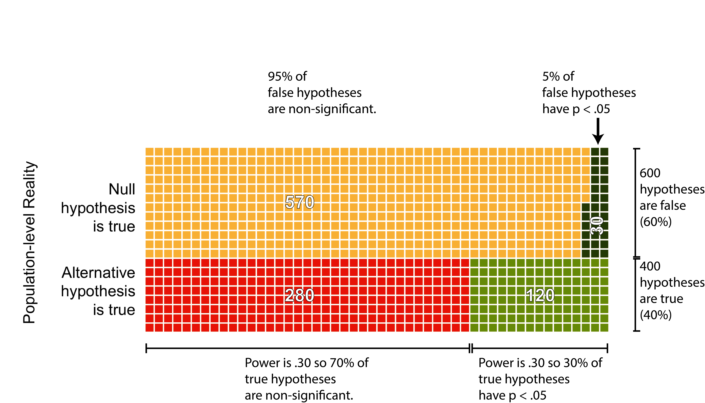
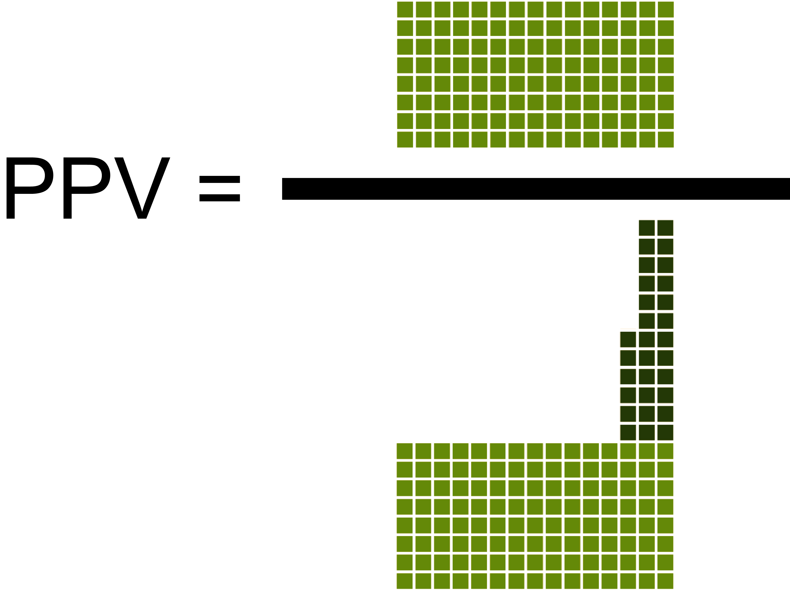
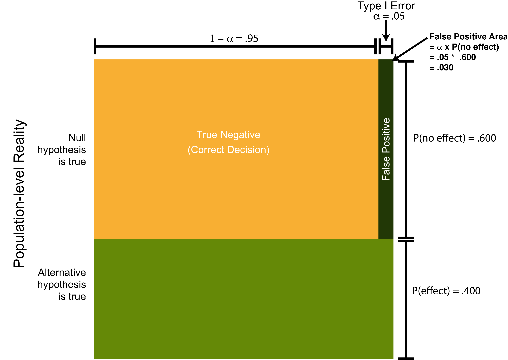

# Positive Predictive Value

## Required

The following CRAN packages must be installed:

| Required CRAN Packages |
|-------------------|
|pwr               |
|TOSTER            |


## Overview

At this point you've learned to be cautious when it comes to interpreting $p$-values. But so far, that's been more of a qualitative form of caution. In this section we attempt to make it a more quantitative form of caution. Specifically, we introduce you to the concept of positive predictive values (PPV) in the context of interpretting significant p-values. The PPV statistic provides us with an estimate of how likely it is there really is an effect when a p-value is significant.


## Informal explanation

### Many hypotheses

When you conduct an experiment to determine if an effect exists you start off fairly confident that the effect is there - otherwise you would not invest the time and money to run the study. Unfortunately only a minority of hypotheses are true. A recent examination of pre-registered studies determined that just over 40% of research hypotheses are true [@scheel2020excess]. Which correspondingly implies that 60% of research hypotheses are false. That is, 60% of studies fail to find what the desired effect. 

One way to think about this finding is by imagining 1000 hypothesis as per Figure \@ref(fig:ppv1). In this figure there are 1000 squares. Each square represents an hypothesis. We've shaded the squares to indicate hypotheses that are true and false. Specifically, 40% of the 1000 hypothses (i.e., 400 squares) are shaded green to indicate the hypothses are true. In contrast, 60% of the 1000 hypothses (i.e., 600 squares) are shaded yellow to indicate the hypothses are false.  

```{r ppvfig1, echo = FALSE, out.width = "90%", fig.scap = "One-thousand hypotheses represented as squares.", fig.cap="One-thousand hypotheses represented as squares. True hypotheses are indicated by the color green. False hypotheses are indicated by the color yellow."}
knitr::include_graphics("ch_ppv/images/fig1.png")
```


### Type I Error

Even when an hypothesis is false there still a chance we will obtain a significant result (i.e., $p$ < .05). More specifically, we will obtain a significant result 5% of the time when the null hypothesis is true and there is no effect. In terms of our example, this means that of the 600 false hypotheses, we would obtain a significant result for 30 of them (i.e., .05 * 600 = 30). These 30 false positive significance tests are illustrated in Figure \@ref(fig:ppvfig2) below.

```{r ppvfig2, echo = FALSE, out.width = "90%", fig.scap= "False positive significance tests.", fig.cap = "False positive significance tests. False hypotheses for which the researcher obtained a significant result are indicated by dark green squares."}
knitr::include_graphics("ch_ppv/images/fig2.png")
```


### Power

Unfortunately, even when an hypothesis is true we won't always obtain a significant p-value. Low sample sizes in psychology are common. As a result most studies in psychology only have a 30% chance of finding an effect if there is one. That is, the typical value for statistical power in psychology is around .30. This typical statistical power level is illustrated in the context of our example in Figure \@ref(fig:ppvfig3) below. In this figure, hypotheses that were true but obtained non-significant p-values are indicated by red squares. In contrast, the hypotheses that were true and determined to be significant are indicated by green squares.

```{r ppvfig3, echo = FALSE, out.width = "90%", fig.scap = "True positive signficance tests.", fig.cap = "True positive signficance tests. True hypotheses for which the researcher obtained a significant result are indicated by green squares. True hypotheses for which the researcher obtained a non-significant result are indicated by red squares." }

```

### Calculating PPV

You can see from Figure \@ref(fig:ppvfig4), below, that there two ways to obtain a signficant p-value. Specifically, you can obtain a significant p-value when the null hypothesis is true (a false positive p-value). As well, you can obtain a significant p-value when the null hypothesis is false (a true positive p-value). As a researcher, when we obtain a signficant p-value we don't know if it's a true-positive or a false-positive. We calculate PPV to determine how likely it is there is an effect when the p-value is significant.


```{r ppvfig4, echo = FALSE, out.width = "90%", fig.cap = "xx"}
knitr::include_graphics("ch_ppv/images/fig4.png")
```


As illustatred in Figure \@ref(fig:ppvfig4), below, the positive predictive value (PPV) is simply the ratio of the true-positive p-values over all the p-values (true positive or true negative). 


```{r ppvfig5, echo = FALSE, out.width = "40%", fig.align='center', fig.cap = "Graphical illustration of the PPV formula."}

```


Placing number into the equation:


\begin{align}
PPV &= \frac{120 }{120  + 30} \\
&= \frac{120}{150} \\
&= 0.80
\end{align}

We see that the positive predictive value is .80 in this circumstance. That is, if we obtain a significant p-value there is an 80% chance there really is an effect.

##  Formal explanation

A more formal explanation of PPV can be made by thinking in terms of the area on a figure.


```{r ppvfig6, echo = FALSE, out.width = "90%"}
knitr::include_graphics("ch_ppv/images/fig6.png")
```

```{r ppvfig7, echo = FALSE, out.width = "90%"}

```

```{r ppvfig8, echo = FALSE, out.width = "90%"}
knitr::include_graphics("ch_ppv/images/fig8.png")
```

```{r ppvfig9, echo = FALSE, out.width = "90%"}
knitr::include_graphics("ch_ppv/images/fig9.png")
```


## Calculating power for your study


You can estimate positive predictive value for your own study. You merely need an estimate of the power of your study


### Power independent groups $t$-test


#298 suggested but we got 25

```{r}
library(pwr)
# Based on the previous study modify the settings below.
# For alternative: use "greater" for one-sided 
# and "two.sided" for two-sided test
alternative <- "greater"
pop_d <- .24
sample_size_per_group <- 25

pwr_out <- pwr.t.test(d = pop_d, 
                      n = sample_size_per_group,
                      type = "two.sample",
                      alternative = alternative)
```

Then we need to print our power / sample size analysis:

```{r}
print(pwr_out)

```

This analysis reveals that a) if we assume the population effect size is .24 ($\delta = .24$) and b) use a sample size of 25 per group, then our resulting power is 0.21. That is, if an effect exists, we have a 21% chance of finding it.


### Power repeated measures $t$-test

#298 # we get 30
```{r}
library(pwr)
# Based on the previous study modify the settings below.
# For alternative: use "greater" for one-sided 
# and "two.sided" for two-sided test
alternative <- "greater"
pop_d <- .17
n <- 30

pwr_out <- pwr.t.test(d = pop_d, 
                      n = n,
                      type = "paired",
                      alternative = alternative)
```

Then we need to print our power / sample size analysis:

```{r}
print(pwr_out)

```

This analysis reveals that a) if we assume the population effect size for our repeated measures $t$-test is 0.17 ($\delta = 0.17$) and b) we have a sample size of 30, then our resulting power is 0.23. That is, if an effect exists, we have a 23% chance of finding it. 


### Power correlations

#260 to #100
```{r}
library(pwr)
# Based on the previous study modify the settings below.
# For alternative: use "greater" for one-sided 
# and "two.sided" for two-sided test
alternative <- "greater"
pop_r <- .18
n <- 100

pwr_out <- pwr.r.test(r = pop_r, 
                      n = n,
                      alternative = alternative)
```

Then we need to print our power / sample size analysis:

```{r}
print(pwr_out)

```

This analysis reveals that a) if we assume the population correlation is .18 ($\rho = .18$) and b) we use a sample sizse of 100, then our resulting power is 0.56. That is, if an effect exists, we have a 56% chance of finding it. 

### Equivalence independent *t*-test

#### Standardized units

```{r}
library(TOSTER)
n_per_group = 40
powerTOSTtwo(alpha = 0.05,
             N  = n_per_group,
             low_eqbound_d = -0.40,
             high_eqbound_d = 0.40)
```

#### Raw units

```{r}
library(TOSTER)
n_per_group = 40

powerTOSTtwo.raw(alpha = 0.05,
                 N  = n_per_group,
                 sdpooled = 2.50,
                 low_eqbound = -1,
                 high_eqbound = 1)
            
```


### Equivalence repeated *t*-test

#### Standardized units

```{r}
library(TOSTER)
n <- 10
powerTOSTpaired(alpha = 0.05,
                N = n,
                low_eqbound_dz = -0.6325,
                high_eqbound_dz = 0.6325)
            
```

#### Raw units

```{r}
library(TOSTER)
n <- 10
powerTOSTpaired.raw(alpha = 0.05,
                    N = n,
                    sdif = 1.581,
                    low_eqbound = -1,
                    high_eqbound = 1)
            
```

### Equivalence correlation

```{r}
library(TOSTER)
n <- 75
powerTOSTr(alpha = .05,
           N = n,
           low_eqbound_r = -.20, 
           high_eqbound_r = .20)
```


## Calculating PPV for your study
