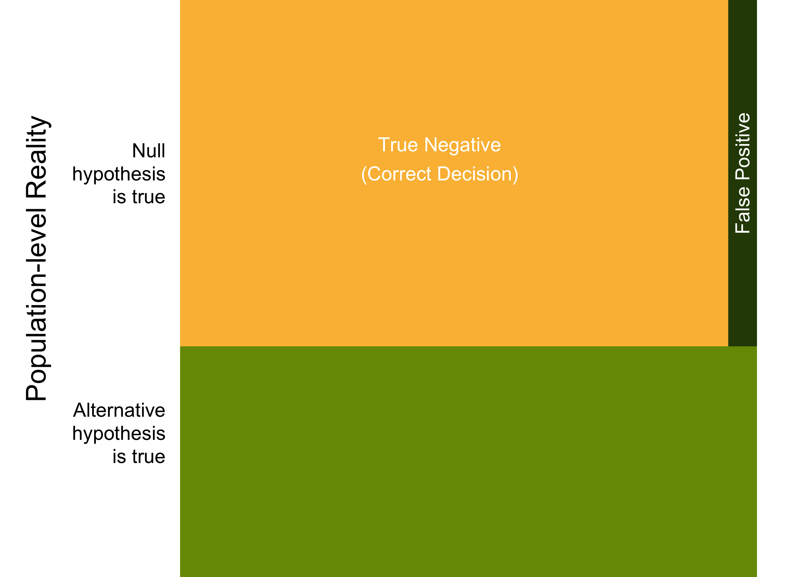
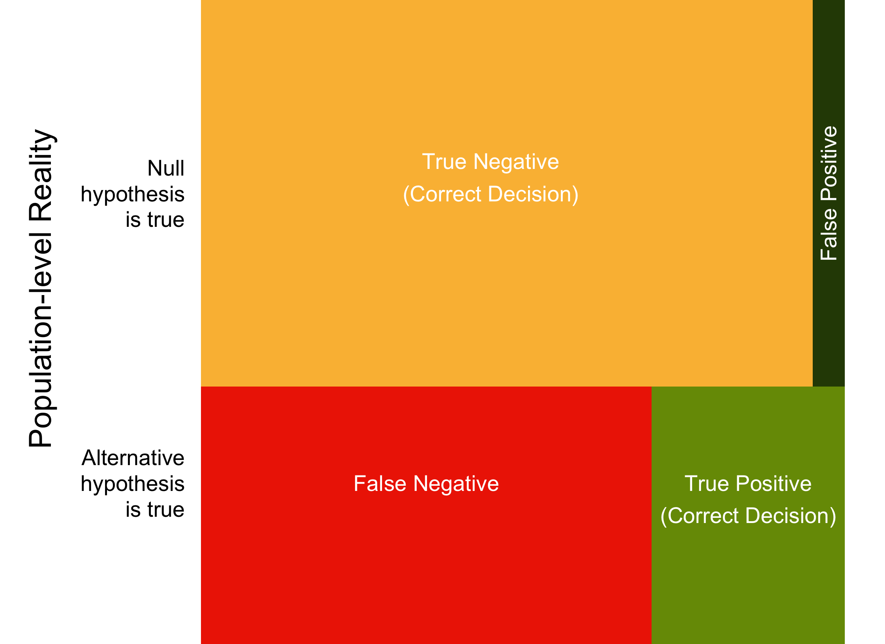
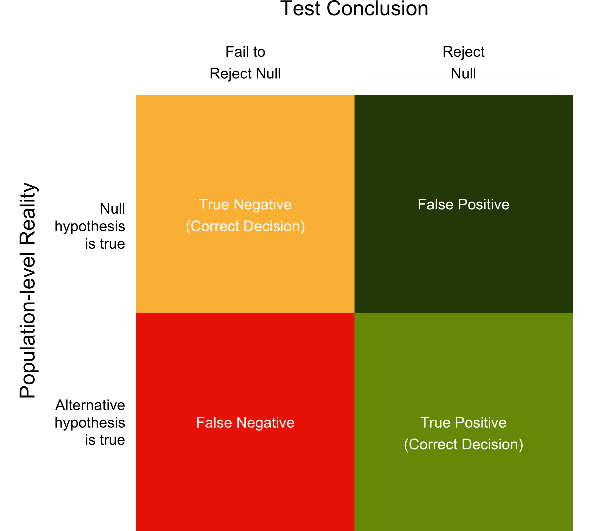

# Positive Predictive Value

## Required

The following CRAN packages must be installed:

| Required CRAN Packages |
|-------------------|
|MBESS              |
|pwr                |


## Overview

$$
\begin{align}
P(\text{effect}) = 0.40
\end{align}
$$


$$
\begin{align}
P(\text{effect} \cap [p < .05]) &= P(\text{effect}) \times P(\text{detecting it}) \\
&= P(\text{effect}) \times \text{Power} \\
&= 0.40 \times 0.30 \\
&= 0.12 \\
\end{align}
$$


$$
\begin{align}
P(\text{no effect} \cap [p < .05]) &= P(\text{no effect}) \times P(\text{sig. test}) \\
&= P(\text{effect}) \times \text{Alpha} \\
&= 0.60 \times 0.05 \\
&= 0.03
\end{align}
$$


$$
\begin{align}
P(\text{effect} | p < .05) = \frac{P(\text{effect} \cap [p < .05]) }{P(\text{effect} \cap [p < .05])  + P(\text{no effect} \cap [p < .05])}
\end{align}
$$


```{r, echo = FALSE, out.width = "90%"}

```

```{r, echo = FALSE, out.width = "90%"}

```


```{r, echo = FALSE, out.width = "90%"}

```

```{r, echo = FALSE, out.width = "90%"}

```

```{r, echo = FALSE, out.width = "90%"}

```

```{r, echo = FALSE, out.width = "90%"}

```

```{r, echo = FALSE, out.width = "90%"}

```


## Power Independent groups $t$-test


#298 suggested but we got 25

```{r}
library(pwr)
# Based on the previous study modify the settings below.
# For alternative: use "greater" for one-sided 
# and "two.sided" for two-sided test
alternative <- "greater"
pop_d <- .24
sample_size_per_group <- 25

pwr_out <- pwr.t.test(d = pop_d, 
                      n = sample_size_per_group,
                      type = "two.sample",
                      alternative = alternative)
```

Then we need to print our power / sample size analysis:

```{r}
print(pwr_out)

```

This analysis reveals that a) if we assume the population effect size is .24 ($\delta = .24$) and b) use a sample size of 25 per group, then our resulting power is 0.21. That is, if an effect exists, we have a 21% chance of finding it.


## Power Repeated measures $t$-test

#298 # we get 30
```{r}
library(pwr)
# Based on the previous study modify the settings below.
# For alternative: use "greater" for one-sided 
# and "two.sided" for two-sided test
alternative <- "greater"
pop_d <- .17
n <- 30

pwr_out <- pwr.t.test(d = pop_d, 
                      n = n,
                      type = "paired",
                      alternative = alternative)
```

Then we need to print our power / sample size analysis:

```{r}
print(pwr_out)

```

This analysis reveals that a) if we assume the population effect size for our repeated measures $t$-test is 0.17 ($\delta = 0.17$) and b) we have a sample size of 30, then our resulting power is 0.23. That is, if an effect exists, we have a 23% chance of finding it. 


## PowerCorrelations

#260 to #100
```{r}
library(pwr)
# Based on the previous study modify the settings below.
# For alternative: use "greater" for one-sided 
# and "two.sided" for two-sided test
alternative <- "greater"
pop_r <- .18
n <- 100

pwr_out <- pwr.r.test(r = pop_r, 
                      n = n,
                      alternative = alternative)
```

Then we need to print our power / sample size analysis:

```{r}
print(pwr_out)

```

This analysis reveals that a) if we assume the population correlation is .18 ($\rho = .18$) and b) we use a sample sizse of 100, then our resulting power is 0.56. That is, if an effect exists, we have a 56% chance of finding it. 


## Power for equivalence testing

### Independent *t*-test

#### Standardized units

```{r}
library(TOSTER)
n_per_group = 40
powerTOSTtwo(alpha = 0.05,
             N  = n_per_group,
             low_eqbound_d = -0.40,
             high_eqbound_d = 0.40)
```

#### Raw units

```{r}
library(TOSTER)
n_per_group = 40

powerTOSTtwo.raw(alpha = 0.05,
                 N  = n_per_group,
                 sdpooled = 2.50,
                 low_eqbound = -1,
                 high_eqbound = 1)
            
```


### Repeated *t*-test

#### Standardized units

```{r}
library(TOSTER)
n <- 10
powerTOSTpaired(alpha = 0.05,
                N = n,
                low_eqbound_dz = -0.6325,
                high_eqbound_dz = 0.6325)
            
```

#### Raw units

```{r}
library(TOSTER)
n <- 10
powerTOSTpaired.raw(alpha = 0.05,
                    N = n,
                    sdif = 1.581,
                    low_eqbound = -1,
                    high_eqbound = 1)
            
```

### Correlation

```{r}
library(TOSTER)
n <- 75
powerTOSTr(alpha = .05,
           N = n,
           low_eqbound_r = -.20, 
           high_eqbound_r = .20)
```


Assignment add some mulitple choice videos
