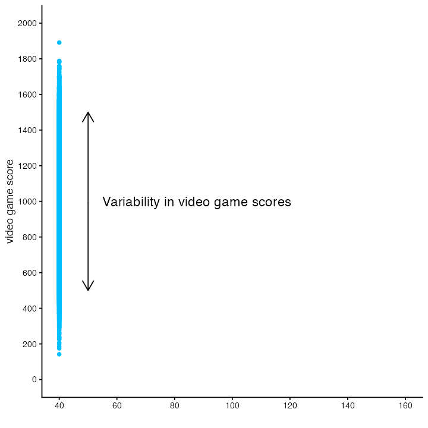
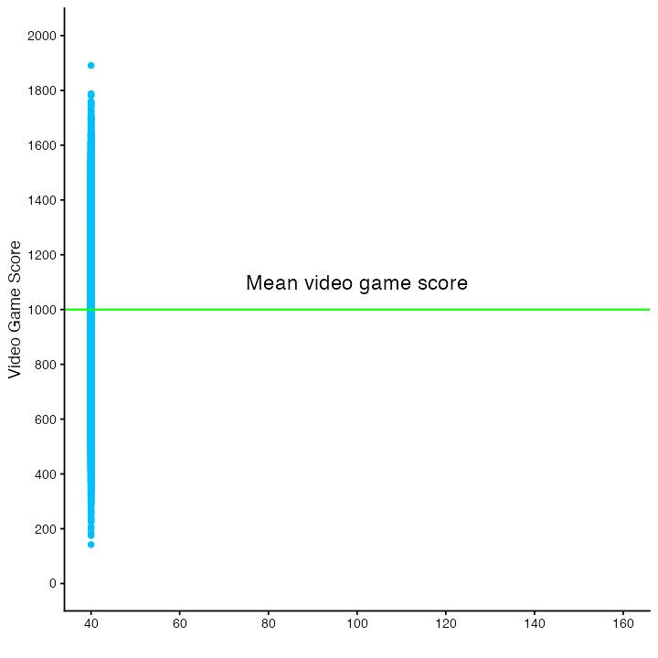
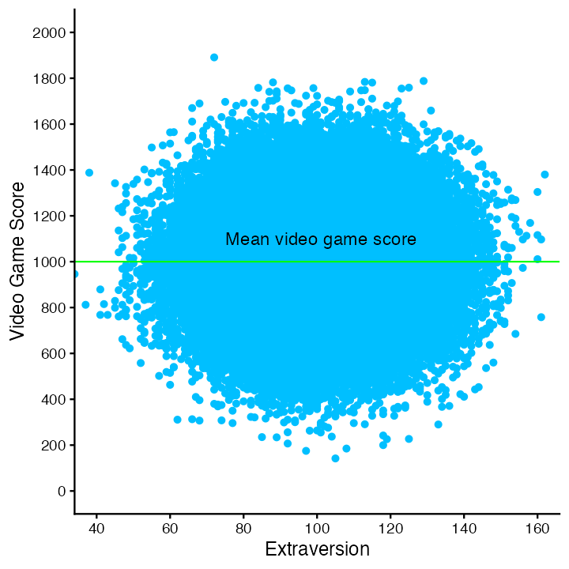
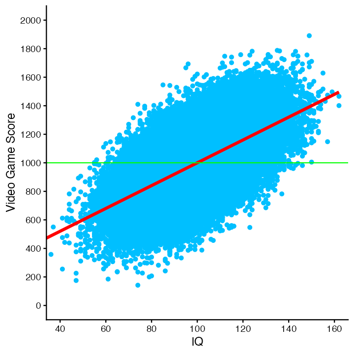
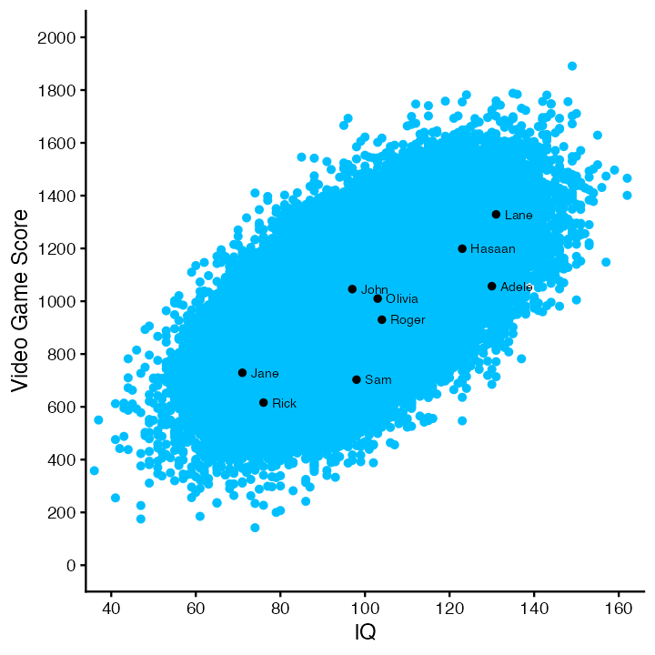
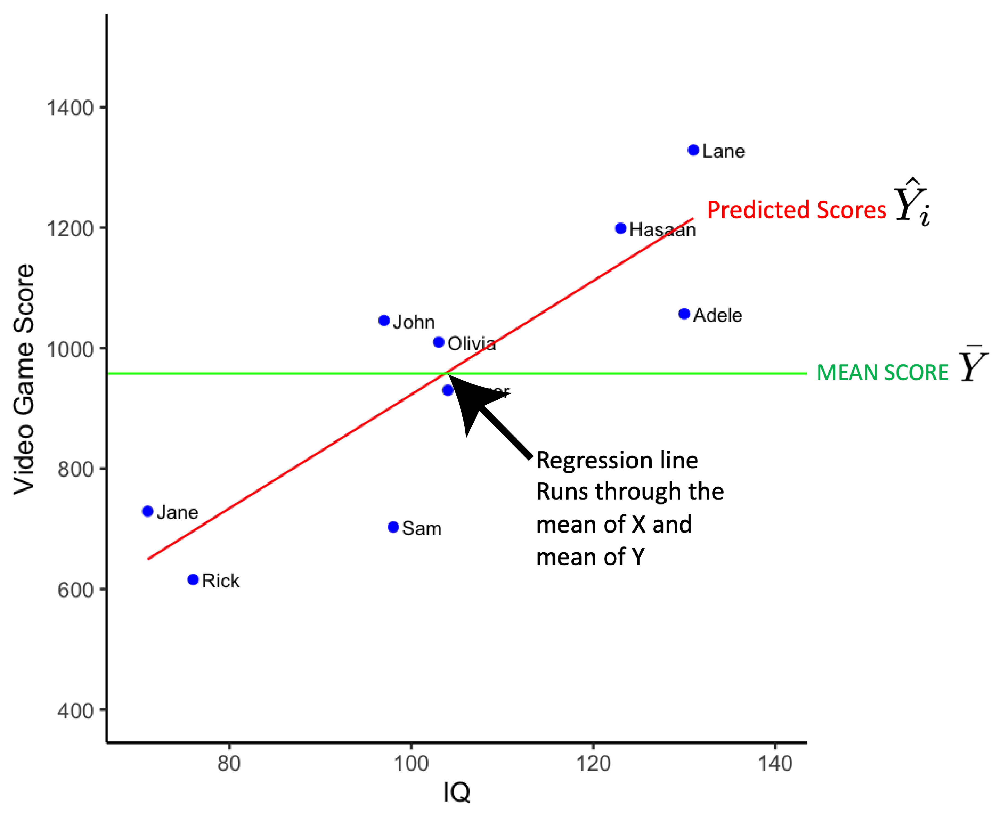
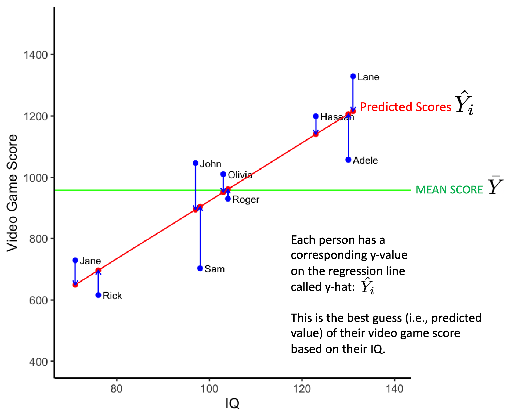
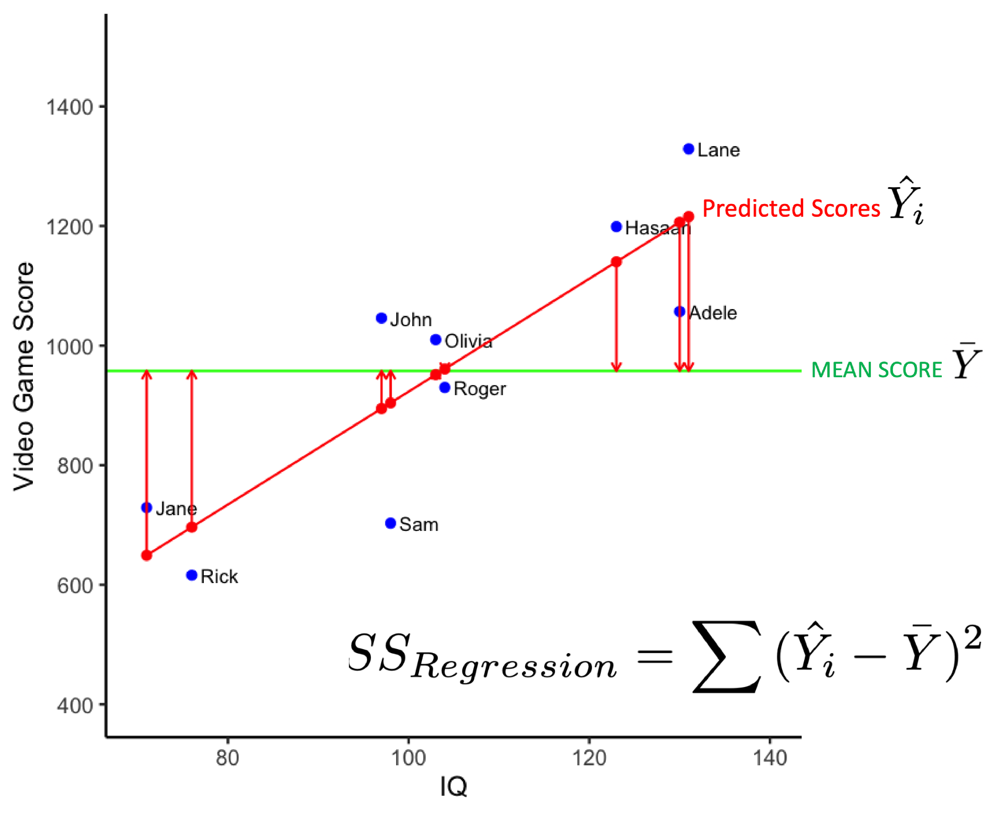
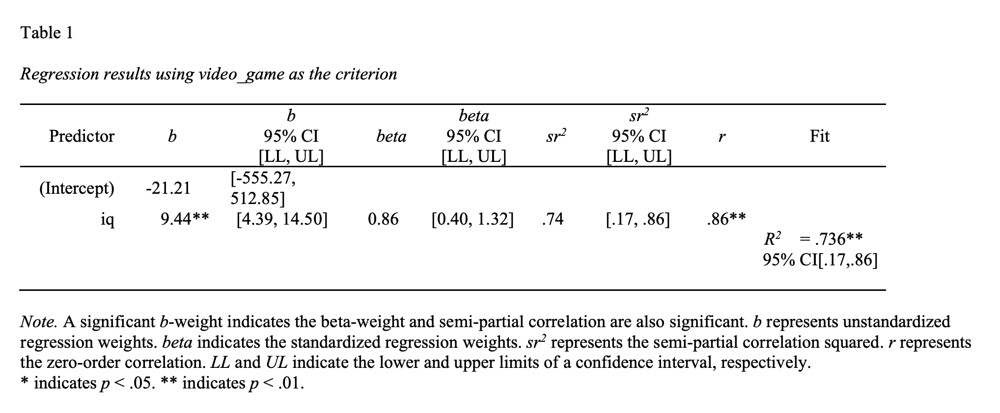
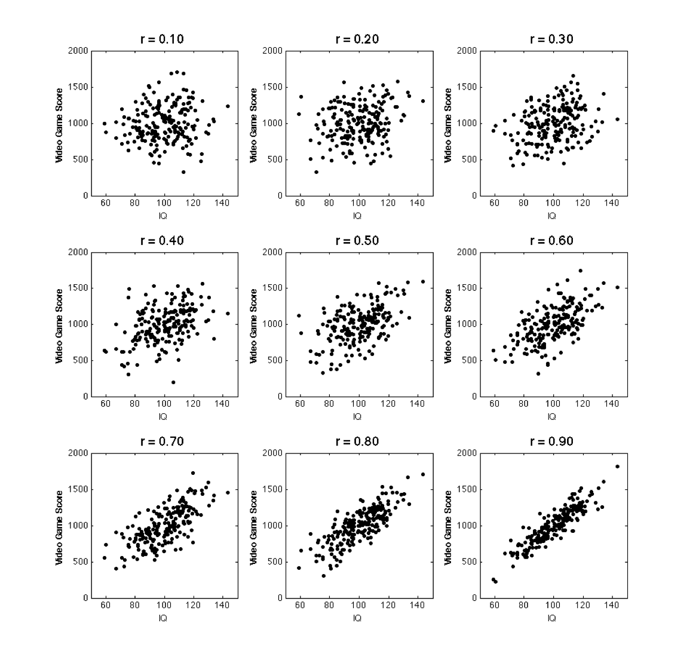

# Regression and correlation

The following CRAN packages must be installed:

| Required CRAN Packages |
|-------------------|
|tidyverse          |
|apaTables         |
|cocor            |
|janitor            |
|psych            |


```{r, echo=FALSE, message=FALSE}
library(tidyverse)
library(janitor)

population_data <- read_csv("data_cor_pop_video_game.csv")
n <- 9
constant_value <- 40
alpha_level <- 1
fig_width <- 10
fig_height <- fig_width
font_size <- 24


population_data$constant <- constant_value
population_data$extraversion <- round(rnorm(dim(population_data)[1])*15 + 100)

set.seed(1)
sample_data <- sample_n(population_data, n)
sample_data <- sample_data %>% arrange(iq)
name_str <- c("Jane", "Rick", "John", "Sam", "Olivia", "Roger", "Hasaan", "Adele", "Lane")
sample_data$name_str <- name_str
  
library(broom)

df_lm <- lm(video_game ~ iq, data = sample_data)
df_aug <- augment(df_lm)
df_aug$mean_score <- mean(sample_data$video_game)
df_aug$name_str <- sample_data$name_str
label_size <- 6

#1, 80, 106
```

## Population example

```{r, echo = FALSE}

```


Consider the following the scenario, we want to examine the extent to which IQ predicts video games scores for people who live in the City of Guelph. We want to make conclusions about people who live in the City of Guelph so we refer to Guelph citizens as our population. Because we are interested in using IQ to predict video game score we refer to IQ as the **predictor**. The value being predicted is video game score and we refer to that variable as the **criterion** (i.e., the dependent variable). Imagine, for a moment, that we are actually able to get an IQ and a video game score for everyone in the City of Guelph (*N* = 100,000). 

### No predictor

We illustrate the range and variability of video game scores for everyone in the population below. There are 100,000 blue dots on this graph. Each blue dot represents a person in the **population**. The vertical position of the dot indicates each person's video game. 


* Notice the range of video game scores - everyone did not obtain the same score. But there are so many dots that they overlap.

* We want to try to understand why, in this population, some people have higher vs lower scores.

* Said another way, we want to explain, for this population, the variability in video game scores above/below the mean video game score.

* Correlation/regression can never provide evidence of causation (or explanation) but we can use those analyses to find a pattern in our data that is consistent with a causal relation. Then we conduct a second **experimental** study to determine if their really is a causal relation.


```{r, echo=FALSE, message=FALSE, out.width="70%"}
pop_graph <- ggplot() + 
  geom_point(data = population_data, 
                    mapping = aes(x = constant, y = video_game),
             color = "deepskyblue",
             alpha = alpha_level) + 
  geom_segment(mapping = aes(x = 50, y = 1000, 
                             xend = 50, yend = 1500),
               arrow = arrow(length = unit(0.03, "npc"))) +
  geom_segment(mapping = aes(x = 50, y = 1000, 
                             xend = 50, yend = 500),
               arrow = arrow(length = unit(0.03, "npc"))) +
  annotate(geom = "text", x = 55, y = 1000, label = "Variability in video game scores", hjust = 0, size = 8) +
  coord_cartesian(xlim = c(40, 160), ylim = c(0, 2000)) +
  scale_y_continuous(breaks = seq(0, 2000, by = 200)) + 
  scale_x_continuous(breaks = seq(40, 160, by = 20)) +
  xlab("") +
  ylab("video game score") +
  theme_classic(18)


ggsave("ch_correlation/images/pop_graph_arrow.png", pop_graph, width = fig_width, height = fig_height, dpi = "screen")

```


Without a predictor variable, our best estimate of a person's video game score is the population mean. Moreover, without a predictor, we have the same estimate for everyone in the population - the mean video game score for the population. We have no way of creating an individualized estimate of someone's video game score. The mean video game score is illustrated in the figure below with a horizontal green line.


```{r, echo=FALSE, message=FALSE, out.width="70%"}
mean_video_game <- mean(population_data$video_game, na.rm = TRUE)

pop_graph <- ggplot() + 
  geom_point(data = population_data, 
                    mapping = aes(x = constant, y = video_game),
             color = "deepskyblue",
             alpha = alpha_level) + 
  annotate(geom = "text", x = 75, y = 1100, label = "Mean video game score", hjust = 0, size = 8) +
  coord_cartesian(xlim = c(40, 160), ylim = c(0, 2000)) +
  scale_y_continuous(breaks = seq(0, 2000, by = 200)) + 
  scale_x_continuous(breaks = seq(40, 160, by = 20)) +
  geom_hline(yintercept = mean_video_game, size = 1, color = "green") +
  xlab("") +
  ylab("Video Game Score") +
  theme_classic(18)


ggsave("ch_correlation/images/pop_graph_mean.png", pop_graph, width = fig_width, height = fig_height, dpi = "screen")

```


### Weak relation

We can plot a variable (e.g., extraversion) against video game score to see if there is a relation between the two. In this case there doesn't appear to be a relation. Indeed, this graph illustrates a zero correlation between extraversion and video game scores - the weakest possible relation for a predictor. Effectively, there is no linear relation between extraversion and video game scores.

As before, we place a horizontal green line on the graph to indicate the mean video game score. We also place a red regression line (i.e., best-fit line) on the graph; however, it is completely hidden by the green line representing the mean video game score. In this case, with these data, knowing a person's extraversion score **does not** allow us to provide an individualized estimate of a person's video game score. As a result, extraversion does not help us explain the variability in video game scores. That is, extraversion scores doesn't not allows us to explain why some people have high video game score whereas other people have low video game scores.


```{r, echo=FALSE, message=FALSE, out.width="70%"}
mean_video_game <- mean(population_data$video_game, na.rm = TRUE)

pop_graph <- ggplot() + 
  geom_point(data = population_data, 
                    mapping = aes(x = extraversion, y = video_game),
             color = "deepskyblue",
             alpha = alpha_level) +
  coord_cartesian(xlim = c(40, 160), ylim = c(0, 2000)) +
  scale_y_continuous(breaks = seq(0, 2000, by = 200)) + 
  scale_x_continuous(breaks = seq(40, 160, by = 20)) +
  annotate(geom = "text", x = 75, y = 1100, label = "Mean video game score", hjust = 0, size = 8) +
  geom_hline(yintercept = mean_video_game, size = 1, color = "green") +
  xlab("Extraversion") +
  ylab("Video Game Score") +
  theme_classic(font_size)

ggsave("ch_correlation/images/pop_graph_extraversion_mean.png", pop_graph, width = fig_width, height = fig_height, dpi = "screen")

```


### Strong relation

What if we were to try another variable -- like IQ? The graph below illustrates a positive linear relation between IQ and video game score. As before, we place a green horizontal line on the graph to indicate the population mean. Additionally, we place a red regression line (i.e., a best-fit line) on the graph. This regression line represents an individualized estimate of video game score for each person based on their IQ. The population-level regression line has the slope 8.00; which indicate that as IQ increase by 1.0 point video game score increases by 8.00 points. The equation for the regression line is:

$$
\begin{align}
\widehat{score} &= 8.00(IQ) + 200.31
\end{align}
$$

Or using the more generic X/Y notation:

$$
\begin{align}
\hat{Y} &= 8.00(X) + 200.31 \\
\end{align}
$$


You can see in the graph below that for some people the individualized estimate of video game score (i.e., the y-axis position of the red line) is higher than the population mean. That is, in some cases the red regression is line is higher than the green mean line. For other people, the individualized estimate of video game score (i.e., the y-axis position of the red line) is lower than the population mean. That is, in some cases the red regression is line is lower than the green mean line. It appears that individuals with a high IQ tend to have a high video game scores whereas individuals with a low IQ tend of have a low video game score. The regression line provides more nuanced estimates for individuals than you can obtain by simply using the same estimation (i.e., the mean) for everyone.

```{r, echo=FALSE, message=FALSE, out.width="70%"}
pop_graph <- ggplot() + 
  geom_point(data = population_data, 
                    mapping = aes(x = iq, y = video_game),
             color = "deepskyblue",
             alpha = alpha_level) +
  geom_smooth(data = population_data, 
                    mapping = aes(x = iq, y = video_game),
              method = lm, se = FALSE, color = "red", size = 3) +
  coord_cartesian(xlim = c(40, 160), ylim = c(0, 2000)) +
  scale_y_continuous(breaks = seq(0, 2000, by = 200)) + 
  scale_x_continuous(breaks = seq(40, 160, by = 20)) +
  geom_hline(yintercept = mean_video_game, size = 1, color = "green") +
  xlab("IQ") +
  ylab("Video Game Score") +
  theme_classic(font_size)

ggsave("ch_correlation/images/pop_graph_iq_line.png", pop_graph, width = fig_width, height = fig_height, dpi = "screen")

```


But how good is this model of the data? There are a variety of way of assessing model fit. We present two below. First, when you are only concerned about how well a single predictor performs, as is the case here, you can use a correlation. The symbol for the population correlation is $\rho$. In these data, $\rho = .60$. The correlation coefficient can range from -1 to 1. The further the correlation is from zero - the stronger the relation between the predictor and the criterion. That is, the better a linear model fits the data the further the correlation will be from zero. A positive correlation indicates that as one variable increases the other variable also increases. A negative correlation indicates that as one variable increases the other variable decreases.

Cohen's benchmarks are below:

|  Cohen (1988) Label  | Value        |
|             :-: |  :-:         | 
| Small           | $\rho$ = .10 |
| Medium          | $\rho$ = .30 |
| Large           | $\rho$ = .50 |

An alternative, and more general, means of assessing the quality of statistical model is to use $R^2$. This index the proportion of video game scores that is accounted for by a statistical model. One important attribute of $R^2$ is that can be used when there are multiple predictors.  When there is only one predictor, $R^2$ is simple the correlation squared. Thus, at the population level, **when there is only one predictor**:

$$
\begin{align}
R^2  = \rho^2
\end{align}
$$


To summarize, the population-level values (i.e., parameters):

* Slope = 8.00

* $\rho = .60$

* $R^2 = .36$


In the next section we use sample-level data to estimate these population-level value.


## Consider a sample

Unfortunately, we never/rarely have data for everyone in the population (in this example everyone in the City of Guelph). Consequently, we usually have to select a subset of the population as a sample and use sample data for our analyses. In the figure below there are 100,000 blue dots - each dot represents an individual in the population. Additionally, there are also 9 black dots. These black dots are a random subset of the population -- our sample. We will use the data from our sample (i.e., the 9 black dots) to estimate the slope, correlation, and $R^2$ for the population (i.e., the 100,000 blue dots).

```{r, echo=FALSE, message=FALSE, out.width="70%"}
sample_mean_video_game <- mean(sample_data$video_game)

pop_sample_graph <- ggplot() + 
  geom_point(data = population_data, 
                    mapping = aes(x = iq, y = video_game),
             color = "deepskyblue",
             alpha = alpha_level) +
  geom_point(data = sample_data,
             mapping = aes(x = iq, y = video_game), 
             color = "black", size = 3) +
  geom_text(data = sample_data, 
                    mapping = aes(x = iq, y = video_game, label = name_str),
            nudge_x =  2, size = 5, hjust = 0) +
  coord_cartesian(xlim = c(40, 160), ylim = c(0, 2000)) +
  scale_y_continuous(breaks = seq(0, 2000, by = 200)) + 
  scale_x_continuous(breaks = seq(40, 160, by = 20)) +
  xlab("IQ") +
  ylab("Video Game Score") +
  theme_classic(font_size)

ggsave("ch_correlation/images/pop_sample_graph.png", pop_sample_graph, width = fig_width, height = fig_height,  dpi = "screen")


mean_score <- mean(df_aug$video_game)

var_plot1 <- ggplot(data = df_aug, mapping = aes(x = iq, y = video_game)) + 
  geom_point(color = "blue", size = 4) +
  geom_text(nudge_x = 1, label = name_str, size = label_size, hjust = 0) +
  geom_hline(yintercept = mean_score, color = "green", size = 1) +
  theme_classic(font_size) +
  coord_cartesian(xlim = c(70, 140), ylim = c(400, 1500)) +
  scale_y_continuous(breaks = seq(0, 2000, by = 200)) + 
  scale_x_continuous(breaks = seq(40, 160, by = 20)) +
  labs(x = "IQ", y = "Video Game Score")

var_plot2 <- ggplot(data = df_aug, mapping = aes(x = iq, y = video_game)) + 
  geom_point(color = "blue", size = 4) +
  geom_text(nudge_x = 1, label = name_str, size = label_size, hjust = 0) +
  geom_hline(yintercept = mean_score, color = "green", size = 1) +
  geom_segment(aes(xend = iq, yend = mean_score), arrow = arrow(length = unit(0.3,"cm")), color = "blue", size = 1) + 
  theme_classic(font_size) +
  coord_cartesian(xlim = c(70, 140), ylim = c(400, 1500)) +
  scale_y_continuous(breaks = seq(0, 2000, by = 200)) + 
  scale_x_continuous(breaks = seq(40, 160, by = 20)) +
  labs(x = "IQ", y = "Video Game Score")


var_plot3 <- ggplot(data = df_aug, mapping = aes(x = iq, y = video_game)) + 
  geom_point(color = "blue", size = 4) +
  geom_text(nudge_x = 1, label = name_str, size = label_size, hjust = 0) +
  geom_line(mapping = aes(x  = iq, y = .fitted), color = "red", size = 1) +
  geom_hline(yintercept = mean_score, color = "green", size = 1) +
  theme_classic(font_size) +
  coord_cartesian(xlim = c(70, 140), ylim = c(400, 1500)) +
  scale_y_continuous(breaks = seq(0, 2000, by = 200)) + 
  scale_x_continuous(breaks = seq(40, 160, by = 20)) +
  labs(x = "IQ", y = "Video Game Score")


var_plot4 <- ggplot(data = df_aug, mapping = aes(x = iq, y = video_game)) + 
  geom_point(color = "blue", size = 4) +
  geom_text(nudge_x = 1, label = name_str, size = label_size, hjust = 0) +
  geom_hline(yintercept = mean_score, color = "green", size = 1) +
  geom_line(mapping = aes(x  = iq, y = .fitted), color = "red", size = 1) +
  geom_point(color = "red", mapping = aes(x = iq, y = .fitted), size =4) +
  geom_segment(aes(xend = iq, yend = .fitted), arrow = arrow(length = unit(0.3,"cm")), color = "blue", size = 1) + 
  theme_classic(font_size) +
  coord_cartesian(xlim = c(70, 140), ylim = c(400, 1500)) +
  scale_y_continuous(breaks = seq(0, 2000, by = 200)) + 
  scale_x_continuous(breaks = seq(40, 160, by = 20)) +
  labs(x = "IQ", y = "Video Game Score")


var_plot5 <- ggplot(data = df_aug, mapping = aes(x = iq, y = video_game)) + 
  geom_point(color = "blue", size = 4) +
  geom_text(nudge_x = 1, label = name_str, size = label_size, hjust = 0) +
  geom_line(mapping = aes(x  = iq, y = .fitted), color = "red", size = 1) +
  geom_hline(yintercept = mean_score, color = "green", size = 1) +
  geom_segment(aes(x = iq, y = .fitted, xend = iq, yend = mean_score), arrow = arrow(length = unit(0.3,"cm")), color = "red", size = 1) + 
  geom_point(color = "red", mapping = aes(x = iq, y = .fitted), size =4) +
  theme_classic(font_size) +
  coord_cartesian(xlim = c(70, 140), ylim = c(400, 1500)) +
  scale_y_continuous(breaks = seq(0, 2000, by = 200)) + 
  scale_x_continuous(breaks = seq(40, 160, by = 20)) +
  labs(x = "IQ", y = "Video Game Score")

ggsave("ch_correlation/images/vplot1.png", var_plot1, width = fig_width, height = fig_height,  dpi = "screen")
ggsave("ch_correlation/images/vplot2.png", var_plot2, width = fig_width, height = fig_height,  dpi = "screen")
ggsave("ch_correlation/images/vplot3.png", var_plot3, width = fig_width, height = fig_height,  dpi = "screen")
ggsave("ch_correlation/images/vplot4.png", var_plot4, width = fig_width, height = fig_height,  dpi = "screen")
ggsave("ch_correlation/images/vplot5.png", var_plot5, width = fig_width, height = fig_height,  dpi = "screen")


```

We always need to remember the values calculated from our sample (statistics) are only estimates of the population-level parameters; estimates that are likely are likely to differ from population parameters due to sampling error.

Let's look at our sample in more detail. Notice, in the figure below, that there is one plotted ($X_i$,$Y_i$) data point for each of the 9 people. We illustrate the mean video game score of the 9 people with the horizontal green line.


```{r, echo = FALSE, out.width="80%"}
knitr::include_graphics("ch_correlation/images/sample_plot1.png")
```

We can calculate the variance of the video game scores using the formula below.

$$
\begin{align}
s^2_{score} = \frac{\sum{(Y_i - \bar{Y})^2}}{N-1}
\end{align}
$$
It's often useful to just focus on the numerator of this equation. We call this Sum of Squares Total (SSR):


$$
\begin{align}
SS_{Total} = \sum{(Y_i - \bar{Y})^2}
\end{align}
$$


The values used in the **Sum of Squares Total** calculation are illustrated in the figure below. The vertical blue line indicates the difference between $Y_i$ and $\bar{Y}$. The $SS_{Total}$ value indexes the variability of the **actual** video game scores around the sample mean.

```{r, echo = FALSE, out.width="80%"}
knitr::include_graphics("ch_correlation/images/sample_plot2.png")
```


In the figure below we add the regression line in red. The regression line is a statistical model for the data (a best-fit line). The regression line always runs through the joint mean of the two variables (i.e., the ($\bar{X}$,$\bar{Y}$) point).


```{r, echo = FALSE, out.width="80%"}

```

Recall that the regression line represents an individualized estimate of each person's video game score derived from their IQ (via the regression equation). You can see in the graph below that each person is represented by a blue dot. The estimate of each person's video game score, $\hat{Y_i}$, derived from the regression equation, is indicated by a red dot on the red regression line. The vertical blue lines are used to indicate, for each person (i.e., blue dot, $Y_i$), the estimate of their video game score (i.e., red dot, $\hat{Y_i}$).

```{r, echo = FALSE, out.width="80%"}

```

We can calculate the extent to which individualized estimates are better than the sample mean for modeling the data. That is, we can calculate the extent to which the regression line is better at modelling the data than the mean line. We do so by calculating the extent to which the individualized estimates on the regression line differ from the sample mean. This is done with the calculation below for the **Sum of Squares Regression**.


$$
\begin{align}
SS_{Regression} = \sum{(\hat{Y_i} - \bar{Y})^2}
\end{align}
$$
The values used in the  **Sum of Squares Regression** calculation are illustrated in the figure below. The vertical red line indicates the difference between $\bar{Y_i}$ and $\bar{Y}$. The $SS_{Regression}$ value indexes the variability of the **estimates** of video game scores around the sample mean. The longer the vertical red line (i.e., the larger the $(\hat{Y_i} - \bar{Y})$ difference) the better the model. Longer vertical red lines are associated with models that do a better job of accounting for variability in video scores.


```{r, echo = FALSE, out.width="80%"}

```


So far we have calculated two values, $SS_{Regression}$ and $SS_{Total}$. The $SS_{Total}$ value indexes the variability of **actual** video game scores about the sample mean (it's the numerator for the variance calculation). In contrast, $SS_{Regression}$ indexes the variability of **estimated** video game scores about the sample mean. We can calculate the proportion of the variability in actual score accounted for the statistical model using $R^2$.

$$
\begin{align}
R^2 = \frac{SS_{Regression}}{SS_{Total}}
\end{align}
$$

### Regression

Let's obtain the actual value for $R^2$, as well as the slope, using R. We can obtain the regression model (i.e.. linear model or lm) using the command below:

```{r}
lm_object <- lm(video_game ~ iq,
                data = sample_data)
```

We display the result using apaTables:

```{r, eval = FALSE}
library(apaTables)

apa.reg.table(lm_object,
              table.number = 1,
              filename = "regression_table.doc")
```

Which produces the output:

```{r, echo = FALSE}

```

If we examine the fit column on the far right we see the $R^2$ = .74, 95% CI [.17, .86]. This indicates that in this sample, 74% of the variability in video scores is accounted accounted for by the statistical model (i.e., red regression line). The confidence interval suggests a plausible range of values for the $R^2$ at the population-level is .17 to .86. Notice that this range captures that population-level $R^2$ of .36 that we calculated from the entire population previously.

$$
\begin{align}
R^2 &= .736 = .74\\\\ 
\end{align}
$$

If we examine the b column in the output we can create the regression equations below:

$$
\begin{align}
\hat{Y_i} &= 9.44(X) -21.21 \\
\widehat{score_i} &= 9.44(IQ) -21.21
\end{align}
$$

This tells use the slope in our sample is 9.44, 95% CI [4.39, 14.50]. That is, in the sample, each IQ point is associated with an additional 9.44 points in the video game. The population regression line might have a smaller/larger slope. The 95% confidence intervals tells us that a plausible range of values for the slope of the regression line at the population-level is 4.39 to 14.50. Notice that this range captures that population-level slope of 8.00 that we calculated from the entire population previously.

Additional regression details are provided with the command below.

```{r}
summary(lm_object)
```


### Correlation

As discussed previously, a correlation can be considered a fit index for a linear regression line. That is, the correlations indicates the extent to which the data fit a straight line (i.e., the extent to which the data fit a linear model). Correlation values range between -1 and +1. The further a correlation value is from 0 the more tightly points will cluster around the regression line.

* A **positive correlation** indicates that as one value **increases** the other value **increases**. For example, as height increases weight increases.

* A **negative correlation** indicates that as one value **increases** the other values **decreases**. For example, as study time increases the number of errors on an exam decreases.

A few possible **positive** correlations are illustrated below -- notice the relation between the graph and the strength of the correlation.

```{r, echo = FALSE, out.width="80%", out.height="80%"}

```

You can obtain the correlation from our sample data with the command below:

```{r}
cor.test(sample_data$iq, sample_data$video_game, 
         na.action = "pairwise.complete.obs")
```

```{r, eval=TRUE, echo = FALSE}
rout <- cor.test(sample_data$iq, sample_data$video_game, 
         na.action = "pairwise.complete.obs")
```

From this output we extract the numbers below in APA reporting style:

$r$ = `r apaTables:::strip.leading.zero(sprintf("%1.2f", rout$estimate))`, 95% CI[`r apaTables:::strip.leading.zero(sprintf("%1.2f", rout$conf.int[1]))`, `r apaTables:::strip.leading.zero(sprintf("%1.2f", rout$conf.int[2]))`], $p$ = `r apaTables:::strip.leading.zero(sprintf("%1.3f", rout$p.value))`, *N* = `r n`

### Graphing

The scatter plot was made with the code below:

```{r., eval = FALSE}
my_plot <- ggplot(data = sample_data, 
                  mapping = aes(x = iq, y = video_game)) + 
  geom_point(color = "blue", size = 4) +
  coord_cartesian(xlim = c(70, 140), ylim = c(400, 1500)) +
  scale_y_continuous(breaks = seq(400, 1500, by = 200)) + 
  scale_x_continuous(breaks = seq(70, 140, by = 20)) +
  labs(x = "IQ", y = "Video Game Score") +
  theme_classic(24)
```

## Comparing correlations

In this part of the chapter we compare correlations within and across studies. We begin by obtaining a data set from the psych package. Note that we **do not** use the library(psych) command due to conflicts with the tidyverse.

```{r}
# Obtain the bfi data set from the psych package
bfi <- psych::bfi

# remove empty rows/columns and clean the variable names
bfi <- bfi %>%
  remove_empty("rows") %>%
  remove_empty("cols") %>%
  clean_names()

```

Check out the large number of columns.

```{r}
glimpse(bfi)
```

Let's select a small subset of the columns for our example:


```{r}
bfi <- bfi %>%
  select(a1, c1, e1, o1, gender)
```

You can confirm the smaller set of columns:

```{r}
glimpse(bfi)
```

These columns are single items from a personality measure.

* a1 (Agreeableness)

* c1 (Conscientiousness)

* e1 (Extraversion) 

* o1 (Opennness)

You can obtain a condensed correlation matrix using the cor() command. You can specify use = "pairwise.complete.obs" for pairwise correlation - the documentation covers other options. The round(2) command rounds the correlations to two decimal places.

```{r, eval = TRUE}
cor(bfi, use = "pairwise.complete.obs") %>%
    round(2)
```

Or you could use apaTable apa.cor.table() command:

```{r, eval = TRUE}
library(apaTables)
apa.cor.table(bfi)
```

If you do this on your own computer you will see that the correlation between a1 and c1 with rounding is *r* =  .03. Likewise, the correlation between e1 and o1 with rounding is *r* = -.10.

### Within a data set

In this section we look at comparing correlation within a single data set.

#### Non-overlapping correlations

We will compare the correlation to between (a1, c1) to the correlation between (e1, o1) with the cocor package. In this case, because neither of the variables in the first correlation (a1, c1) are in the second correlation (e1, o1) we refer to this as a non-overlapping correlation comparison.

The cocor command will provide a lot of output. We are most interested in the last part of the output corresponding to Zou (2007).
But we also want to examine the first part of the output which will show us the two original correlations (a1, c1) = 0.0276, and (e1, o1) = -0.1002. As well it also shows us the difference between them, Difference: r.jk - r.hm = 0.1278.

```{r}
library(cocor)

cocor( ~ a1 + c1 | e1 + o1, data = as.data.frame(bfi))
```


We could  write this as $\Delta$*r* = .13, 95% CI [.07, .18]. We could also add the *p*-value from silver2004. In this case we would write this as $\Delta$*r* = .13, 95% CI [.07, .18], *p* < .001.


#### Overlapping correlations

We will compare the correlation to between (a1, c1) to the correlation between (a1, e1) with cocor. In this case, because a1 is common to the first correlation (a1, c1) and the second correlation (e1, o1) we refer to this as an overlapping correlation comparison.

The cocor command will provide a lot of output. We are most interested in the last part of the output corresponding to Zou (2007).
But we also want to examine the first part of the output which will show us the two original correlations (a1, c1) = 0.0276, and (a1, e1) = 0.10472 As well it also shows us the difference between them, Difference: r.jk - r.jh = -0.0784 (with rounding, -.08).

Look in the APA correlation table above to confirm the correlations that are being compared (.0276 (i.e., .03) and .10472 (i.e., .10)).

```{r}
library(cocor)

cocor( ~ a1 + c1 | a1 + e1, data = as.data.frame(bfi))
```


We could  write this as $\Delta$*r* = -.08, 95% CI [-.13, -.03]. If we include the *p*-value from hittner2003 it becomes:

$\Delta$*r* = -.08, 95% CI [-.13, -.03], *p* = .004.

### Between data sets

In this section we look at comparing correlation across two data sets.

#### Create seperate data files for men and women (if needed)

```{r} 
bfi_men   <- bfi %>%
  filter(gender == 1) %>%
  select(-gender)

bfi_women <- bfi %>%
  filter(gender == 2) %>%
  select(-gender)

```


Use glimpse to check out the subgroups. Note that it also tells you the number of participants in each subgroup.

```{r}
glimpse(bfi_men)
glimpse(bfi_women)
```


#### Check out the subgroup correlations


For **men**, we can obtain the correlation matrix with the code below. Pay special attention to the correlation between a1 and e1.

```{r}
apa.cor.table(bfi_men)
```

For **women**, we can obtain the correlation matrix with the code below. Pay special attention to the correlation between a1 and e1.

```{r}
apa.cor.table(bfi_women)
```


##  Comparison r(a1, e1)

As per the correlation tables above we find the correlations for men ($r_{(a1, e1)}$ = 0.1387) and women ($r_{(a1, e1)}$=  0.1387) in the output. We also see the comparison: Difference: r1.jk - r2.hm = 0.0765. Looking below we see the zou2007 confidence interval.

```{r}
library(cocor)
bfi_men_dataframe   <- as.data.frame(bfi_men)
bfi_women_dataframe <- as.data.frame(bfi_women)

cocor( ~ a1 + e1 | a1 + e1,
       data = list(bfi_men_dataframe, bfi_women_dataframe))
```

We could  write this as $\Delta$*r* = .08, 95% CI [-.002, .15]. If we include the *p*-value from fisher1925. We would write:

$\Delta$*r* = .08, 95% CI [-.002, .15], *p* = .057.


