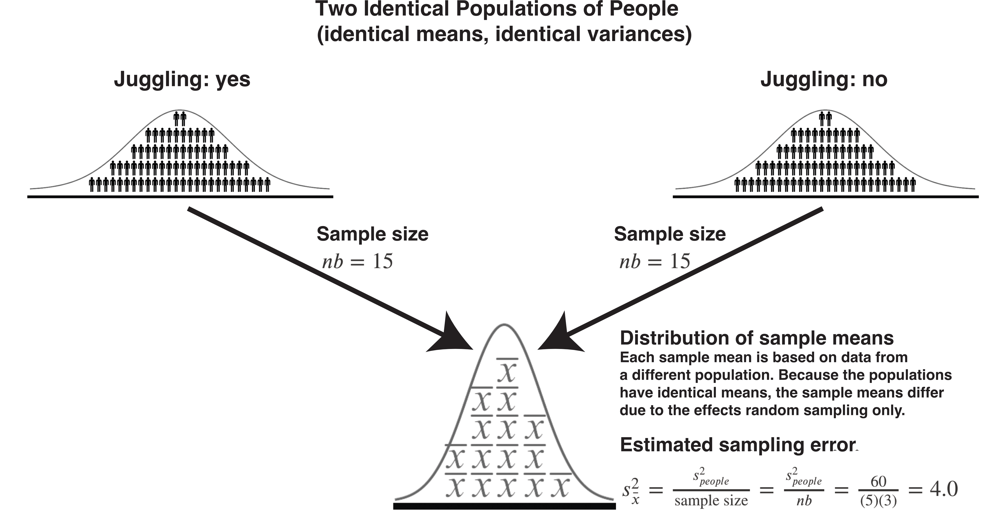

# Sampling and N-way ANOVA [Under Construction]

## Previously: One-way ANOVA

In the last chapter, we considered a scenario where there was a single independent variable with multiple levels. For example, imagine that we are interested measuring the heights of students (a dependent variable). We might examine how those heights vary across three populations. That is, we could think of university as the independent variable and Waterloo, Western, and Guelph as the levels of that single independent variable, university. In this example, the independent variable (i.e., university) represents a SET of populations and the each level of the independent variable is a specific population (e.g., Waterloo).

## Now: N-way ANOVA

In this chapter, we consider a scenario where there are multiple independent variables. We call it N-way because the N- refers to the number of independent variables. I must stress, however, that you should probably limit the number of independent variables in you study to **at most** three independent variables. Cognitive psychology research has demonstrated that human beings have a **very** hard time wrapping their minds around the the complexity associated with four independent variables and interpreting five independent variables is practially impossible. My understanding is that, somewhat ironically, 4-way interactions are not uncommon in Cognitive psychology. Be sure to read the article below though so that you can avoid the problems associated with having too many independnet variables.

[Halford, G. S., Baker, R., McCredden, J. E., & Bain, J. D. (2005). How many variables can humans process?. Psychological science, 16(1), 70-76.
Chicago.](https://doi.org/10.1111/j.0956-7976.2005.00782.x)

N-way ANOVA differs from one-way ANOVA because you can look how the multiple independent variables **combine** to influence a dependent variable. When we look at these combined effects we are looking at an **interaction** (or **moderation**) effect.

Additionally, because there are multiple independent variables there are multiple sets of populations to consider. For simplicity, we will focus on only two independent variables for this chapter  (i.e., a 2-way ANOVA). Specifically, consider a ficticous example where we examine how two independent variables **combine** to influence how calm students are before an exam. Calmness before the exam is the dependent variable. 

The first independent variable is juggling (yes/no) during study breaks. This independent variable has two levels: **yes** and **no**. So we think of there being two populations of calmness scores obtained before the exam: 1) a population of calmness scores for students who learned to juggling during study breaks and 2) a population of calmness scores for students who did not learn to juggle during study breaks. We refer to this **set** of two populations (*yes* and *no* juggling) using the label **juggling**. Juggling is an **independent variable** or **factor** in our design. We are interested in how juggling level (yes/no) influences the mean of these two populations of calmness scores. We consider the participants in our juggling levels as samples from these two populations.

The second independent variable is preparation (low/medium/high) time before the exam. That is, how much students studied before the exam. This independent variable has three levels: **low**, **medium**, and **high**. So we think of there being three populations of calmness scores obtained before the exam: 1) a population of calmness scores where students prepared a low amount of time, 2) a population of calmness scores where students prepared a medium amount of time, and 3) a population of calmness scores where students prepared a high amount of time. We refer to this **set** of three populations (*low*, *medium*, and *high* preparation) using the label **preparation**. Preparation is an *independent variable* or *factor* in our design. We are interested in how preparation level (low/medium/high) influences the mean of these three  populations of calmness scores. We consider the participants in our preparation levels as samples from these three populations.


As mentioned previously, an advantage of conducting a 2-way ANOVA over two 1-way ANOVAs is that we get to look at how calmness scores are influenced by the **combined** effect of the two independent variables. You can see this in the diagram below - there are **six cells** each of which is created by the **combination** of one level of juggling and one level of preparation. We call this a *fully-crossed* design because there are people at every combination of juggling and preparation levels. When we examine cells we are looking at the combined effect of independent variables on the dependent variable. When we do this, we typically say we are examining how the independent variables **interact** to influence the dependent variable. You can this of the six cells are another **set** of populations. We will see people that you can think of each set of populations as a frame of reference.


```{r, echo = FALSE, out.width="80%"}
knitr::include_graphics("ch_deeper_nway/images/nway_design_cells_design.png")
```


## Multiple frames of reference

A complication many students experience with understanding the different frames of reference that can be used with N-way ANOVA is the notation. Particularly when it comes the different sample sizes involved in this design. Therefore, prior to continuing we'll review some key notation. 

The notation is general in nature because each experiment will have different independent variables. A common way to refer to the first independent variable using symbolic notiation is by using an uppercase $A$. Likewise, we refer to the number of levels in that independent variable using lowercase $a$. Thus, for the first independent variable $A$ = "Juggling" and $a = 2$ because there are two levels of juggling (yes or no). So instead of saying we are examining the effect of juggling on calmness we might say we are examining the effect of Independent Variable $A$ on the dependent variable. For the second independent variable we use uppercase $B$ and lowercase $b$, and so on. The table below illustrates how we represent both independent variables in this experiment.

 Effect  | Letter designation | Number of levels| Levels| 
:-------:|:------------------:|:---------------:|:-----:|
 Independent variable 1 | $A$ = Juggling |  $a = 2$ | yes, no 
 Independent variable 2 | $B$ = Preparation |  $b = 3$ | low, medium, high 
 

There are three frames of reference we will use for this 2-way ANOVA. The key to understanding these frames of reference is to think in terms of **populations** that are represented in your experiment. These population were mentioned previously, but we'll review them in more detail below.


## Frame 1: Cell Populations

With this first frame of reference we look at combinations of the **levels** of the $A$ and $B$ independent variables (i.e., juggling and preparation). Recall we refer to each combination of levels as a **cell**. For example, individuals that both juggled during breaks  (i.e., **yes** level of juggling) and prepared for a low amount of time (i.e., **low** level of preparation), would be in one cell. As mentioned previously, be sure to think in terms of populations. In this study, for this frame of reference, we can calculate the total number of populations by multiplying the number of levels for the independent variables. Here, $a = 2$ (two levels of jugglings) and $b =3$ (three levels of preparation). Thus, $ab=(2)(3)=6$, so there are six cell populations. The participants in each cell are a sample from a corresponding cell population. The six cell **populations** are illustrated below. 


```{r, echo = FALSE, out.width="80%"}

```

For example, there is a single population (Population 1) that is composed of people who juggled during breaks and prepared for a low amount of time.  The participants in Cell 1 **are a sample** ($n = 5$ ) from the No Juggling Low Preparation Population. 

We look at the means of these six cells when we are examining an **interaction** among the independent variables.

## Frame 2: $A$ Populations (Juggling)

The second frame of reference we examine is that of the first independent variable (i.e., $A$). We examine the effect of juggling (i.e., $A$) on calmness ignoring the effect of preparation (i.e., $B$).

Within this frame of reference we imagine that there are two populations of calmness scores; one for each level of juggling. Note that the sample size is different for this frame of reference. For each level of juggling, the sample size is 15. Thus, if you were comparing the **yes juggling population** to the **no juggling population** each sample mean would would be based on 15 people. This should be clear when you look at the diagram below.

```{r, echo = FALSE, out.width="80%"}
knitr::include_graphics("ch_deeper_nway/images/nway_design_A_pop.png")
```

Unfortunately, students often struggle when presented with the sample size as a calculation with symbolic notation. Recall that we we use $n = 5$ to refer the number of people in each cell, $a = 2$ to refer to the number of juggling levels, and $b = 3$ to refer to the number of preparation levels. 

When we want to know the sample size for an $A$ mean we simply multiply the cell size ($n = 5$) by the number of levels of B (i.e., $b = 3$) to obtain 15. This is confusing for some people because even though you want to calculate the sample size of the means for $A$ you use $b$ in the calculation. But if you look at the diagram above, it should be clear why this is the case.

$$
\begin{align}
\text{Sample Size A} &= nb\\
&= 5\times3\\
&= 15\\
\end{align}
$$


Note when you examine the means for Juggling we refer to this using a few different phrases:

* Examining the **Main effect** of $A$
* Examining the **Margin means** for $A$
* Examining the **Main effect** of Juggling
* Examining the **Margin means** for Juggling


But again remember we are using sample means to make inferences about population means. Never forget the conclusions we make are at the population level - not the sample level.

## Frame 3: $B$ Populations (Preparation)

The third frame of reference we examine is that of the second independent variable (i.e., $B$). That is, we examine the effect of preparation (i.e., $B$) ignoring the effect of juggling (i.e., $A$). 

Within this frame of reference we imagine that there are three populations; one for each level of preparation. Note that the sample size is again different for this frame of reference. For each level of preparation, the sample size is 10. Thus, if you were comparing the mean for the low preparation population to the medium population each sample mean would would be based on 10 people. This should be clear when you look at the diagram below.

```{r, echo = FALSE, out.width="80%"}
knitr::include_graphics("ch_deeper_nway/images/nway_design_B_pop.png")
```

When we want to know the sample size for a $B$ mean we simply multiply the size size ($n = 5$) by the number of levels of $A$ (i.e., $a =2$). This is confusing for some people because even though you want to know the sample size of the means for $B$ you use $a$ in the calculation. But if you look the diagram above, it should be clear why this is the case.


$$
\begin{align}
\text{Sample Size B} &= na\\
&= 5\times2\\
&= 10\\
\end{align}
$$

Note when you examine the means for Preparation we refer to this using a few different phrases:

* Examining the **Main effect** of $B$
* Examining the **Margin means** for $B$
* Examining the **Main effect** of Preparation
* Examining the **Margin means** for Preparation

But again remember we are using sample means to make inferences about population means. Never forget the conclusions we make are at the population level - not the sample level.

## ANOVA by another name

*A rose by another name would smell as sweet*

*ANOVA by another name would be just as useful*

As noted, some researchers use the world **factor** to refer to an independent variable. An implication of this is that instead of using the term N-way ANOVA they use the term **Completely Randomized Factorial** Design or **CRF** Design. So be aware there are many ways to refer to an ANOVA design.

Likewise, note that in some research areas, they use a different word for interaction, namely the synonym **moderation**. That is, although many research areas would say: "We examined how juggling and preparation interacted to influence calmness scores". Other research areas might phrase it as 1) "We examined how the effect of juggling on calmness scores was **moderated** by preparation" or, the other way around, 2) "We examined how the effect of preparation on calmness scores was **moderated** by juggling". Mathematically, these three ways of describing the combined effect of the independent variables (or factors) on the dependent variable are identical. Conceptually, the two moderation examples differ, but surprisingly not in the math we use to test them.


## Homogeneity of variance

As we saw in previous sections, depending on the effect you are interested in, the relevant populations (i.e., frame of reference) can be quite different. However, regardless of the frame of reference, we assume the variance of people's calmness scores ($\sigma_{people}^2$) is the same across populations.

For the cell frame of reference, we assume the variance of calmness scores in all six populations of calmness scores ($\sigma_1^2,\sigma_2^2,\sigma_3^2,\sigma_4^2,\sigma_5^2,\sigma_6^2$) is the same. Using symbols, we indicate that there a single value, $\sigma_{cells}^2$, for the variance of calmness scores **at the population level** across the six cells:

$\sigma_{cells}^2=\sigma_1^2=\sigma_2^2=\sigma_3^2=\sigma_4^2=\sigma_5^2=\sigma_6^2$

For the effect of $A$ frame of reference (i.e., juggling), we assume the variance of calmness scores in both juggling populations ($\sigma_{A1}^2,\sigma_{A2}^2$) is the same. Using symbols, we indicate that there a single value, $\sigma_{A}^2$, for the variance of calmness scores **at the population level** across the both populations.

$\sigma_{A}^2=\sigma_{A1}^2=\sigma_{A2}^2$

For the effect of $B$ frame of reference (i.e., preparation), we assume the variance of calmness scores in all three preparation populations ($\sigma_{B1}^2=\sigma_{B2}^2=\sigma_{B3}^2$) is the same. Using symbols, we indicate that there a single value, $\sigma_{B}^2$, for the variance of calmness scores **at the population level** across the three populations.

$\sigma_{B}^2=\sigma_{B1}^2=\sigma_{B2}^2=\sigma_{B3}^2$

**But most importantly** we assume the variance of calmness scores is the same across all three frames of reference. That is, there is a single value that represents the variance of population-level calmness scores regardless of the population set. We refer to this as value the variance of people's calmness score and represent it with the symbol: $\sigma_{people}^2$

So:

$\sigma_{people}^2 =\sigma_{cells}^2=\sigma_{A}^2=\sigma_{B}^2$

We typically refer to this as the **homogeneity of POPULATION variances** assumption. With this assumption, in this example, we are referring the the variance of **participants calmness scores** across the populations in the variance frames of reference.

## Estimating population variance

Let's start by considering the cell frame of reference. Within this frame of reference there are six populations of calmness scores and we have a sample ($n =5$) from each population. We can estimate each of the six population variances using this data. To do so, however, we need the sample mean for each of the six cells. So we calculate those means ($\bar{x}$) first.


```{r, echo = F}
x1 = c(79,66,70,75,67)
x2 = c(62,84,66,73,78)
x3 = c(76,94,83,94,93)
x4 = c(61,58,64,56,58)
x5 = c(61,42,59,51,50)
x6 = c(66,59,38,61,53)
xbar1 = mean(x1)
xbar2 = mean(x2)
xbar3 = mean(x3)
xbar4 = mean(x4)
xbar5 = mean(x5)
xbar6 = mean(x6)
var1 = var(x1)
var2 = var(x2)
var3 = var(x3)
var4 = var(x4)
var5 = var(x5)
var6 = var(x6)

var_all = c(var1, var2, var3, var4, var5, var6)
```

### Sample means

We calculate the sample means for each cell using the formula below:

$$
\bar{x} = \frac{\sum x_i}{n}
$$

We use this formula in each of the cells:

```{r, eval = FALSE, echo = FALSE}
 Effect  | low_prep  | medium_prep| high_prep| 
:-------:|:---------:|:----------:|:-----:|
yes_juggle| $\bar{x_{1}}=\frac{\sum x_i}{n}\\=\frac{79+66+70+75+67}{5}\\= `r xbar1`$       | $\bar{x_{2}}=\frac{\sum x_i}{n}\\=\frac{62+84+66+73+78}{5}\\= `r xbar2`$           | $\bar{x_{3}}=\frac{\sum x_i}{n}\\=\frac{76+94+83+94+93}{5}\\= `r xbar3`$      |
no_juggle |$\bar{x_{4}}=\frac{\sum x_i}{n}\\=\frac{61+58+64+56+58}{5}\\= `r xbar4`$        | $\bar{x_{5}}=\frac{\sum x_i}{n}\\=\frac{61+42+59+51+50}{5}\\= `r xbar5`$           |  $\bar{x_{6}}=\frac{\sum x_i}{n}\\=\frac{66+59+38+61+53}{5}\\= `r xbar6`$     |
```

```{r, echo = FALSE, out.width="100%"}

```

Each of these six cell means (i.e., sample means) is an estimate of the corresponding six population means.


### Population variance estimates

Now that we have the mean for each cell we can estimate the variance of calmness scores for the six populations. We do this with the usual equation below:

$$
s^2 = \frac{\sum (x_i - \bar{x}^2)}{n-1}
$$


We use this formula in each of the cells:

```{r, eval = FALSE, echo = FALSE}
 Effect  | low_prep  | medium_prep| high_prep| 
:-------:|:---------:|:----------:|:-----:|
yes_juggle|$s_1^2=\frac{\sum (x_i - \bar{x_1})^2}{n-1}\\=\frac{(79-`r xbar1`)^2+(66-`r xbar1`)^2+(70-`r xbar1`)^2+(75-`r xbar1`)^2+(67-`r xbar1`)^2}{5 - 1}\\=`r var1`$|$s_2^2=\frac{\sum (x_i - \bar{x_2})^2}{n-1}\\=\frac{(62-`r xbar2`)^2+(84-`r xbar2`)^2+(66-`r xbar2`)^2+(73-`r xbar2`)^2+(78-`r xbar2`)^2}{5 - 1}\\=`r var2`$|$s_3^2=\frac{\sum (x_i - \bar{x_3})^2}{n-1}\\=\frac{(76-`r xbar3`)^2+(94-`r xbar3`)^2+(83-`r xbar3`)^2+(94-`r xbar3`)^2+(93-`r xbar3`)^2}{5 - 1}\\=`r var3`$
no_juggle |$s_4^2=\frac{\sum (x_i - \bar{x_4})^2}{n-1}\\=\frac{(61-`r xbar4`)^2+(58-`r xbar4`)^2+(64-`r xbar4`)^2+(56-`r xbar4`)^2+(58-`r xbar4`)^2}{5 - 1}\\=`r var4`$|$s_5^2=\frac{\sum (x_i - \bar{x_5})^2}{n-1}\\=\frac{(61-`r xbar5`)^2+(42-`r xbar5`)^2+(59-`r xbar5`)^2+(51-`r xbar5`)^2+(50-`r xbar5`)^2}{5 - 1}\\=`r var5`$|$s_6^2=\frac{\sum (x_i - \bar{x_6})^2}{n-1}\\=\frac{(66-`r xbar6`)^2+(59-`r xbar6`)^2+(38-`r xbar6`)^2+(61-`r xbar6`)^2+(53-`r xbar6`)^2}{5 - 1}\\=`r var6`$
```

```{r, echo = FALSE, out.width="100%"}
knitr::include_graphics("ch_deeper_nway/images/calc_cell_var.png")
```

As noted above, it's important to remember that each sample variance (e.g., $s_1^2$) is an estimate of the corresponding population variance (e.g., $\sigma_1^2$). This is illustrated in the figure below.

```{r, echo = FALSE, out.width="80%"}
knitr::include_graphics("ch_deeper_nway/images/nway_design_cells_sd.png")
```

### Averaging variances

In the previous section, we started from the premise that there were six populations. The populations variances ($\sigma^2$) are unknown but we calculated an estimate of each population variance ($s^2$) using sample data. These are presented in the table below:

Cell | Juggling level | Preparation level | Population variance | Sample estimate |
:---:|:---:|:---:|:------------------:|:---------------:|
1| yes|low | $\sigma_1^2$      | $s_1^2 = `r var1`$|
2| yes|medium | $\sigma_2^2$      | $s_2^2 = `r var2`$|
3| yes|high | $\sigma_3^2$      | $s_3^2 = `r var3`$|
4| no|low | $\sigma_4^2$      | $s_4^2 = `r var4`$|
5| no|medium| $\sigma_5^2$      | $s_5^2 = `r var5`$|
6| no|high | $\sigma_6^2$      | $s_6^2 = `r var6`$|


Recall, however, the homogeneity of population variances assumption. We assume 
$\sigma_{people}^2=\sigma_1^2=\sigma_2^2=\sigma_3^2=\sigma_4^2=\sigma_5^2=\sigma_6^2=\sigma^2=?$. 

Consequently, the sample variance estimates ($s_1^2$, $s_2^2$, $s_3^2$, $s_4^2$, $s_5^2$, $s_6^2$) are estimates of the the same population value of calmness scores, $\sigma_{people}^2$.

Therefore, a better way to display the population variance estimates is with the table below. 

| Population Variance | Sample Estimates |
|:------------------:|:---------------:|
| $\sigma_{people}^2$      | $s_1^2 = `r var1`$, $s_2^2 = `r var2`$, $s_3^2 = `r var3`$ $s_4^2 = `r var4`$, $s_5^2 = `r var5`$, $s_6^2 = `r var6`$|

**CRITICAL:** When we ASSUME the six sample estimates ($s_1^2$, $s_2^2$, $s_3^2$, $s_4^2$, $s_5^2$, $s_6^2$) are all estimates of **the same** population value, $\sigma_{people}^2$, we can combine the sample estimates (i.e., average them) to get a best estimate of the population value (i.e., $s_{people}^2$). This makes sense because, with the identical population variances assumption, each sample variance estimate (e.g., $s_1^2$) only differs from the population variance ($\sigma_{people}^2$) due to random sampling error. By averaging the sample estimates ($s_1^2$, $s_2^2$, $s_3^2$, $s_4^2$, $s_5^2$, $s_6^2$) we are "averaging out" the random sampling error.

We use the formula below to average the cell variances **when the sample sizes for the 6 cells are identical.** That is, all $n = 5$.:

\begin{align}
s_{people}^2 &=\frac{s_1^2 + s_2^2 + s_3^2 + s_4^2 + s_5^2 + s_6^2}{6}\\ &= \frac{`r var1` + `r var2` +`r var3` +`r var4` +`r var5` +`r var6` }{6} \\ &= `r mean(var_all)`
\end{align}

Thus, our best sample-based estimate of the variance of calmness scores in the population is $s_{people}^2 = 60.00$.

**We averaged, or took the mean of, six sample based estimates to obtain $s_{people}^2$. Most people refer to $s_{people}^2$ as Mean Squared Error or MSE. You can think of Mean Squared Error as a synonym for *estimated population variance.* **

$$\text{Mean Squared Error} = MSE = s_{people}^2  = 60.0$$

**CRITICAL:** Note that averaging the sample variances estimates ONLY MAKES SENSE if we assume the six population variances are all the same. It only makes sense to average the sample variance estimates if they are all estimates of a single population value. Thus, calculation of Mean Squared Error only makes sense if the homogeneity of population variances assumption is true. Also note that when the cell sizes are unequal you need to created a weighted average of the sample variance estimates - this math is not reviewed in detail for the sake of a simple narrative.

We now in the following situation:

```{r, echo = FALSE, out.width="100%"}
knitr::include_graphics("ch_deeper_nway/images/summary_mse.png")
```


```{r, eval = F, echo =F}
  Calculation | A = Juggling | B = Preparation | Cells |
:--------------:|:--------------:|:------------------:|:---------------:|
Variance of people | $\sigma_{A}^2=\sigma_{people}^2= ?$ | $\sigma_{B}^2=\sigma_{people}^2= ?$ | $\sigma_{cells}^2=\sigma_{people}^2= ?$|
Estimated variance (MSE) of calmness scores | $s_{people}^2 =MSE = 60.0$ | $s_{people}^2 =MSE = 60.0$ | $s_{people}^2 =MSE = 60.0$|
Degrees of freedom for MSE |$ab(n-1) = (2)(3)(5-1)=24$ |$ab(n-1) = (2)(3)(5-1)=24$ |$ab(n-1) = (2)(3)(5-1)=24$ |
```
 
Notice the degrees of freedom for MSE. Recall that when we calculated MSE (i.e., $s_{people}^2$) we averaged 6 cell variance estimates (e.g., $s_1^2$). Each of those six estimates had $n-1$ degrees for freedom. You know it's $n-1$ degrees of freedom for each cell variance (e.g., $s_1^2$) because that's the denominator of the variance formula ($s^2 = \frac{\sum (x_i - \bar{x}^2)}{n-1}$). So the degrees of freedom for $s_{people}^2$  (i.e., MSE) is $6(n-1)$ because there were six cell estimates we combined.

Symbolically, we express the calculation of degrees of freedom as $(3)(2)(n-1)$ which is $ab(n-1)$. So the degrees of freedom for $s_{people}^2$ (i.e., MSE) is $ab(n-1)$. It's important to know this tidbit so that you will understand where all the numbers in a 2-way ANOVA table come from when we examine it later.


## CLT Sampling Error

As we learned in the 1-way ANOVA chapters, an important part of ANOVA is determining if the variability in sample means is greater than could be expected due to random sampling error. Consequently, we have to estimate how much random sampling error variance there would be (on average) in sample means for each of the three frames of reference (main effect of $A$ means, main effect of $B$ means, and cell means).

To estimate the expected variability in sample means due to sampling error we need an estimate ($s_{people}^2$) of the population variance ($\sigma_{people}^2$). That's why we spent so much time obtaining $s_{people}^2$ in the previous section. Recall the general form of the formula for the expected variance in sample means, due to sampling error, from previous chapters:

$$
\begin{align}
\text{Sampling error variance for means} &= \sigma_{\bar{x}}^2 \\
 &= \frac{\sigma_{people}^2}{\text{sample size}}\\
\end{align}
$$

The formula above, for the variability due to sampling error alone, is based on the Central Limit Theorem (CLT) and is reviewed extensively in past chapters.


### CLT $A$: Juggling

In the context of the juggling main effect means, each juggle mean is based on $nb=(5)(3)=15$ people. 
Therefore, for these juggling main effect means the general formula for the variance due to sampling error is below:


$$
\begin{align}
\text{Sampling error variance for means for A} &=
\sigma_{\bar{x}}^2 \\
&= \frac{\sigma_{people}^2}{\text{sample size}}\\
&= \frac{\sigma_{people}^2}{nb}\\
\end{align}
$$


We don't know the population variance ($\sigma_{people}^2$) though, but we use an estimate below ($s_{people}^2$):

$$
\begin{align}
\text{Estimated sampling error variance for means for A} &= s_{\bar{x}}^2\\
&= \frac{s_{people}^2}{nb}\\
&= \frac{s_{people}^2}{(5)(3)}\\
&= \frac{60.0}{15}\\
&= 4.0
\end{align}
$$


Thus, when we have two juggling populationss from which we obtained samples of 15 people, we would expect the variance of sample means to be 4.0; assuming the population means are the same.

```{r, echo = FALSE, out.width="80%"}

```


### CLT $B$: Preparation

In the context of the preparation main effect means, each preparation mean is based on $na=(5)(2)=10$ people. 
Therefore, for these preparation main effect means the general formula for the variance due to sampling error is below:

$$
\begin{align}
\text{Sampling error variance for means for B} &=
\sigma_{\bar{x}}^2 \\
&= \frac{\sigma_{people}^2}{\text{sample size}}\\
&= \frac{\sigma_{people}^2}{na}\\
\end{align}
$$

We don't know the population variance ($\sigma_{people}^2$) though, but we use an estimate below ($s_{people}^2$):

$$
\begin{align}
\text{Estimated sampling error variance for means for B} &= s_{\bar{x}}^2\\
&= \frac{s_{people}^2}{na}\\
&= \frac{s_{people}^2}{(5)(2)}\\
&= \frac{60.0}{10}\\
&= 6.0
\end{align}
$$

Thus, when we have three preparation populations from which we obtained samples of 10 people, we would expect the variance of sample means to be 6.0; assuming the population means are the same.

```{r, echo = FALSE, out.width="80%"}
knitr::include_graphics("ch_deeper_nway/images/pop_equal_means_b.png")
```

### CLT Cells

In the context of the cell means, each cell mean is based on $n=5$ people. 
Therefore, for these cell means the general formula for the variance due to sampling error is below:

$$
\begin{align}
\text{Sampling error variance for cell means} = \sigma_{\bar{x}}^2 &= \frac{\sigma_{people}^2}{\text{sample size}}\\
&= \frac{\sigma_{people}^2}{n}\\
\end{align}
$$

$$
\begin{align}
\text{Estimated sampling error variance for cell means} &= s_{\bar{x}}^2\\
&= \frac{s_{people}^2}{n}\\
&= \frac{60.0}{5}\\
&= 12.0
\end{align}
$$


I omit the diagram for cells populations and sample mean distributions. This is done because there are so many different ways cells might be examined. There would be too many diagrams - and it would be misleading to present just one diagram. But don't worry we will return to this issue, with diagrams, when we start talking about interactions in more detail.


### CLT Summary

```{r, eval = F, echo = F}
#   Calculation | A = Juggling | B = Preparation | Cells |
# :--------------:|:--------------:|:------------------:|:---------------:|
# Estimated variance of people's calmness scores | $s_{people}^2 =MSE = 60.0$ | $s_{people}^2 =MSE = 60.0$ | $s_{people}^2 =MSE = 60.0$|
# Sample size for mean | $nb = (5)(3)=15$ | $na = (5)(2)=10$|$n=5$|
# Estimated sampling error variance for means| $\frac{s_{people}^2}{nb} = 4.0$ | $\frac{s_{people}^2}{na} = 6.0$ |$\frac{s_{people}^2}{n} = 12$|
#Degrees of freedom for sampling error estimate | $ab(n-1)=(2)(3)(5-1)=24$ | $ab(n-1)=(2)(3)(5-1)=24$ | $ab(n-1)=(2)(3)(5-1)=24$|
```

```{r, echo = FALSE, out.width="100%"}
knitr::include_graphics("ch_deeper_nway/images/summary_clt.png")
```

You can see in the table above that we have estimated the variability we will see in the sample means for different effects. The estimated sampling error differs for each effect because the sample size differs for each effect.

Notice that the degrees of freedom for the sampling error variance is the same for all the effects. This is because the degrees of freedom is based on the $s_{people}^2$ calculation (i.e., MSE calculation). Sampling error variance is just $s_{people}^2$ (i.e., MSE) divided by sample size. Consequently, the degrees for freedom for sampling error variance the same as MSE,  $ab(n-1)$.

## Main effect variance

### Means $A$: Juggling

  Juggling| Formula | Expected value | degrees of feedom |
:--------------:|:--------------:|:------------------:|:---------------:|
Estimated total variance | $\frac{\sum(\bar{x_i}-\bar{\bar{x}})^2}{a-1}$ |$\frac{\sigma_{people}^2}{nb} + \sigma_{A}^2$ | $(a-1) = 1$
Estimated variance sampling error | $\frac{s_{people}^2}{nb} = 4.0$ |$\frac{\sigma_{people}^2}{nb}$ | $ab(n-1) = 24$
Comparison using $F$-ratio | $\frac{\frac{\sum (\bar{x_i}-\bar{\bar{x}})^2}{a-1}}{                  \frac{s_{people}^2}{nb}}$ |  $\frac{\frac{\sigma_{people}^2}{nb} + \sigma_{A}^2}{    \frac{\sigma_{people}^2}{nb}}$ | $[(a-1),ab(n-1)]=[1,24]$


### Means $B$: Preparation 

Preparation| Formula | Expected value | degrees of feedom |
:--------------:|:--------------:|:------------------:|:---------------:|
Estimated total variance | $\frac{\sum(\bar{x_i}-\bar{\bar{x}})^2}{b-1}$ |$\frac{\sigma_{people}^2}{na} + \sigma_{B}^2$ | $(b-1) = 2$
Estimated variance sampling error | $\frac{s_{people}^2}{na} = ?$ |$\frac{\sigma_{people}^2}{na}$ | $ab(n-1) = 24$
Comparison using $F$-ratio | $\frac{\frac{\sum (\bar{x_i}-\bar{\bar{x}})^2}{b-1}}{                  \frac{s_{people}^2}{na}}$ |  $\frac{\frac{\sigma_{people}^2}{na} + \sigma_{B}^2}{    \frac{\sigma_{people}^2}{na}}$ | $[(b-1),ab(n-1)]=[2,24]$


## Interaction variance

### Cell means vs. marginal means

### Residual means

### Variance of residual means


### Juggling Typical

  Juggling| Formula | Expected value | degrees of feedom |
:--------------:|:--------------:|:------------------:|:---------------:|
Sample size multiplied by estimated total variance| $\frac{nb\sum(\bar{x_i}-\bar{\bar{x}})^2}{a-1}$ |$\sigma_{people}^2 + nb \sigma_{A}^2$ | $(a-1) = 1$
Estimated population variance | $s_{people}^2 =MSE= 60.0$ |$\sigma_{people}^2$ | $ab(n-1) = 24$
Comparison using $F$-ratio | $\frac{\frac{nb\sum(\bar{x_i}-\bar{\bar{x}})^2}{a-1}}{s_{people}^2}$ | $\frac{\sigma_{people}^2 + nb \sigma_{A}^2}{\sigma_{people}^2}$ | $(a-1) = 1$      | $[(a-1),ab(n-1)]=[1,24]$


### Preparation Typical

  Juggling| Formula | Expected value | degrees of feedom |
:--------------:|:--------------:|:------------------:|:---------------:|
Sample size multiplied by estimated total variance| $\frac{nb\sum(\bar{x_i}-\bar{\bar{x}})^2}{b-1}$ |$\sigma_{people}^2 + na \sigma_{B}^2$ | $(b-1) = 2$
Estimated population variance | $s_{people}^2 =MSE= 60.0$ |$\sigma_{people}^2$ | $ab(n-1) = 24$
Comparison using $F$-ratio | $\frac{\frac{na\sum(\bar{x_i}-\bar{\bar{x}})^2}{b-1}}{s_{people}^2}$ | $\frac{\sigma_{people}^2 + na \sigma_{B}^2}{\sigma_{people}^2}$ | $(b-2) = 1$      | $[(b-1),ab(n-1)]=[2,24]$


