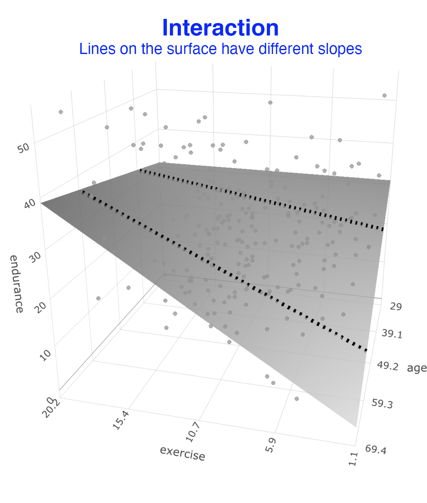
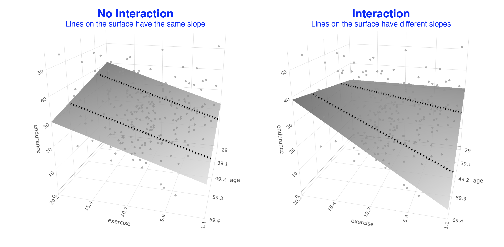
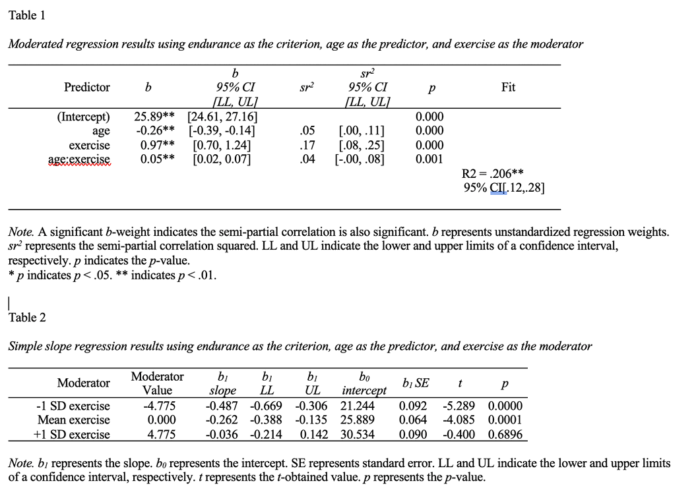

# Moderated multiple regression

```{r, include=FALSE}
library(tidyverse)
library(fastInteraction)
```
The following CRAN packages must be installed:

| Required CRAN Packages |
|-------------------|
|tidyverse          |
|remotes            |

The following GitHub packages must be installed:

| Required GitHub Packages |
|--------------------------|
|dstanley4/fastInteraction |


After the remotes package is installed, it can be used to install a package from GitHub:

```{r, eval = FALSE}
remotes::install_github("dstanley4/fastInteraction")
```

## Overview

In this chapter we present a brief overview of moderated multiple regression. In an ANOVA you can have two variables interact to predict a dependent variable. In this ANOVA scenario, the predictors are the categorical ANOVA variables. When our predictors are continuous variables (e.g., height, weight, etc) they can still interact to predict the dependent variable (i.e., criterion). In this chapter we primarily focus on how to obtain the required information from R to write up a continous variable interaction (also known as a moderated multiple regression). For an understanding of the underlying theory I strongly encourage you to read *Chapter 7: Interactions among continuous variables* in Cohen, Cohen, West, and Aiken (2003):


```{r, echo = FALSE, out.width="30%"}
knitr::include_graphics("ch_mmr/images/ccwa_cover.png")
```

Cohen, J., Cohen, P., West, S. G., & Aiken, L. S. (2013). Applied multiple regression/correlation analysis for the behavioral sciences. Routledge.

## Scenario

Imagine a scenario where we are interested in predicted endurance from participant age and exercise.

We can load the data:

```{r, message=FALSE}
library(tidyverse)

data_endurance <- read_csv("data_endurance.csv")
```

We can see the structure of the data:

```{r}
glimpse(data_endurance)
```

## Overview

### No interaction

$$ \hat{Y} = b_0 + b_1age + b_2exercise $$

```{r}
lm_no_int <- lm(endurance ~ age + exercise,
                data = data_endurance)
```


```{r, echo = FALSE, out.width="35%"}
knitr::include_graphics("ch_mmr/images/mmr_no_int.png")
```


### Interaction

$$ \hat{Y} = b_0 + b_1age + b_2exercise + b_3(age)(exercise)$$
```{r}
lm_int <- lm(endurance ~ age + exercise + I(age*exercise),
             data = data_endurance)
```


```{r, echo = FALSE, out.width="35%"}

```


### Comparison

```{r, echo = FALSE, out.width="90%"}

```


## fastInteraction

We want to conduct the regression below:

$$ \hat{Y} = b_0 + b_1age + b_2exercise + b_3(age)(exercise)$$

The fast.int() command in the fastInteraction package does the following:

1. Centers variables if requested

2. Conducts the regression (i.e., the lm command)

3. Creates the 2D graph

4. Creates the 3D graph

5. Creates two APA style tables to describe the analyses


```{r}
library(fastInteraction)

new_axis_labels <- list(criterion = "Endurance",
                        predictor = "Age (centered)",
                        moderator = "Exercise (centered)")

mmr_output <- fast.int(data = cohen_exercise,
                       criterion = endurance,
                       predictor = age,
                       moderator = exercise,
                       center.predictors = TRUE,
                       axis.labels = new_axis_labels,
                       path = "tables_mmr.doc")
```

### Graphing in 3D

```{r}
mmr_output$graph3D
```

### Unformatted 2D graph


```{r}
unformatted_ggplot_graph <- mmr_output$graph2D.unformatted

print(unformatted_ggplot_graph)
```


### Tables

We inspect MS Word file created by the fast.int() command below. It presents the results of the various regression in tables corresponding to APA style.

```{r, echo=FALSE, out.width="80%"}

```

### Formatted 2D graph

We inspect the Table output and find the value for -1/+1 SD of the moderator (age). In this case, we find the value is 4.775. So we use this to set the x-axis labels. That way the ticks on the x-axis correspond to standard deviations.

```{r}

custom_formatted_ggplot_graph <- unformatted_ggplot_graph +
  coord_cartesian(ylim = c(10, 40)) +
  scale_y_continuous(breaks = seq(10, 40, by = 5)) +
  scale_x_continuous(breaks = seq(-4.775*2, 4.775*2, by = 4.775)) +
  labs(x = "Exercise (centered)",
       y = "Endurance",
       linetype = "Age (centered)") +
  theme_classic(18)

print(custom_formatted_ggplot_graph)
```

#### Saving

```{r, eval = FALSE}
ggsave("graph_2D_interaction.png", custom_formatted_ggplot_graph)
```
